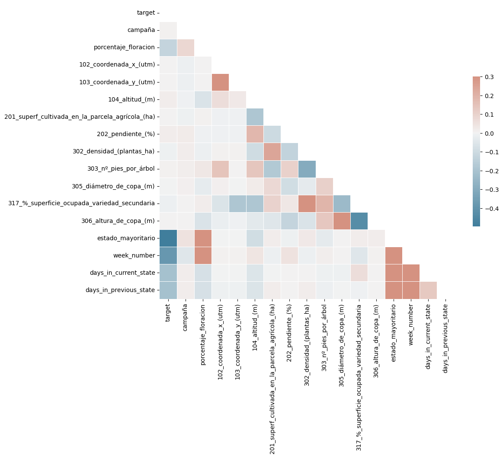
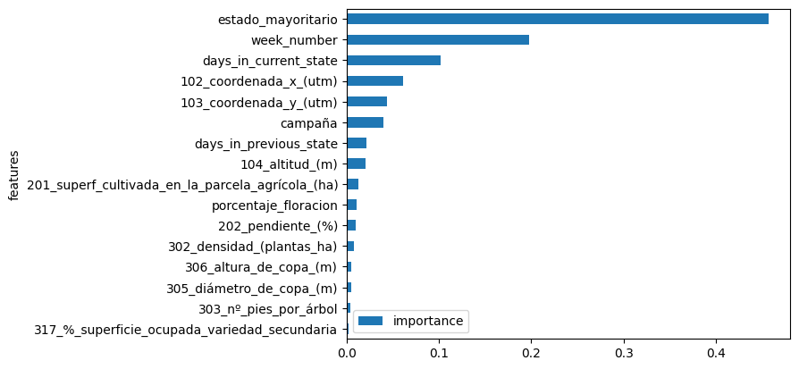
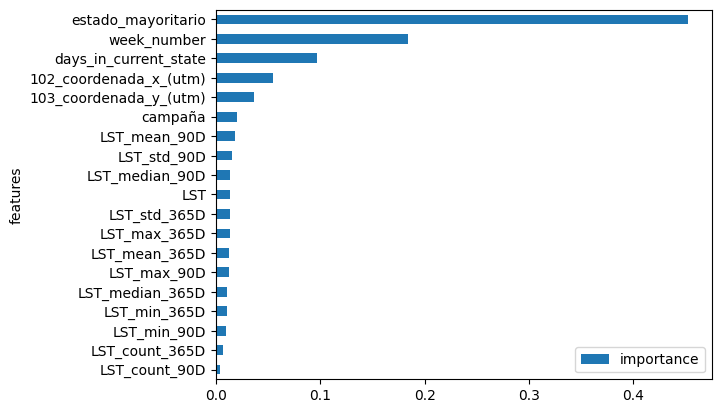

# Summary
This notebook performs the experimentation to get the best model and features\
to predict how many states an olive will grow in 14 days.

- Obtained a model that outperforms the baseline. This is the lightgbm model.
- The predictive features used are: ['estado_mayoritario',
 'week_number',
 'days_in_current_state',
 'campaña',
 '102_coordenada_x_(utm)',
 '103_coordenada_y_(utm)',
 'LST_mean_365D',
 'LST_std_365D',
 'LST_median_365D',
 'LST']
- The metric results of the lightgbm model in test:
  - accuracy: 0.7476235527323513
  - mse: 0.27958733162139027
  - precision_for_class: [0.86795887 0.64121769 0.59095841 0.6969697 ]
  - recall_for_class: [0.83177815 0.72404856 0.61038476 0.15927978]
  - f1_for_class: [0.84948343 0.68012044 0.60051452 0.25930101]
  - confusion_matrix:
    \[[9538 1897   30    2]
     \[1408 5308  606    9]
     \[  40  964 1634   39]
     \[   3  109  495  115]]
- The metric results of the baseline in test:
  - accuracy: 0.6591431274496553
  - mse: 0.4575393071135739
  - precision_for_class: [0.75273694 0.5095332  0.62638581 0.        ]
  - recall_for_class: [0.83945234 0.52857727 0.42211431 0.        ]
  - f1_for_class: [0.79373325 0.51888056 0.50435171 0.        ]
  - confusion_matrix:
    \[[9626 1799   42    0]
     \[2948 3875  508    0]
     \[ 200 1347 1130    0]
     \[  14  584  124    0]]

## NEXT STEPS:
  - Categorical features were not used, their usage could improve the model.
  - The treatment for missing values in the meteo dataset was LOCF, try with\
    different approaches. Same for numerical features in the parcelas dataset,\
    where imputation with the mean was used.
  - Create more features. In our model, the features that we created were\
    the most important features when making a prediction.
  - Use the entire dataset given. The parcelas and meteo data used in this\
    experimentation was between 2018 and 2022 (inclusive), but did not use\
    the 2023 data, as it was given much later.

# Experimentation


```python
import seaborn as sns
import matplotlib.pyplot as plt
import pandas as pd
import numpy as np
from pathlib import Path
import sys
```


```python
sys.path.insert(0, str(Path("../../").resolve()))

from src.features import create_feature_frame, generate_target
from src.models import train_test_split, feature_label_split, baseline

from sklearn.pipeline import make_pipeline, Pipeline
from sklearn.impute import SimpleImputer
from sklearn.preprocessing import OneHotEncoder, OrdinalEncoder, StandardScaler
from sklearn.compose import ColumnTransformer
from sklearn.ensemble import GradientBoostingClassifier, RandomForestClassifier
```

## Load feature frames


```python
from src.load import load_parcelas_feature_frame
from src.load_meteo import load_meteo_feature_frame

df_parcelas = load_parcelas_feature_frame()
df_meteo = load_meteo_feature_frame()
```

    INFO:root:Executing load_parcelas_feature_frame
    INFO:root:Loading dataset from /Users/jianingxu/Documents/repositories/courses/zrive-ds-1q24-olive-stage-prediction/src/notebooks_jianing/../../data/parcelas_feature_frame.parquet
    INFO:root:Executing load_meteo_feature_frame
    INFO:root:Loading dataset from /Users/jianingxu/Documents/repositories/courses/zrive-ds-1q24-olive-stage-prediction/src/notebooks_jianing/../../data/meteo_feature_frame.parquet


## Evaluation defitinion


```python
from src.metrics import evaluate_classification, log_metrics, evaluate_configuration


def plot_feature_importance(model, columns):
    fig, ax = plt.subplots()
    fi = pd.DataFrame(
        list(zip(columns, model.feature_importances_)),
        columns=["features", "importance"],
    ).sort_values(by="importance", ascending=True)
    fi.plot(kind="barh", x="features", y="importance", ax=ax)
    return fi, fig, ax


models_metric_results = {}

def save_model(model: Pipeline, model_name: str, models: dict):
    models[model_name] = model

models = {}
```

## Baseline


```python
baseline_parcelas = generate_target(df_parcelas)
baseline_train_df, baseline_test_df = train_test_split(
    baseline_parcelas, split_year=2021, max_year=2022
)
baseline_result = baseline(baseline_train_df, baseline_test_df, "target")[
    ["codparcela", "fecha", "target", "y_pred"]
]
models_metric_results["baseline"] = {
    "test": evaluate_classification(
        baseline_result["target"], baseline_result["y_pred"].round()
    )
}
log_metrics("baseline", models_metric_results["baseline"]["test"])
```

    INFO:src.metrics:Computed Metrics for baseline:
    INFO:src.metrics:accuracy: 0.6591431274496553
    INFO:src.metrics:mse: 0.4575393071135739
    INFO:src.metrics:precision_for_class: [0.75273694 0.5095332  0.62638581 0.        ]
    INFO:src.metrics:recall_for_class: [0.83945234 0.52857727 0.42211431 0.        ]
    INFO:src.metrics:f1_for_class: [0.79373325 0.51888056 0.50435171 0.        ]
    INFO:src.metrics:confusion_matrix:
    [[9626 1799   42    0]
     [2948 3875  508    0]
     [ 200 1347 1130    0]
     [  14  584  124    0]]
    INFO:src.metrics:----------------------------------


## ML pipeline


```python
### I won't use columns with more than 80% of nulls
PHENOLOGICAL_STATE_COLS = [f"estado_fenologico_{i}" for i in range(14, 0, -1)]

parcelas_numerical_cols = ['campaña','porcentaje_floracion','102_coordenada_x_(utm)',
        '103_coordenada_y_(utm)', '104_altitud_(m)','201_superf_cultivada_en_la_parcela_agrícola_(ha)',
        '202_pendiente_(%)', '302_densidad_(plantas_ha)', '303_nº_pies_por_árbol',
        '305_diámetro_de_copa_(m)','317_%_superficie_ocupada_variedad_secundaria',
        '306_altura_de_copa_(m)', 'estado_mayoritario']

parcelas_categorical_cols = ['codparcela', '105_comarca', '203_orientación', '204_textura_del_suelo',
       '206_secano_/_regadío', '211_utilización_de_cubierta_vegetal',
       '212_tipo_de_cubierta_vegetal',
       '214_cultivo_asociado/otro_aprovechamiento', '301_marco_(m_x_m)',
       '304_formación', '308_variedad_principal',
       '311_fecha_de_plantación_variedad_principal',
       '208_riego:_procedencia_del_agua', '209_riego:_calidad_del_agua',
       '313_variedad_secundaria', '107_zona_homogénea',
       '120_zona_biológica_raif', '401_estación_climática_asociada',
       '402_sensor_climático_asociado', '207_riego:_sistema_usual_de_riego',
       '108_u_h_c_a_la_que_pertenece',
       '316_fecha_de_plantación_variedad_secundaria',
       '315_patrón_variedad_secundaria', '310_patrón_variedad_principal',
       '411_representa_a_la_u_h_c_(si/no)',
       '109_sistema_para_el_cumplimiento_gestión_integrada']

meteo_numerical_cols = ['lat', 'lon', 'FAPAR', 'GNDVI', 'LST',
                         'NDVI', 'NDWI', 'SAVI', 'SIPI', 'SSM']

label_col = 'target'

parcelas_created_features_cols = ['week_number', 'days_in_current_state', 'days_in_previous_state']

```

### Correlation matrix - HACERLA CON TODAS LAS VARIABLES NUMÉRICAS DE CLIMA Y PARCELAS Y EL TARGET


```python
feature_frame = create_feature_frame(
    df_parcelas, df_meteo, parcelas_numerical_cols + parcelas_created_features_cols, []
)
```


```python
numerical_df = feature_frame.select_dtypes(include=['number'])
# filtered_numerical_df = numerical_df.loc[:, ~numerical_df.columns.str.startswith('estado_')]

def plot_correlation_matrix(df_):
    # Compute the correlation matrix
    corr = df_.corr()

    # Generate a mask for the upper triangle
    mask = np.triu(np.ones_like(corr, dtype=bool))

    # Set up the matplotlib figure
    fig, ax = plt.subplots(figsize=(11, 9))

    # Generate a custom diverging colormap
    cmap = sns.diverging_palette(230, 20, as_cmap=True)

    # Draw the heatmap with the mask and correct aspect ratio
    sns.heatmap(corr, mask=mask, cmap=cmap, vmax=.3, center=0,
                square=True, linewidths=.5, cbar_kws={"shrink": .5})
    
plot_correlation_matrix(numerical_df)
# plot_correlation_matrix(filtered_numerical_df)
```


    

    


## Parcelas numerical and created features experimentation

### Linear Models: Lasso and Ridge Logistic Regression


```python
def preprocess_data(
    df_parcelas: pd.DataFrame,
    df_meteo: pd.DataFrame,
    columns_parcela: list[str],
    columns_meteo: list[str],
):
    SPLIT_YEAR = 2021
    MAX_YEAR = 2022
    LABEL_COL = "target"

    feature_frame = create_feature_frame(
        df_parcelas, df_meteo, columns_parcela, columns_meteo
    )

    train_df, test_df = train_test_split(
        feature_frame, split_year=SPLIT_YEAR, max_year=MAX_YEAR
    )

    X_train, y_train = feature_label_split(train_df, LABEL_COL)
    X_test, y_test = feature_label_split(test_df, LABEL_COL)

    numerical_processor = Pipeline(
        steps=[
            ("imputation_mean", SimpleImputer(strategy="mean")),
        ]
    )

    preprocessor = ColumnTransformer(
        transformers=[
            ("numerical", numerical_processor, columns_parcela + columns_meteo),
        ]
    )

    X_train_preprocessed = preprocessor.fit_transform(X_train)
    X_test_preprocessed = preprocessor.transform(X_test)

    # Use get_feature_names_out to get the transformed column names
    transformed_names = preprocessor.get_feature_names_out()

    # Create DataFrames with the transformed names
    X_train_preprocessed = pd.DataFrame(X_train_preprocessed, columns=transformed_names)
    X_test_preprocessed = pd.DataFrame(X_test_preprocessed, columns=transformed_names)

    return X_train_preprocessed, y_train.array, X_test_preprocessed, y_test.array
```


```python
# train test split with only parcelas numerical columns
selected_parcelas_cols = parcelas_numerical_cols + parcelas_created_features_cols
X_train, y_train, X_test, y_test = preprocess_data(
    df_parcelas=df_parcelas,
    df_meteo=df_meteo,
    columns_parcela=selected_parcelas_cols,
    columns_meteo=[],
)
```

#### Lasso Logistic Regression


```python
from sklearn.linear_model import LogisticRegression

cs = [1e-8, 1e-6, 1e-4, 1e-2, 1, 100, 1e4]
for c in cs:
    model_name = f"lr_l1_parcelas_numerical_c_{c}"
    lr = Pipeline(
        [
            ("standard_scaler", StandardScaler()),
            ("lr", LogisticRegression(penalty="l1", C=c, multi_class='multinomial', solver='saga')),
        ]
    )
    lr.fit(X_train, y_train)
    evaluate_configuration(lr, model_name, X_train, y_train, X_test, y_test, models_metric_results)
    save_model(lr, model_name, models)
```

    INFO:src.metrics:Computed Metrics for lr_l1_parcelas_numerical_c_1e-08_train:
    INFO:src.metrics:accuracy: 0.5234272964736613
    INFO:src.metrics:mse: 0.9742326948193296
    INFO:src.metrics:precision_for_class: [0.5234273 0.        0.        0.       ]
    INFO:src.metrics:recall_for_class: [1. 0. 0. 0.]
    INFO:src.metrics:f1_for_class: [0.68717069 0.         0.         0.        ]
    INFO:src.metrics:confusion_matrix:
    [[57711     0     0     0]
     [37680     0     0     0]
     [12810     0     0     0]
     [ 2055     0     0     0]]
    INFO:src.metrics:----------------------------------
    INFO:src.metrics:Computed Metrics for lr_l1_parcelas_numerical_c_1e-08_test:
    INFO:src.metrics:accuracy: 0.5166013425237644
    INFO:src.metrics:mse: 1.1054196513042303
    INFO:src.metrics:precision_for_class: [0.51660134 0.         0.         0.        ]
    INFO:src.metrics:recall_for_class: [1. 0. 0. 0.]
    INFO:src.metrics:f1_for_class: [0.68126188 0.         0.         0.        ]
    INFO:src.metrics:confusion_matrix:
    [[11467     0     0     0]
     [ 7331     0     0     0]
     [ 2677     0     0     0]
     [  722     0     0     0]]
    INFO:src.metrics:----------------------------------
    INFO:src.metrics:Computed Metrics for lr_l1_parcelas_numerical_c_1e-06_train:
    INFO:src.metrics:accuracy: 0.5234272964736613
    INFO:src.metrics:mse: 0.9742326948193296
    INFO:src.metrics:precision_for_class: [0.5234273 0.        0.        0.       ]
    INFO:src.metrics:recall_for_class: [1. 0. 0. 0.]
    INFO:src.metrics:f1_for_class: [0.68717069 0.         0.         0.        ]
    INFO:src.metrics:confusion_matrix:
    [[57711     0     0     0]
     [37680     0     0     0]
     [12810     0     0     0]
     [ 2055     0     0     0]]
    INFO:src.metrics:----------------------------------
    INFO:src.metrics:Computed Metrics for lr_l1_parcelas_numerical_c_1e-06_test:
    INFO:src.metrics:accuracy: 0.5166013425237644
    INFO:src.metrics:mse: 1.1054196513042303
    INFO:src.metrics:precision_for_class: [0.51660134 0.         0.         0.        ]
    INFO:src.metrics:recall_for_class: [1. 0. 0. 0.]
    INFO:src.metrics:f1_for_class: [0.68126188 0.         0.         0.        ]
    INFO:src.metrics:confusion_matrix:
    [[11467     0     0     0]
     [ 7331     0     0     0]
     [ 2677     0     0     0]
     [  722     0     0     0]]
    INFO:src.metrics:----------------------------------
    INFO:src.metrics:Computed Metrics for lr_l1_parcelas_numerical_c_0.0001_train:
    INFO:src.metrics:accuracy: 0.6157397329850529
    INFO:src.metrics:mse: 0.552369032070817
    INFO:src.metrics:precision_for_class: [0.6647576  0.49033403 0.         0.        ]
    INFO:src.metrics:recall_for_class: [0.91310149 0.40321125 0.         0.        ]
    INFO:src.metrics:f1_for_class: [0.76938576 0.4425253  0.         0.        ]
    INFO:src.metrics:confusion_matrix:
    [[52696  5015     0     0]
     [22487 15193     0     0]
     [ 4035  8775     0     0]
     [   53  2002     0     0]]
    INFO:src.metrics:----------------------------------
    INFO:src.metrics:Computed Metrics for lr_l1_parcelas_numerical_c_0.0001_test:
    INFO:src.metrics:accuracy: 0.5782312925170068
    INFO:src.metrics:mse: 0.6581970536558994
    INFO:src.metrics:precision_for_class: [0.63871047 0.41515404 0.         0.        ]
    INFO:src.metrics:recall_for_class: [0.90189239 0.34006275 0.         0.        ]
    INFO:src.metrics:f1_for_class: [0.74782169 0.37387522 0.         0.        ]
    INFO:src.metrics:confusion_matrix:
    [[10342  1125     0     0]
     [ 4838  2493     0     0]
     [  989  1688     0     0]
     [   23   699     0     0]]
    INFO:src.metrics:----------------------------------
    INFO:src.metrics:Computed Metrics for lr_l1_parcelas_numerical_c_0.01_train:
    INFO:src.metrics:accuracy: 0.6231497605572486
    INFO:src.metrics:mse: 0.5015781454070527
    INFO:src.metrics:precision_for_class: [0.68655352 0.47895613 0.09090909 1.        ]
    INFO:src.metrics:recall_for_class: [9.11264750e-01 4.27653928e-01 7.80640125e-05 4.86618005e-04]
    INFO:src.metrics:f1_for_class: [7.83107862e-01 4.51853514e-01 1.55994072e-04 9.72762646e-04]
    INFO:src.metrics:confusion_matrix:
    [[52590  5119     2     0]
     [21558 16114     8     0]
     [ 2338 10471     1     0]
     [  114  1940     0     1]]
    INFO:src.metrics:----------------------------------
    INFO:src.metrics:Computed Metrics for lr_l1_parcelas_numerical_c_0.01_test:
    INFO:src.metrics:accuracy: 0.6147227102761634
    INFO:src.metrics:mse: 0.5162409334594765
    INFO:src.metrics:precision_for_class: [0.72279698 0.44281046 0.         0.        ]
    INFO:src.metrics:recall_for_class: [0.85907386 0.5175283  0.         0.        ]
    INFO:src.metrics:f1_for_class: [0.78506535 0.47726272 0.         0.        ]
    INFO:src.metrics:confusion_matrix:
    [[9851 1616    0    0]
     [3537 3794    0    0]
     [ 232 2445    0    0]
     [   9  713    0    0]]
    INFO:src.metrics:----------------------------------
    /Users/jianingxu/Library/Caches/pypoetry/virtualenvs/zrive-ds-z0yr2URu-py3.11/lib/python3.11/site-packages/sklearn/linear_model/_sag.py:350: ConvergenceWarning: The max_iter was reached which means the coef_ did not converge
      warnings.warn(
    INFO:src.metrics:Computed Metrics for lr_l1_parcelas_numerical_c_1_train:
    INFO:src.metrics:accuracy: 0.6239388332607749
    INFO:src.metrics:mse: 0.4983039471774779
    INFO:src.metrics:precision_for_class: [0.68858004 0.48033317 0.28571429 0.27642276]
    INFO:src.metrics:recall_for_class: [0.91001715 0.430069   0.0028103  0.01654501]
    INFO:src.metrics:f1_for_class: [0.78396191 0.45381352 0.00556586 0.0312213 ]
    INFO:src.metrics:confusion_matrix:
    [[52518  5159    14    20]
     [21410 16205    46    19]
     [ 2232 10492    36    50]
     [  110  1881    30    34]]
    INFO:src.metrics:----------------------------------
    INFO:src.metrics:Computed Metrics for lr_l1_parcelas_numerical_c_1_test:
    INFO:src.metrics:accuracy: 0.6160291931342073
    INFO:src.metrics:mse: 0.5168265981889445
    INFO:src.metrics:precision_for_class: [0.72973377 0.44774401 0.1875     0.22222222]
    INFO:src.metrics:recall_for_class: [0.85096363 0.53062338 0.00896526 0.00277008]
    INFO:src.metrics:f1_for_class: [0.78569991 0.48567326 0.0171123  0.00547196]
    INFO:src.metrics:confusion_matrix:
    [[9758 1678   31    0]
     [3378 3890   62    1]
     [ 227 2420   24    6]
     [   9  700   11    2]]
    INFO:src.metrics:----------------------------------
    /Users/jianingxu/Library/Caches/pypoetry/virtualenvs/zrive-ds-z0yr2URu-py3.11/lib/python3.11/site-packages/sklearn/linear_model/_sag.py:350: ConvergenceWarning: The max_iter was reached which means the coef_ did not converge
      warnings.warn(
    INFO:src.metrics:Computed Metrics for lr_l1_parcelas_numerical_c_100_train:
    INFO:src.metrics:accuracy: 0.6239841822667247
    INFO:src.metrics:mse: 0.4982313887679582
    INFO:src.metrics:precision_for_class: [0.68861616 0.48040901 0.28571429 0.28225806]
    INFO:src.metrics:recall_for_class: [0.91001715 0.43017516 0.0028103  0.01703163]
    INFO:src.metrics:f1_for_class: [0.78398531 0.45390647 0.00556586 0.03212483]
    INFO:src.metrics:confusion_matrix:
    [[52518  5159    14    20]
     [21406 16209    46    19]
     [ 2232 10492    36    50]
     [  110  1880    30    35]]
    INFO:src.metrics:----------------------------------
    INFO:src.metrics:Computed Metrics for lr_l1_parcelas_numerical_c_100_test:
    INFO:src.metrics:accuracy: 0.6158940397350994
    INFO:src.metrics:mse: 0.5169617515880525
    INFO:src.metrics:precision_for_class: [0.72969334 0.44766839 0.18320611 0.27272727]
    INFO:src.metrics:recall_for_class: [0.85078922 0.53035057 0.00896526 0.00415512]
    INFO:src.metrics:f1_for_class: [0.78560213 0.48551449 0.01709402 0.00818554]
    INFO:src.metrics:confusion_matrix:
    [[9756 1679   32    0]
     [3378 3888   64    1]
     [ 227 2419   24    7]
     [   9  699   11    3]]
    INFO:src.metrics:----------------------------------
    /Users/jianingxu/Library/Caches/pypoetry/virtualenvs/zrive-ds-z0yr2URu-py3.11/lib/python3.11/site-packages/sklearn/linear_model/_sag.py:350: ConvergenceWarning: The max_iter was reached which means the coef_ did not converge
      warnings.warn(
    INFO:src.metrics:Computed Metrics for lr_l1_parcelas_numerical_c_10000.0_train:
    INFO:src.metrics:accuracy: 0.6239841822667247
    INFO:src.metrics:mse: 0.4982313887679582
    INFO:src.metrics:precision_for_class: [0.68861616 0.48040901 0.28571429 0.28225806]
    INFO:src.metrics:recall_for_class: [0.91001715 0.43017516 0.0028103  0.01703163]
    INFO:src.metrics:f1_for_class: [0.78398531 0.45390647 0.00556586 0.03212483]
    INFO:src.metrics:confusion_matrix:
    [[52518  5159    14    20]
     [21406 16209    46    19]
     [ 2232 10492    36    50]
     [  110  1880    30    35]]
    INFO:src.metrics:----------------------------------
    INFO:src.metrics:Computed Metrics for lr_l1_parcelas_numerical_c_10000.0_test:
    INFO:src.metrics:accuracy: 0.6158940397350994
    INFO:src.metrics:mse: 0.5169617515880525
    INFO:src.metrics:precision_for_class: [0.72969334 0.44766839 0.18320611 0.27272727]
    INFO:src.metrics:recall_for_class: [0.85078922 0.53035057 0.00896526 0.00415512]
    INFO:src.metrics:f1_for_class: [0.78560213 0.48551449 0.01709402 0.00818554]
    INFO:src.metrics:confusion_matrix:
    [[9756 1679   32    0]
     [3378 3888   64    1]
     [ 227 2419   24    7]
     [   9  699   11    3]]
    INFO:src.metrics:----------------------------------


No matter the regularization, the performance is the same.

#### Ridge Logistic Regression


```python
from sklearn.linear_model import LogisticRegression

cs = [1e-8, 1e-6, 1e-4, 1e-2, 1, 100, 1e4]
for c in cs:
    model_name = f"lr_l2_parcelas_numerical_c_{c}"
    lr = Pipeline(
        [
            ("standard_scaler", StandardScaler()),
            ("lr", LogisticRegression(penalty="l2", C=c, multi_class='multinomial', solver='saga')),
        ]
    )
    lr.fit(X_train, y_train)
    evaluate_configuration(lr, model_name, X_train, y_train, X_test, y_test, models_metric_results)
    save_model(lr, model_name, models)
```

    INFO:src.metrics:Computed Metrics for lr_l2_parcelas_numerical_c_1e-08_train:
    INFO:src.metrics:accuracy: 0.5234272964736613
    INFO:src.metrics:mse: 0.9742326948193296
    INFO:src.metrics:precision_for_class: [0.5234273 0.        0.        0.       ]
    INFO:src.metrics:recall_for_class: [1. 0. 0. 0.]
    INFO:src.metrics:f1_for_class: [0.68717069 0.         0.         0.        ]
    INFO:src.metrics:confusion_matrix:
    [[57711     0     0     0]
     [37680     0     0     0]
     [12810     0     0     0]
     [ 2055     0     0     0]]
    INFO:src.metrics:----------------------------------
    INFO:src.metrics:Computed Metrics for lr_l2_parcelas_numerical_c_1e-08_test:
    INFO:src.metrics:accuracy: 0.5166013425237644
    INFO:src.metrics:mse: 1.1054196513042303
    INFO:src.metrics:precision_for_class: [0.51660134 0.         0.         0.        ]
    INFO:src.metrics:recall_for_class: [1. 0. 0. 0.]
    INFO:src.metrics:f1_for_class: [0.68126188 0.         0.         0.        ]
    INFO:src.metrics:confusion_matrix:
    [[11467     0     0     0]
     [ 7331     0     0     0]
     [ 2677     0     0     0]
     [  722     0     0     0]]
    INFO:src.metrics:----------------------------------
    INFO:src.metrics:Computed Metrics for lr_l2_parcelas_numerical_c_1e-06_train:
    INFO:src.metrics:accuracy: 0.5234272964736613
    INFO:src.metrics:mse: 0.9742326948193296
    INFO:src.metrics:precision_for_class: [0.5234273 0.        0.        0.       ]
    INFO:src.metrics:recall_for_class: [1. 0. 0. 0.]
    INFO:src.metrics:f1_for_class: [0.68717069 0.         0.         0.        ]
    INFO:src.metrics:confusion_matrix:
    [[57711     0     0     0]
     [37680     0     0     0]
     [12810     0     0     0]
     [ 2055     0     0     0]]
    INFO:src.metrics:----------------------------------
    INFO:src.metrics:Computed Metrics for lr_l2_parcelas_numerical_c_1e-06_test:
    INFO:src.metrics:accuracy: 0.5166013425237644
    INFO:src.metrics:mse: 1.1054196513042303
    INFO:src.metrics:precision_for_class: [0.51660134 0.         0.         0.        ]
    INFO:src.metrics:recall_for_class: [1. 0. 0. 0.]
    INFO:src.metrics:f1_for_class: [0.68126188 0.         0.         0.        ]
    INFO:src.metrics:confusion_matrix:
    [[11467     0     0     0]
     [ 7331     0     0     0]
     [ 2677     0     0     0]
     [  722     0     0     0]]
    INFO:src.metrics:----------------------------------
    INFO:src.metrics:Computed Metrics for lr_l2_parcelas_numerical_c_0.0001_train:
    INFO:src.metrics:accuracy: 0.615939268611232
    INFO:src.metrics:mse: 0.5498294877376287
    INFO:src.metrics:precision_for_class: [0.66670037 0.48690931 0.         0.        ]
    INFO:src.metrics:recall_for_class: [0.9141065  0.40225584 0.         0.        ]
    INFO:src.metrics:f1_for_class: [0.77104313 0.44055283 0.         0.        ]
    INFO:src.metrics:confusion_matrix:
    [[52754  4957     0     0]
     [22523 15157     0     0]
     [ 3569  9241     0     0]
     [  281  1774     0     0]]
    INFO:src.metrics:----------------------------------
    INFO:src.metrics:Computed Metrics for lr_l2_parcelas_numerical_c_0.0001_test:
    INFO:src.metrics:accuracy: 0.5922421948912016
    INFO:src.metrics:mse: 0.564490696941028
    INFO:src.metrics:precision_for_class: [0.67671736 0.40656966 0.         0.        ]
    INFO:src.metrics:recall_for_class: [0.90032267 0.38494066 0.         0.        ]
    INFO:src.metrics:f1_for_class: [0.77266774 0.39545964 0.         0.        ]
    INFO:src.metrics:confusion_matrix:
    [[10324  1143     0     0]
     [ 4509  2822     0     0]
     [  401  2276     0     0]
     [   22   700     0     0]]
    INFO:src.metrics:----------------------------------
    INFO:src.metrics:Computed Metrics for lr_l2_parcelas_numerical_c_0.01_train:
    INFO:src.metrics:accuracy: 0.6233311565810478
    INFO:src.metrics:mse: 0.5016779132201422
    INFO:src.metrics:precision_for_class: [0.68643073 0.47944265 0.31818182 0.25      ]
    INFO:src.metrics:recall_for_class: [0.91214846 0.42645966 0.0010929  0.00097324]
    INFO:src.metrics:f1_for_class: [0.78335404 0.45140176 0.00217831 0.00193892]
    INFO:src.metrics:confusion_matrix:
    [[52641  5064     4     2]
     [21591 16069    18     2]
     [ 2333 10461    14     2]
     [  123  1922     8     2]]
    INFO:src.metrics:----------------------------------
    INFO:src.metrics:Computed Metrics for lr_l2_parcelas_numerical_c_0.01_test:
    INFO:src.metrics:accuracy: 0.6144524034779475
    INFO:src.metrics:mse: 0.5193494616389602
    INFO:src.metrics:precision_for_class: [0.72052307 0.44268162 0.20408163 0.        ]
    INFO:src.metrics:recall_for_class: [0.86491672 0.50620652 0.00373552 0.        ]
    INFO:src.metrics:f1_for_class: [0.78614458 0.47231768 0.00733676 0.        ]
    INFO:src.metrics:confusion_matrix:
    [[9918 1536   13    0]
     [3596 3711   24    0]
     [ 242 2425   10    0]
     [   9  711    2    0]]
    INFO:src.metrics:----------------------------------
    /Users/jianingxu/Library/Caches/pypoetry/virtualenvs/zrive-ds-z0yr2URu-py3.11/lib/python3.11/site-packages/sklearn/linear_model/_sag.py:350: ConvergenceWarning: The max_iter was reached which means the coef_ did not converge
      warnings.warn(
    INFO:src.metrics:Computed Metrics for lr_l2_parcelas_numerical_c_1_train:
    INFO:src.metrics:accuracy: 0.6239569728631549
    INFO:src.metrics:mse: 0.49828580757509794
    INFO:src.metrics:precision_for_class: [0.68859316 0.48036281 0.28571429 0.27642276]
    INFO:src.metrics:recall_for_class: [0.91003448 0.43009554 0.0028103  0.01654501]
    INFO:src.metrics:f1_for_class: [0.78397683 0.45384152 0.00556586 0.0312213 ]
    INFO:src.metrics:confusion_matrix:
    [[52519  5158    14    20]
     [21409 16206    46    19]
     [ 2232 10492    36    50]
     [  110  1881    30    34]]
    INFO:src.metrics:----------------------------------
    INFO:src.metrics:Computed Metrics for lr_l2_parcelas_numerical_c_1_test:
    INFO:src.metrics:accuracy: 0.6160291931342073
    INFO:src.metrics:mse: 0.5169617515880525
    INFO:src.metrics:precision_for_class: [0.72971963 0.44782308 0.18461538 0.2       ]
    INFO:src.metrics:recall_for_class: [0.85113805 0.53035057 0.00896526 0.00277008]
    INFO:src.metrics:f1_for_class: [0.78576604 0.48560545 0.01710011 0.00546448]
    INFO:src.metrics:confusion_matrix:
    [[9760 1675   32    0]
     [3379 3888   63    1]
     [ 227 2419   24    7]
     [   9  700   11    2]]
    INFO:src.metrics:----------------------------------
    /Users/jianingxu/Library/Caches/pypoetry/virtualenvs/zrive-ds-z0yr2URu-py3.11/lib/python3.11/site-packages/sklearn/linear_model/_sag.py:350: ConvergenceWarning: The max_iter was reached which means the coef_ did not converge
      warnings.warn(
    INFO:src.metrics:Computed Metrics for lr_l2_parcelas_numerical_c_100_train:
    INFO:src.metrics:accuracy: 0.6239841822667247
    INFO:src.metrics:mse: 0.4982313887679582
    INFO:src.metrics:precision_for_class: [0.68861616 0.48040901 0.28571429 0.28225806]
    INFO:src.metrics:recall_for_class: [0.91001715 0.43017516 0.0028103  0.01703163]
    INFO:src.metrics:f1_for_class: [0.78398531 0.45390647 0.00556586 0.03212483]
    INFO:src.metrics:confusion_matrix:
    [[52518  5159    14    20]
     [21406 16209    46    19]
     [ 2232 10492    36    50]
     [  110  1880    30    35]]
    INFO:src.metrics:----------------------------------
    INFO:src.metrics:Computed Metrics for lr_l2_parcelas_numerical_c_100_test:
    INFO:src.metrics:accuracy: 0.6158940397350994
    INFO:src.metrics:mse: 0.5169617515880525
    INFO:src.metrics:precision_for_class: [0.72969334 0.44766839 0.18320611 0.27272727]
    INFO:src.metrics:recall_for_class: [0.85078922 0.53035057 0.00896526 0.00415512]
    INFO:src.metrics:f1_for_class: [0.78560213 0.48551449 0.01709402 0.00818554]
    INFO:src.metrics:confusion_matrix:
    [[9756 1679   32    0]
     [3378 3888   64    1]
     [ 227 2419   24    7]
     [   9  699   11    3]]
    INFO:src.metrics:----------------------------------
    /Users/jianingxu/Library/Caches/pypoetry/virtualenvs/zrive-ds-z0yr2URu-py3.11/lib/python3.11/site-packages/sklearn/linear_model/_sag.py:350: ConvergenceWarning: The max_iter was reached which means the coef_ did not converge
      warnings.warn(
    INFO:src.metrics:Computed Metrics for lr_l2_parcelas_numerical_c_10000.0_train:
    INFO:src.metrics:accuracy: 0.6239841822667247
    INFO:src.metrics:mse: 0.4982313887679582
    INFO:src.metrics:precision_for_class: [0.68861616 0.48040901 0.28571429 0.28225806]
    INFO:src.metrics:recall_for_class: [0.91001715 0.43017516 0.0028103  0.01703163]
    INFO:src.metrics:f1_for_class: [0.78398531 0.45390647 0.00556586 0.03212483]
    INFO:src.metrics:confusion_matrix:
    [[52518  5159    14    20]
     [21406 16209    46    19]
     [ 2232 10492    36    50]
     [  110  1880    30    35]]
    INFO:src.metrics:----------------------------------
    INFO:src.metrics:Computed Metrics for lr_l2_parcelas_numerical_c_10000.0_test:
    INFO:src.metrics:accuracy: 0.6158940397350994
    INFO:src.metrics:mse: 0.5169617515880525
    INFO:src.metrics:precision_for_class: [0.72969334 0.44766839 0.18320611 0.27272727]
    INFO:src.metrics:recall_for_class: [0.85078922 0.53035057 0.00896526 0.00415512]
    INFO:src.metrics:f1_for_class: [0.78560213 0.48551449 0.01709402 0.00818554]
    INFO:src.metrics:confusion_matrix:
    [[9756 1679   32    0]
     [3378 3888   64    1]
     [ 227 2419   24    7]
     [   9  699   11    3]]
    INFO:src.metrics:----------------------------------


Lasso and Ridge have same performance.
Optimal c=0.01, 1, 100, 10000.

#### Feature importance with linear models


```python
best_model_name_lr_l1 = max(
    models_metric_results,
    key=lambda x: models_metric_results[x]["test"]["accuracy"] if "l1" in x else 0,
)
best_model_lr_l1 = models[best_model_name_lr_l1]
best_model_lr_l1_coeff = pd.DataFrame(
    {
        "features": X_train.columns,
        "importance": np.abs(best_model_lr_l1.named_steps["lr"].coef_[0]),
        "regularisation": ["l1"] * len(X_train.columns),
    }
)
best_model_lr_l1_coeff = best_model_lr_l1_coeff.sort_values(
    "importance", ascending=True
)


best_model_name_lr_l2 = max(
    models_metric_results,
    key=lambda x: models_metric_results[x]["test"]["accuracy"] if "l2" in x else 0,
)
best_model_lr_l2 = models[best_model_name_lr_l2]
best_model_lr_l2_coeff = pd.DataFrame(
    {
        "features": X_train.columns,
        "importance": np.abs(best_model_lr_l2.named_steps["lr"].coef_[0]),
        "regularisation": ["l2"] * len(X_train.columns),
    }
)
best_model_lr_l2_coeff = best_model_lr_l2_coeff.sort_values(
    "importance", ascending=True
)
```


```python
print(models_metric_results[best_model_name_lr_l1]["test"])
print(models_metric_results[best_model_name_lr_l2]["test"])
```

    {'accuracy': 0.6160291931342073, 'mse': 0.5168265981889445, 'precision_for_class': array([0.72973377, 0.44774401, 0.1875    , 0.22222222]), 'recall_for_class': array([0.85096363, 0.53062338, 0.00896526, 0.00277008]), 'f1_for_class': array([0.78569991, 0.48567326, 0.0171123 , 0.00547196]), 'confusion_matrix': array([[9758, 1678,   31,    0],
           [3378, 3890,   62,    1],
           [ 227, 2420,   24,    6],
           [   9,  700,   11,    2]])}
    {'accuracy': 0.6160291931342073, 'mse': 0.5169617515880525, 'precision_for_class': array([0.72971963, 0.44782308, 0.18461538, 0.2       ]), 'recall_for_class': array([0.85113805, 0.53035057, 0.00896526, 0.00277008]), 'f1_for_class': array([0.78576604, 0.48560545, 0.01710011, 0.00546448]), 'confusion_matrix': array([[9760, 1675,   32,    0],
           [3379, 3888,   63,    1],
           [ 227, 2419,   24,    7],
           [   9,  700,   11,    2]])}


```python
# Plot feature importance
lr_coeffs = pd.concat([best_model_lr_l2_coeff, best_model_lr_l1_coeff])
lr_coeffs["features"] = pd.Categorical(lr_coeffs["features"])
lr_coeffs = lr_coeffs.sort_values(by=["importance"])
order_columns = best_model_lr_l2_coeff.sort_values(by="importance", ascending=False)[
    "features"
]
sns.barplot(
    data=lr_coeffs,
    x="importance",
    y="features",
    hue="regularisation",
    order=order_columns,
)
```


    <Axes: xlabel='importance', ylabel='features'>


    

    


```python
print(best_model_name_lr_l1)
print(best_model_name_lr_l2)
```

    lr_l1_parcelas_numerical_c_1
    lr_l2_parcelas_numerical_c_1


### Random Forest Trees


```python
n_trees_grid = [5, 25, 50, 100, 250]

for n_trees in n_trees_grid:
    model_name = f"rf_parcelas_numerical_trees_{n_trees}"

    rf = RandomForestClassifier(n_trees)
    rf.fit(X_train, y_train)

    evaluate_configuration(rf, model_name, X_train, y_train, X_test, y_test, models_metric_results)
    save_model(rf, model_name, models)
```

    INFO:src.metrics:Computed Metrics for rf_parcelas_numerical_trees_5_train:
    INFO:src.metrics:accuracy: 0.9792664344797563
    INFO:src.metrics:mse: 0.025123349296183428
    INFO:src.metrics:precision_for_class: [0.98757582 0.96969937 0.96975004 0.98003153]
    INFO:src.metrics:recall_for_class: [0.9903138  0.9758758  0.9509758  0.90754258]
    INFO:src.metrics:f1_for_class: [0.98894291 0.97277778 0.96027117 0.94239515]
    INFO:src.metrics:confusion_matrix:
    [[57152   541    17     1]
     [  658 36771   245     6]
     [   57   540 12182    31]
     [    4    68   118  1865]]
    INFO:src.metrics:----------------------------------
    INFO:src.metrics:Computed Metrics for rf_parcelas_numerical_trees_5_test:
    INFO:src.metrics:accuracy: 0.718070009460738
    INFO:src.metrics:mse: 0.3626616209397666
    INFO:src.metrics:precision_for_class: [0.85331553 0.61551155 0.49256827 0.40837696]
    INFO:src.metrics:recall_for_class: [0.83605128 0.66143773 0.53231229 0.10803324]
    INFO:src.metrics:f1_for_class: [0.84459519 0.63764876 0.51166966 0.17086528]
    INFO:src.metrics:confusion_matrix:
    [[9587 1708  167    5]
     [1534 4849  902   46]
     [  96 1094 1425   62]
     [  18  227  399   78]]
    INFO:src.metrics:----------------------------------
    INFO:src.metrics:Computed Metrics for rf_parcelas_numerical_trees_25_train:
    INFO:src.metrics:accuracy: 0.9986213902191264
    INFO:src.metrics:mse: 0.001405819184443477
    INFO:src.metrics:precision_for_class: [0.99939342 0.99753453 0.99820102 0.99951196]
    INFO:src.metrics:recall_for_class: [0.99922025 0.99861996 0.99625293 0.99659367]
    INFO:src.metrics:f1_for_class: [0.99930683 0.99807695 0.99722602 0.99805068]
    INFO:src.metrics:confusion_matrix:
    [[57666    45     0     0]
     [   35 37628    17     0]
     [    0    47 12762     1]
     [    0     1     6  2048]]
    INFO:src.metrics:----------------------------------
    INFO:src.metrics:Computed Metrics for rf_parcelas_numerical_trees_25_test:
    INFO:src.metrics:accuracy: 0.7379826102626481
    INFO:src.metrics:mse: 0.3183763571653827
    INFO:src.metrics:precision_for_class: [0.87488626 0.6402923  0.51756885 0.44144144]
    INFO:src.metrics:recall_for_class: [0.83849307 0.69322057 0.61075831 0.06786704]
    INFO:src.metrics:f1_for_class: [0.85630316 0.66570605 0.56031528 0.11764706]
    INFO:src.metrics:confusion_matrix:
    [[9615 1695  151    6]
     [1338 5082  884   27]
     [  34  979 1635   29]
     [   3  181  489   49]]
    INFO:src.metrics:----------------------------------
    INFO:src.metrics:Computed Metrics for rf_parcelas_numerical_trees_50_train:
    INFO:src.metrics:accuracy: 0.9994376723262226
    INFO:src.metrics:mse: 0.0005895370773472646
    INFO:src.metrics:precision_for_class: [0.9997401  0.99907137 0.99906235 1.        ]
    INFO:src.metrics:recall_for_class: [0.99979207 0.99933652 0.99812646 0.99951338]
    INFO:src.metrics:f1_for_class: [0.99976608 0.99920393 0.99859419 0.99975663]
    INFO:src.metrics:confusion_matrix:
    [[57699    12     0     0]
     [   14 37655    11     0]
     [    1    23 12786     0]
     [    0     0     1  2054]]
    INFO:src.metrics:----------------------------------
    INFO:src.metrics:Computed Metrics for rf_parcelas_numerical_trees_50_test:
    INFO:src.metrics:accuracy: 0.7349641843492364
    INFO:src.metrics:mse: 0.3138712438617831
    INFO:src.metrics:precision_for_class: [0.87286441 0.64095642 0.50803761 0.41025641]
    INFO:src.metrics:recall_for_class: [0.837621   0.68012549 0.62570041 0.06648199]
    INFO:src.metrics:f1_for_class: [0.85487962 0.65996029 0.56076331 0.11442193]
    INFO:src.metrics:confusion_matrix:
    [[9605 1715  141    6]
     [1367 4986  945   33]
     [  30  942 1675   30]
     [   2  136  536   48]]
    INFO:src.metrics:----------------------------------
    INFO:src.metrics:Computed Metrics for rf_parcelas_numerical_trees_100_train:
    INFO:src.metrics:accuracy: 0.9995555797416921
    INFO:src.metrics:mse: 0.00044442025830793787
    INFO:src.metrics:precision_for_class: [0.99982673 0.99949561 0.99843969 1.        ]
    INFO:src.metrics:recall_for_class: [0.99987871 0.99920382 0.99906323 1.        ]
    INFO:src.metrics:f1_for_class: [0.99985272 0.99934969 0.99875137 1.        ]
    INFO:src.metrics:confusion_matrix:
    [[57704     7     0     0]
     [   10 37650    20     0]
     [    0    12 12798     0]
     [    0     0     0  2055]]
    INFO:src.metrics:----------------------------------
    INFO:src.metrics:Computed Metrics for rf_parcelas_numerical_trees_100_test:
    INFO:src.metrics:accuracy: 0.7365409740054962
    INFO:src.metrics:mse: 0.30896067036085956
    INFO:src.metrics:precision_for_class: [0.87212578 0.64199435 0.5168847  0.464     ]
    INFO:src.metrics:recall_for_class: [0.83683614 0.68148956 0.63466567 0.08033241]
    INFO:src.metrics:f1_for_class: [0.8541166  0.66115265 0.56975184 0.13695396]
    INFO:src.metrics:confusion_matrix:
    [[9596 1737  128    6]
     [1377 4996  928   30]
     [  29  918 1699   31]
     [   1  131  532   58]]
    INFO:src.metrics:----------------------------------
    INFO:src.metrics:Computed Metrics for rf_parcelas_numerical_trees_250_train:
    INFO:src.metrics:accuracy: 0.9995555797416921
    INFO:src.metrics:mse: 0.00044442025830793787
    INFO:src.metrics:precision_for_class: [0.99989602 0.99907164 0.99937471 1.        ]
    INFO:src.metrics:recall_for_class: [0.9998094  0.99962845 0.99812646 1.        ]
    INFO:src.metrics:f1_for_class: [0.99985271 0.99934997 0.9987502  1.        ]
    INFO:src.metrics:confusion_matrix:
    [[57700    11     0     0]
     [    6 37666     8     0]
     [    0    24 12786     0]
     [    0     0     0  2055]]
    INFO:src.metrics:----------------------------------
    INFO:src.metrics:Computed Metrics for rf_parcelas_numerical_trees_250_test:
    INFO:src.metrics:accuracy: 0.7381177636617561
    INFO:src.metrics:mse: 0.3079695454340677
    INFO:src.metrics:precision_for_class: [0.87536496 0.64650503 0.51275208 0.43243243]
    INFO:src.metrics:recall_for_class: [0.83666172 0.68380848 0.64587225 0.06648199]
    INFO:src.metrics:f1_for_class: [0.85557587 0.66463374 0.57166474 0.1152461 ]
    INFO:src.metrics:confusion_matrix:
    [[9594 1726  140    7]
     [1337 5013  949   32]
     [  27  897 1729   24]
     [   2  118  554   48]]
    INFO:src.metrics:----------------------------------


```python
best_model_name_rf = max(
    models_metric_results,
    key=lambda x: models_metric_results[x]["test"]["accuracy"] if "rf" in x else 0,
)
best_model_rf = models[best_model_name_rf]

rf_fi, fig, ax = plot_feature_importance(
    best_model_rf, parcelas_numerical_cols + parcelas_created_features_cols
)
```


    

    


```python
print(models_metric_results[best_model_name_rf]["test"])
print(best_model_name_rf)
```

    {'accuracy': 0.7381177636617561, 'mse': 0.3079695454340677, 'precision_for_class': array([0.87536496, 0.64650503, 0.51275208, 0.43243243]), 'recall_for_class': array([0.83666172, 0.68380848, 0.64587225, 0.06648199]), 'f1_for_class': array([0.85557587, 0.66463374, 0.57166474, 0.1152461 ]), 'confusion_matrix': array([[9594, 1726,  140,    7],
           [1337, 5013,  949,   32],
           [  27,  897, 1729,   24],
           [   2,  118,  554,   48]])}
    rf_parcelas_numerical_trees_250


### Lightgbm


```python
evaluation_metrics = {}
```


```python
import lightgbm as lgb

def evaluate_gbm_model(X_train, y_train, X_test, y_test):
    train_data = lgb.Dataset(X_train, label=np.array(y_train))
    test_data = lgb.Dataset(X_test, label=np.array(y_test), reference=train_data)

    params = {
        'boosting_type': 'gbdt',
        'objective': 'multiclass',
        'metric': 'multi_logloss',
        'num_class': len(np.unique(y_train)),
        'num_leaves': 31,
        'learning_rate': 0.05,
        'feature_fraction': 0.9
    }

    model = lgb.train(
        params,
        train_data,
        num_boost_round=100,
        valid_sets=[train_data, test_data],
        # early_stopping_rounds=10
    )

    evaluate_configuration(model, "lgb_with_selected_features", X_train, y_train, X_test, y_test, evaluation_metrics)
    lgb.plot_importance(model)
    plt.show()
```


```python
evaluate_gbm_model(X_train, y_train, X_test, y_test)
```

    [LightGBM] [Info] Auto-choosing row-wise multi-threading, the overhead of testing was 0.002712 seconds.
    You can set `force_row_wise=true` to remove the overhead.
    And if memory is not enough, you can set `force_col_wise=true`.
    [LightGBM] [Info] Total Bins 1708
    [LightGBM] [Info] Number of data points in the train set: 110256, number of used features: 16
    [LightGBM] [Info] Start training from score -0.647357
    [LightGBM] [Info] Start training from score -1.073675
    [LightGBM] [Info] Start training from score -2.152579
    [LightGBM] [Info] Start training from score -3.982529


    INFO:src.metrics:Computed Metrics for lgb_with_selected_features_train:
    INFO:src.metrics:accuracy: 0.801081120301843
    INFO:src.metrics:mse: 0.21817406762443767
    INFO:src.metrics:precision_for_class: [0.89408231 0.71253556 0.65414875 0.87254902]
    INFO:src.metrics:recall_for_class: [0.88199823 0.75788217 0.62958626 0.38978102]
    INFO:src.metrics:f1_for_class: [0.88799916 0.73450963 0.64163252 0.53884965]
    INFO:src.metrics:confusion_matrix:
    [[50901  6632   176     2]
     [ 5898 28557  3201    24]
     [  127  4527  8065    91]
     [    5   362   887   801]]
    INFO:src.metrics:----------------------------------
    INFO:src.metrics:Computed Metrics for lgb_with_selected_features_test:
    INFO:src.metrics:accuracy: 0.7488399333243231
    INFO:src.metrics:mse: 0.28431770059016986
    INFO:src.metrics:precision_for_class: [0.86893733 0.64709549 0.59349593 0.55059524]
    INFO:src.metrics:recall_for_class: [0.83430714 0.70808894 0.62719462 0.25623269]
    INFO:src.metrics:f1_for_class: [0.85127019 0.67621963 0.60988013 0.34971645]
    INFO:src.metrics:confusion_matrix:
    [[9567 1854   38    8]
     [1412 5191  689   39]
     [  28  866 1679  104]
     [   3  111  423  185]]
    INFO:src.metrics:----------------------------------


    

    


### XGBoost


```python
n_trees_grid = [5, 25, 50, 100]

for lr in [0.05, 0.1]:
    for depth in [3, 5, 8]:
        for n_trees in n_trees_grid:
            gbt = GradientBoostingClassifier(
                learning_rate=lr, max_depth=depth, n_estimators=n_trees
            )
            gbt.fit(X_train, y_train)
            model_name = f"gbt_parcelas_numerical_trees-{n_trees}_lr-{lr}_depth-{depth}"
            evaluate_configuration(
                gbt, model_name, X_train, y_train, X_test, y_test, models_metric_results
            )
            save_model(gbt, model_name, models)
```

    INFO:src.metrics:Computed Metrics for gbt_parcelas_numerical_trees-5_lr-0.05_depth-3_train:
    INFO:src.metrics:accuracy: 0.6029785227107822
    INFO:src.metrics:mse: 0.6138985633434915
    INFO:src.metrics:precision_for_class: [0.62795226 0.48565966 0.         0.        ]
    INFO:src.metrics:recall_for_class: [0.98913552 0.24941614 0.         0.        ]
    INFO:src.metrics:f1_for_class: [0.768208   0.32957514 0.         0.        ]
    INFO:src.metrics:confusion_matrix:
    [[57084   627     0     0]
     [28282  9398     0     0]
     [ 4974  7836     0     0]
     [  565  1490     0     0]]
    INFO:src.metrics:----------------------------------
    INFO:src.metrics:Computed Metrics for gbt_parcelas_numerical_trees-5_lr-0.05_depth-3_test:
    INFO:src.metrics:accuracy: 0.5785466504482588
    INFO:src.metrics:mse: 0.6942379600846962
    INFO:src.metrics:precision_for_class: [0.61593656 0.38923791 0.         0.        ]
    INFO:src.metrics:recall_for_class: [0.99563966 0.19438003 0.         0.        ]
    INFO:src.metrics:f1_for_class: [0.76105723 0.25927948 0.         0.        ]
    INFO:src.metrics:confusion_matrix:
    [[11417    50     0     0]
     [ 5906  1425     0     0]
     [ 1088  1589     0     0]
     [  125   597     0     0]]
    INFO:src.metrics:----------------------------------
    INFO:src.metrics:Computed Metrics for gbt_parcelas_numerical_trees-25_lr-0.05_depth-3_train:
    INFO:src.metrics:accuracy: 0.7296745755333043
    INFO:src.metrics:mse: 0.33612683209984034
    INFO:src.metrics:precision_for_class: [0.82142286 0.60433132 0.64547507 0.55      ]
    INFO:src.metrics:recall_for_class: [0.89069675 0.67170913 0.29008587 0.0107056 ]
    INFO:src.metrics:f1_for_class: [0.85465836 0.63624137 0.40028007 0.02100239]
    INFO:src.metrics:confusion_matrix:
    [[51403  6197   111     0]
     [10680 25310  1689     1]
     [  466  8611  3716    17]
     [   29  1763   241    22]]
    INFO:src.metrics:----------------------------------
    INFO:src.metrics:Computed Metrics for gbt_parcelas_numerical_trees-25_lr-0.05_depth-3_test:
    INFO:src.metrics:accuracy: 0.6881560571248367
    INFO:src.metrics:mse: 0.43131954768662434
    INFO:src.metrics:precision_for_class: [0.78258853 0.53692252 0.71358268 0.        ]
    INFO:src.metrics:recall_for_class: [0.8827069  0.60401037 0.27082555 0.        ]
    INFO:src.metrics:f1_for_class: [0.82963813 0.56849403 0.39263471 0.        ]
    INFO:src.metrics:confusion_matrix:
    [[10122  1328    17     0]
     [ 2650  4428   253     0]
     [  156  1796   725     0]
     [    6   695    21     0]]
    INFO:src.metrics:----------------------------------
    INFO:src.metrics:Computed Metrics for gbt_parcelas_numerical_trees-50_lr-0.05_depth-3_train:
    INFO:src.metrics:accuracy: 0.7473969670584821
    INFO:src.metrics:mse: 0.292891089827311
    INFO:src.metrics:precision_for_class: [0.84490337 0.64778684 0.57991228 0.69503546]
    INFO:src.metrics:recall_for_class: [0.87267592 0.67231953 0.51608119 0.04768856]
    INFO:src.metrics:f1_for_class: [0.85856511 0.65982523 0.54613796 0.08925319]
    INFO:src.metrics:confusion_matrix:
    [[50363  7050   297     1]
     [ 8945 25333  3393     9]
     [  279  5887  6611    33]
     [   21   837  1099    98]]
    INFO:src.metrics:----------------------------------
    INFO:src.metrics:Computed Metrics for gbt_parcelas_numerical_trees-50_lr-0.05_depth-3_test:
    INFO:src.metrics:accuracy: 0.717394242465198
    INFO:src.metrics:mse: 0.33878452043068885
    INFO:src.metrics:precision_for_class: [0.80873384 0.60318076 0.60692841 0.        ]
    INFO:src.metrics:recall_for_class: [0.8672713  0.63633884 0.49084796 0.        ]
    INFO:src.metrics:f1_for_class: [0.83698031 0.6193163  0.54275093 0.        ]
    INFO:src.metrics:confusion_matrix:
    [[9945 1495   27    0]
     [2265 4665  401    0]
     [  83 1279 1314    1]
     [   4  295  423    0]]
    INFO:src.metrics:----------------------------------
    INFO:src.metrics:Computed Metrics for gbt_parcelas_numerical_trees-100_lr-0.05_depth-3_train:
    INFO:src.metrics:accuracy: 0.7578997968364534
    INFO:src.metrics:mse: 0.2759940502104194
    INFO:src.metrics:precision_for_class: [0.86082934 0.65994931 0.58060167 0.75824176]
    INFO:src.metrics:recall_for_class: [0.87050995 0.6979034  0.53786105 0.06715328]
    INFO:src.metrics:f1_for_class: [0.86564258 0.67839591 0.55841472 0.12337953]
    INFO:src.metrics:confusion_matrix:
    [[50238  7184   288     1]
     [ 7894 26297  3479    10]
     [  213  5674  6890    33]
     [   15   692  1210   138]]
    INFO:src.metrics:----------------------------------
    INFO:src.metrics:Computed Metrics for gbt_parcelas_numerical_trees-100_lr-0.05_depth-3_test:
    INFO:src.metrics:accuracy: 0.7261792134072171
    INFO:src.metrics:mse: 0.3111231247465874
    INFO:src.metrics:precision_for_class: [0.82461901 0.61901723 0.59363673 0.5       ]
    INFO:src.metrics:recall_for_class: [0.85410308 0.66157414 0.55061636 0.00138504]
    INFO:src.metrics:f1_for_class: [0.83910212 0.63958855 0.57131783 0.00276243]
    INFO:src.metrics:confusion_matrix:
    [[9794 1646   27    0]
     [2028 4850  453    0]
     [  52 1150 1474    1]
     [   3  189  529    1]]
    INFO:src.metrics:----------------------------------
    INFO:src.metrics:Computed Metrics for gbt_parcelas_numerical_trees-5_lr-0.05_depth-5_train:
    INFO:src.metrics:accuracy: 0.6069510956319838
    INFO:src.metrics:mse: 0.8347300827165869
    INFO:src.metrics:precision_for_class: [0.58411172 0.77249944 0.         0.        ]
    INFO:src.metrics:recall_for_class: [0.98064494 0.27404459 0.         0.        ]
    INFO:src.metrics:f1_for_class: [0.73213454 0.40456834 0.         0.        ]
    INFO:src.metrics:confusion_matrix:
    [[56594  1117     0     0]
     [27354 10326     0     0]
     [11086  1724     0     0]
     [ 1855   200     0     0]]
    INFO:src.metrics:----------------------------------
    INFO:src.metrics:Computed Metrics for gbt_parcelas_numerical_trees-5_lr-0.05_depth-5_test:
    INFO:src.metrics:accuracy: 0.6010271658332207
    INFO:src.metrics:mse: 0.9449925665630491
    INFO:src.metrics:precision_for_class: [0.5805421  0.74346113 0.         0.        ]
    INFO:src.metrics:recall_for_class: [0.98247144 0.28304461 0.         0.        ]
    INFO:src.metrics:f1_for_class: [0.72982865 0.40999802 0.         0.        ]
    INFO:src.metrics:confusion_matrix:
    [[11266   201     0     0]
     [ 5256  2075     0     0]
     [ 2233   444     0     0]
     [  651    71     0     0]]
    INFO:src.metrics:----------------------------------
    INFO:src.metrics:Computed Metrics for gbt_parcelas_numerical_trees-25_lr-0.05_depth-5_train:
    INFO:src.metrics:accuracy: 0.7603758525613119
    INFO:src.metrics:mse: 0.27614823683064865
    INFO:src.metrics:precision_for_class: [0.86287385 0.65608105 0.59726053 0.77722772]
    INFO:src.metrics:recall_for_class: [0.87435671 0.71496815 0.49016393 0.07639903]
    INFO:src.metrics:f1_for_class: [0.86857733 0.68425999 0.53843845 0.13912273]
    INFO:src.metrics:confusion_matrix:
    [[50460  7012   239     0]
     [ 7784 26940  2949     7]
     [  221  6272  6279    38]
     [   14   838  1046   157]]
    INFO:src.metrics:----------------------------------
    INFO:src.metrics:Computed Metrics for gbt_parcelas_numerical_trees-25_lr-0.05_depth-5_test:
    INFO:src.metrics:accuracy: 0.7246925260170294
    INFO:src.metrics:mse: 0.3355408388520971
    INFO:src.metrics:precision_for_class: [0.83079784 0.60201875 0.61347869 0.32      ]
    INFO:src.metrics:recall_for_class: [0.85724252 0.68339926 0.46245798 0.01108033]
    INFO:src.metrics:f1_for_class: [0.84381304 0.64013288 0.52736954 0.02141901]
    INFO:src.metrics:confusion_matrix:
    [[9830 1609   25    3]
     [1936 5010  382    3]
     [  62 1366 1238   11]
     [   4  337  373    8]]
    INFO:src.metrics:----------------------------------
    INFO:src.metrics:Computed Metrics for gbt_parcelas_numerical_trees-50_lr-0.05_depth-5_train:
    INFO:src.metrics:accuracy: 0.7723842693368161
    INFO:src.metrics:mse: 0.25643048904368015
    INFO:src.metrics:precision_for_class: [0.87692762 0.67765412 0.58933916 0.8688946 ]
    INFO:src.metrics:recall_for_class: [0.87401015 0.71910828 0.5687744  0.16447689]
    INFO:src.metrics:f1_for_class: [0.87546646 0.69776605 0.57887419 0.27659574]
    INFO:src.metrics:confusion_matrix:
    [[50440  6970   301     0]
     [ 6925 27096  3651     8]
     [  148  5333  7286    43]
     [    6   586  1125   338]]
    INFO:src.metrics:----------------------------------
    INFO:src.metrics:Computed Metrics for gbt_parcelas_numerical_trees-50_lr-0.05_depth-5_test:
    INFO:src.metrics:accuracy: 0.7355949002117403
    INFO:src.metrics:mse: 0.30386989232779205
    INFO:src.metrics:precision_for_class: [0.84195029 0.62605919 0.60130719 0.61016949]
    INFO:src.metrics:recall_for_class: [0.84782419 0.69540308 0.54986926 0.0498615 ]
    INFO:src.metrics:f1_for_class: [0.84487703 0.65891172 0.57443902 0.0921895 ]
    INFO:src.metrics:confusion_matrix:
    [[9722 1712   30    3]
     [1773 5098  457    3]
     [  49 1139 1472   17]
     [   3  194  489   36]]
    INFO:src.metrics:----------------------------------
    INFO:src.metrics:Computed Metrics for gbt_parcelas_numerical_trees-100_lr-0.05_depth-5_train:
    INFO:src.metrics:accuracy: 0.7916938760702366
    INFO:src.metrics:mse: 0.231896676824844
    INFO:src.metrics:precision_for_class: [0.88520302 0.70223692 0.63585015 0.87852113]
    INFO:src.metrics:recall_for_class: [0.88546378 0.74400212 0.59758002 0.24282238]
    INFO:src.metrics:f1_for_class: [0.88533338 0.72251646 0.61612137 0.38048037]
    INFO:src.metrics:confusion_matrix:
    [[51101  6405   205     0]
     [ 6496 28034  3137    13]
     [  125  4974  7655    56]
     [    6   508  1042   499]]
    INFO:src.metrics:----------------------------------
    INFO:src.metrics:Computed Metrics for gbt_parcelas_numerical_trees-100_lr-0.05_depth-5_test:
    INFO:src.metrics:accuracy: 0.7485245753930712
    INFO:src.metrics:mse: 0.2780105419651304
    INFO:src.metrics:precision_for_class: [0.85619645 0.65037783 0.59714286 0.63235294]
    INFO:src.metrics:recall_for_class: [0.84529519 0.70440595 0.62457975 0.11911357]
    INFO:src.metrics:f1_for_class: [0.8507109  0.67631458 0.61055322 0.2004662 ]
    INFO:src.metrics:confusion_matrix:
    [[9693 1738   34    2]
     [1591 5164  565   11]
     [  34  934 1672   37]
     [   3  104  529   86]]
    INFO:src.metrics:----------------------------------
    INFO:src.metrics:Computed Metrics for gbt_parcelas_numerical_trees-5_lr-0.05_depth-8_train:
    INFO:src.metrics:accuracy: 0.6488535771295894
    INFO:src.metrics:mse: 0.7636681903932666
    INFO:src.metrics:precision_for_class: [0.62017798 0.78643229 0.         1.        ]
    INFO:src.metrics:recall_for_class: [0.98057563 0.39657643 0.         0.00340633]
    INFO:src.metrics:f1_for_class: [0.75980639 0.52726663 0.         0.00678952]
    INFO:src.metrics:confusion_matrix:
    [[56590  1121     0     0]
     [22737 14943     0     0]
     [10133  2677     0     0]
     [ 1788   260     0     7]]
    INFO:src.metrics:----------------------------------
    INFO:src.metrics:Computed Metrics for gbt_parcelas_numerical_trees-5_lr-0.05_depth-8_test:
    INFO:src.metrics:accuracy: 0.6312564761003739
    INFO:src.metrics:mse: 0.8790377077983511
    INFO:src.metrics:precision_for_class: [0.6156043 0.6896993 0.        0.       ]
    INFO:src.metrics:recall_for_class: [0.93991454 0.44114036 0.         0.        ]
    INFO:src.metrics:f1_for_class: [0.74395168 0.53810316 0.         0.        ]
    INFO:src.metrics:confusion_matrix:
    [[10778   689     0     0]
     [ 4097  3234     0     0]
     [ 2002   675     0     0]
     [  631    91     0     0]]
    INFO:src.metrics:----------------------------------
    INFO:src.metrics:Computed Metrics for gbt_parcelas_numerical_trees-25_lr-0.05_depth-8_train:
    INFO:src.metrics:accuracy: 0.808400449862139
    INFO:src.metrics:mse: 0.21553475547815992
    INFO:src.metrics:precision_for_class: [0.89704105 0.71465215 0.68089178 0.93862816]
    INFO:src.metrics:recall_for_class: [0.90038294 0.7837845  0.55550351 0.25304136]
    INFO:src.metrics:f1_for_class: [0.89870889 0.74762357 0.61183956 0.39862016]
    INFO:src.metrics:confusion_matrix:
    [[51962  5635   114     0]
     [ 5831 29533  2309     7]
     [  129  5538  7116    27]
     [    4   619   912   520]]
    INFO:src.metrics:----------------------------------
    INFO:src.metrics:Computed Metrics for gbt_parcelas_numerical_trees-25_lr-0.05_depth-8_test:
    INFO:src.metrics:accuracy: 0.7371266387349642
    INFO:src.metrics:mse: 0.30490606838761997
    INFO:src.metrics:precision_for_class: [0.8499521  0.62660996 0.59073684 0.3853211 ]
    INFO:src.metrics:recall_for_class: [0.85113805 0.7034511  0.52409414 0.05817175]
    INFO:src.metrics:f1_for_class: [0.85054466 0.66281087 0.55542359 0.10108303]
    INFO:src.metrics:confusion_matrix:
    [[9760 1673   30    4]
     [1683 5157  472   19]
     [  38 1192 1403   44]
     [   2  208  470   42]]
    INFO:src.metrics:----------------------------------
    INFO:src.metrics:Computed Metrics for gbt_parcelas_numerical_trees-50_lr-0.05_depth-8_train:
    INFO:src.metrics:accuracy: 0.8332154259178639
    INFO:src.metrics:mse: 0.1841623131620955
    INFO:src.metrics:precision_for_class: [0.91404187 0.75393716 0.70531201 0.93743372]
    INFO:src.metrics:recall_for_class: [0.90561591 0.80169851 0.66440281 0.43017032]
    INFO:src.metrics:f1_for_class: [0.90980938 0.77708465 0.68424649 0.58972648]
    INFO:src.metrics:confusion_matrix:
    [[52264  5304   143     0]
     [ 4826 30208  2634    12]
     [   85  4167  8511    47]
     [    4   388   779   884]]
    INFO:src.metrics:----------------------------------
    INFO:src.metrics:Computed Metrics for gbt_parcelas_numerical_trees-50_lr-0.05_depth-8_test:
    INFO:src.metrics:accuracy: 0.7527593818984547
    INFO:src.metrics:mse: 0.2752624228499347
    INFO:src.metrics:precision_for_class: [0.87071145 0.65460896 0.58615917 0.57476636]
    INFO:src.metrics:recall_for_class: [0.84102206 0.71586414 0.63279791 0.17036011]
    INFO:src.metrics:f1_for_class: [0.85560928 0.6838676  0.60858631 0.26282051]
    INFO:src.metrics:confusion_matrix:
    [[9644 1772   47    4]
     [1408 5248  652   23]
     [  23  896 1694   64]
     [   1  101  497  123]]
    INFO:src.metrics:----------------------------------
    INFO:src.metrics:Computed Metrics for gbt_parcelas_numerical_trees-100_lr-0.05_depth-8_train:
    INFO:src.metrics:accuracy: 0.8677804382527935
    INFO:src.metrics:mse: 0.14372006965607315
    INFO:src.metrics:precision_for_class: [0.92856021 0.80244094 0.78329775 0.95633188]
    INFO:src.metrics:recall_for_class: [0.92183466 0.83930467 0.74465262 0.63941606]
    INFO:src.metrics:f1_for_class: [0.92518521 0.82045894 0.76348647 0.7664042 ]
    INFO:src.metrics:confusion_matrix:
    [[53200  4415    96     0]
     [ 4011 31625  2033    11]
     [   78  3144  9539    49]
     [    4   227   510  1314]]
    INFO:src.metrics:----------------------------------
    INFO:src.metrics:Computed Metrics for gbt_parcelas_numerical_trees-100_lr-0.05_depth-8_test:
    INFO:src.metrics:accuracy: 0.7533900977609587
    INFO:src.metrics:mse: 0.27683921250619453
    INFO:src.metrics:precision_for_class: [0.87993768 0.66745098 0.55361446 0.56329114]
    INFO:src.metrics:recall_for_class: [0.83727217 0.69649434 0.68658947 0.2465374 ]
    INFO:src.metrics:f1_for_class: [0.85807489 0.68166344 0.61297315 0.34296724]
    INFO:src.metrics:confusion_matrix:
    [[9601 1768   86   12]
     [1289 5106  909   27]
     [  20  720 1838   99]
     [   1   56  487  178]]
    INFO:src.metrics:----------------------------------
    INFO:src.metrics:Computed Metrics for gbt_parcelas_numerical_trees-5_lr-0.1_depth-3_train:
    INFO:src.metrics:accuracy: 0.6960074735161805
    INFO:src.metrics:mse: 0.38189304890436804
    INFO:src.metrics:precision_for_class: [0.78604846 0.55703707 0.75       0.        ]
    INFO:src.metrics:recall_for_class: [9.11247423e-01 6.40843949e-01 2.34192037e-04 0.00000000e+00]
    INFO:src.metrics:f1_for_class: [8.44030366e-01 5.96008836e-01 4.68237865e-04 0.00000000e+00]
    INFO:src.metrics:confusion_matrix:
    [[52589  5122     0     0]
     [13532 24147     1     0]
     [  743 12064     3     0]
     [   39  2016     0     0]]
    INFO:src.metrics:----------------------------------
    INFO:src.metrics:Computed Metrics for gbt_parcelas_numerical_trees-5_lr-0.1_depth-3_test:
    INFO:src.metrics:accuracy: 0.6572509798621435
    INFO:src.metrics:mse: 0.4752444023967203
    INFO:src.metrics:precision_for_class: [0.76214355 0.49864192 0.         0.        ]
    INFO:src.metrics:recall_for_class: [0.88802651 0.60100941 0.         0.        ]
    INFO:src.metrics:f1_for_class: [0.82028355 0.54506093 0.         0.        ]
    INFO:src.metrics:confusion_matrix:
    [[10183  1284     0     0]
     [ 2925  4406     0     0]
     [  245  2432     0     0]
     [    8   714     0     0]]
    INFO:src.metrics:----------------------------------
    INFO:src.metrics:Computed Metrics for gbt_parcelas_numerical_trees-25_lr-0.1_depth-3_train:
    INFO:src.metrics:accuracy: 0.7493379045131331
    INFO:src.metrics:mse: 0.29055108112030187
    INFO:src.metrics:precision_for_class: [0.84845729 0.6490725  0.57926292 0.70992366]
    INFO:src.metrics:recall_for_class: [0.87293584 0.67882166 0.51288056 0.04525547]
    INFO:src.metrics:f1_for_class: [0.86052252 0.66361384 0.54405432 0.08508692]
    INFO:src.metrics:confusion_matrix:
    [[50378  7022   310     1]
     [ 8729 25578  3363    10]
     [  252  5961  6570    27]
     [   17   846  1099    93]]
    INFO:src.metrics:----------------------------------
    INFO:src.metrics:Computed Metrics for gbt_parcelas_numerical_trees-25_lr-0.1_depth-3_test:
    INFO:src.metrics:accuracy: 0.716267964139298
    INFO:src.metrics:mse: 0.33995584988962474
    INFO:src.metrics:precision_for_class: [0.80821138 0.60043781 0.60855263 0.        ]
    INFO:src.metrics:recall_for_class: [0.86692247 0.63606602 0.48375047 0.        ]
    INFO:src.metrics:f1_for_class: [0.83653806 0.61773862 0.53902185 0.        ]
    INFO:src.metrics:confusion_matrix:
    [[9941 1500   26    0]
     [2277 4663  391    0]
     [  79 1300 1295    3]
     [   3  303  416    0]]
    INFO:src.metrics:----------------------------------
    INFO:src.metrics:Computed Metrics for gbt_parcelas_numerical_trees-50_lr-0.1_depth-3_train:
    INFO:src.metrics:accuracy: 0.7587704977506893
    INFO:src.metrics:mse: 0.2736540415034103
    INFO:src.metrics:precision_for_class: [0.86097411 0.66210874 0.58097386 0.75555556]
    INFO:src.metrics:recall_for_class: [0.87113375 0.69779724 0.54301327 0.06618005]
    INFO:src.metrics:f1_for_class: [0.86602413 0.67948469 0.56135254 0.12170022]
    INFO:src.metrics:confusion_matrix:
    [[50274  7155   281     1]
     [ 7895 26293  3482    10]
     [  208  5613  6956    33]
     [   15   650  1254   136]]
    INFO:src.metrics:----------------------------------
    INFO:src.metrics:Computed Metrics for gbt_parcelas_numerical_trees-50_lr-0.1_depth-3_test:
    INFO:src.metrics:accuracy: 0.7271703383340091
    INFO:src.metrics:mse: 0.3068883182412038
    INFO:src.metrics:precision_for_class: [0.82569117 0.62307495 0.58767773 0.22222222]
    INFO:src.metrics:recall_for_class: [0.85427749 0.66225617 0.5558461  0.00277008]
    INFO:src.metrics:f1_for_class: [0.83974112 0.64206837 0.57131887 0.00547196]
    INFO:src.metrics:confusion_matrix:
    [[9796 1644   27    0]
     [2012 4855  464    0]
     [  53 1129 1488    7]
     [   3  164  553    2]]
    INFO:src.metrics:----------------------------------
    INFO:src.metrics:Computed Metrics for gbt_parcelas_numerical_trees-100_lr-0.1_depth-3_train:
    INFO:src.metrics:accuracy: 0.770470541285735
    INFO:src.metrics:mse: 0.2565483964591496
    INFO:src.metrics:precision_for_class: [0.86952998 0.67648607 0.60437725 0.75      ]
    INFO:src.metrics:recall_for_class: [0.8738542  0.71610934 0.56479313 0.1459854 ]
    INFO:src.metrics:f1_for_class: [0.87168673 0.69573401 0.5839151  0.24439919]
    INFO:src.metrics:confusion_matrix:
    [[50431  7031   246     3]
     [ 7398 26983  3278    21]
     [  160  5339  7235    76]
     [    9   534  1212   300]]
    INFO:src.metrics:----------------------------------
    INFO:src.metrics:Computed Metrics for gbt_parcelas_numerical_trees-100_lr-0.1_depth-3_test:
    INFO:src.metrics:accuracy: 0.7376672523313962
    INFO:src.metrics:mse: 0.2888228138937694
    INFO:src.metrics:precision_for_class: [0.84221933 0.63970777 0.58147882 0.64864865]
    INFO:src.metrics:recall_for_class: [0.84721374 0.68080753 0.60515502 0.06648199]
    INFO:src.metrics:f1_for_class: [0.84470916 0.65961805 0.59308072 0.12060302]
    INFO:src.metrics:confusion_matrix:
    [[9715 1715   34    3]
     [1775 4991  556    9]
     [  42 1001 1620   14]
     [   3   95  576   48]]
    INFO:src.metrics:----------------------------------
    INFO:src.metrics:Computed Metrics for gbt_parcelas_numerical_trees-5_lr-0.1_depth-5_train:
    INFO:src.metrics:accuracy: 0.7275159628500943
    INFO:src.metrics:mse: 0.3412059207662168
    INFO:src.metrics:precision_for_class: [0.82138857 0.59132588 0.80226571 0.81372549]
    INFO:src.metrics:recall_for_class: [0.90220235 0.70342357 0.12162373 0.04038929]
    INFO:src.metrics:f1_for_class: [0.85990091 0.64252209 0.2112256  0.07695874]
    INFO:src.metrics:confusion_matrix:
    [[52067  5639     5     0]
     [10797 26505   375     3]
     [  488 10748  1558    16]
     [   37  1931     4    83]]
    INFO:src.metrics:----------------------------------
    INFO:src.metrics:Computed Metrics for gbt_parcelas_numerical_trees-5_lr-0.1_depth-5_test:
    INFO:src.metrics:accuracy: 0.6804523133756814
    INFO:src.metrics:mse: 0.44537550119385505
    INFO:src.metrics:precision_for_class: [0.78873129 0.5239832  0.85386819 0.        ]
    INFO:src.metrics:recall_for_class: [0.87773611 0.64670577 0.11131864 0.        ]
    INFO:src.metrics:f1_for_class: [0.83085686 0.57891202 0.19695968 0.        ]
    INFO:src.metrics:confusion_matrix:
    [[10065  1396     0     6]
     [ 2524  4741    50    16]
     [  163  2199   298    17]
     [    9   712     1     0]]
    INFO:src.metrics:----------------------------------
    INFO:src.metrics:Computed Metrics for gbt_parcelas_numerical_trees-25_lr-0.1_depth-5_train:
    INFO:src.metrics:accuracy: 0.7711235669714119
    INFO:src.metrics:mse: 0.2574825859817153
    INFO:src.metrics:precision_for_class: [0.87666487 0.67711449 0.58434452 0.84941176]
    INFO:src.metrics:recall_for_class: [0.87250264 0.71494161 0.57517564 0.1756691 ]
    INFO:src.metrics:f1_for_class: [0.8745788  0.6955141  0.57972383 0.29112903]
    INFO:src.metrics:confusion_matrix:
    [[50353  7037   319     2]
     [ 6937 26939  3792    12]
     [  141  5251  7368    50]
     [    6   558  1130   361]]
    INFO:src.metrics:----------------------------------
    INFO:src.metrics:Computed Metrics for gbt_parcelas_numerical_trees-25_lr-0.1_depth-5_test:
    INFO:src.metrics:accuracy: 0.7340181105554805
    INFO:src.metrics:mse: 0.3054466819840519
    INFO:src.metrics:precision_for_class: [0.84290922 0.62550682 0.59272876 0.44318182]
    INFO:src.metrics:recall_for_class: [0.84695212 0.69444823 0.54202465 0.05401662]
    INFO:src.metrics:f1_for_class: [0.84492583 0.65817712 0.5662439  0.0962963 ]
    INFO:src.metrics:confusion_matrix:
    [[9712 1720   32    3]
     [1759 5091  469   12]
     [  48 1144 1451   34]
     [   3  184  496   39]]
    INFO:src.metrics:----------------------------------
    INFO:src.metrics:Computed Metrics for gbt_parcelas_numerical_trees-50_lr-0.1_depth-5_train:
    INFO:src.metrics:accuracy: 0.7918299230880859
    INFO:src.metrics:mse: 0.23153388477724568
    INFO:src.metrics:precision_for_class: [0.88520554 0.70247396 0.63746048 0.8528    ]
    INFO:src.metrics:recall_for_class: [0.88468403 0.74453291 0.5980484  0.2593674 ]
    INFO:src.metrics:f1_for_class: [0.88494471 0.72289219 0.61712583 0.39776119]
    INFO:src.metrics:confusion_matrix:
    [[51056  6447   206     2]
     [ 6487 28054  3118    21]
     [  129  4951  7661    69]
     [    5   484  1033   533]]
    INFO:src.metrics:----------------------------------
    INFO:src.metrics:Computed Metrics for gbt_parcelas_numerical_trees-50_lr-0.1_depth-5_test:
    INFO:src.metrics:accuracy: 0.7475785015993153
    INFO:src.metrics:mse: 0.28197504167229803
    INFO:src.metrics:precision_for_class: [0.85899485 0.64656887 0.59403419 0.6056338 ]
    INFO:src.metrics:recall_for_class: [0.84363827 0.70945301 0.61001121 0.11911357]
    INFO:src.metrics:f1_for_class: [0.85124731 0.67655285 0.6019167  0.19907407]
    INFO:src.metrics:confusion_matrix:
    [[9674 1752   37    4]
     [1553 5201  561   16]
     [  32  976 1633   36]
     [   3  115  518   86]]
    INFO:src.metrics:----------------------------------
    INFO:src.metrics:Computed Metrics for gbt_parcelas_numerical_trees-100_lr-0.1_depth-5_train:
    INFO:src.metrics:accuracy: 0.8133344217094761
    INFO:src.metrics:mse: 0.20446959802641126
    INFO:src.metrics:precision_for_class: [0.89637531 0.73223878 0.68227807 0.86961451]
    INFO:src.metrics:recall_for_class: [0.89258547 0.7705414  0.65277127 0.37323601]
    INFO:src.metrics:f1_for_class: [0.89447638 0.75090197 0.6671986  0.52230167]
    INFO:src.metrics:confusion_matrix:
    [[51512  6049   146     4]
     [ 5823 29034  2798    25]
     [  128  4234  8362    86]
     [    4   334   950   767]]
    INFO:src.metrics:----------------------------------
    INFO:src.metrics:Computed Metrics for gbt_parcelas_numerical_trees-100_lr-0.1_depth-5_test:
    INFO:src.metrics:accuracy: 0.7512276433752308
    INFO:src.metrics:mse: 0.27566788304725864
    INFO:src.metrics:precision_for_class: [0.86933405 0.66220121 0.56666667 0.60507246]
    INFO:src.metrics:recall_for_class: [0.84128368 0.68776429 0.67949197 0.23130194]
    INFO:src.metrics:f1_for_class: [0.85507889 0.67474072 0.6179718  0.33466934]
    INFO:src.metrics:confusion_matrix:
    [[9647 1747   71    2]
     [1426 5042  829   34]
     [  23  762 1819   73]
     [   1   63  491  167]]
    INFO:src.metrics:----------------------------------
    INFO:src.metrics:Computed Metrics for gbt_parcelas_numerical_trees-5_lr-0.1_depth-8_train:
    INFO:src.metrics:accuracy: 0.7753500943259324
    INFO:src.metrics:mse: 0.27999383253519083
    INFO:src.metrics:precision_for_class: [0.85748569 0.65720137 0.78991597 0.91702128]
    INFO:src.metrics:recall_for_class: [0.91632444 0.76656051 0.2568306  0.20973236]
    INFO:src.metrics:f1_for_class: [0.8859292  0.707681   0.38762887 0.34138614]
    INFO:src.metrics:confusion_matrix:
    [[52882  4808    20     1]
     [ 8207 28884   584     5]
     [  475  9012  3290    33]
     [  107  1246   271   431]]
    INFO:src.metrics:----------------------------------
    INFO:src.metrics:Computed Metrics for gbt_parcelas_numerical_trees-5_lr-0.1_depth-8_test:
    INFO:src.metrics:accuracy: 0.7123034644321304
    INFO:src.metrics:mse: 0.3869892327792044
    INFO:src.metrics:precision_for_class: [0.81795124 0.57347263 0.70610687 0.19834711]
    INFO:src.metrics:recall_for_class: [0.87180605 0.68885554 0.27642884 0.033241  ]
    INFO:src.metrics:f1_for_class: [0.84402043 0.62589081 0.39731544 0.0569395 ]
    INFO:src.metrics:confusion_matrix:
    [[9997 1457    9    4]
     [2101 5050  142   38]
     [ 106 1776  740   55]
     [  18  523  157   24]]
    INFO:src.metrics:----------------------------------
    INFO:src.metrics:Computed Metrics for gbt_parcelas_numerical_trees-25_lr-0.1_depth-8_train:
    INFO:src.metrics:accuracy: 0.8351563633725149
    INFO:src.metrics:mse: 0.17972718038020608
    INFO:src.metrics:precision_for_class: [0.91415686 0.75700396 0.70946844 0.9373297 ]
    INFO:src.metrics:recall_for_class: [0.90620506 0.80172505 0.66682279 0.50218978]
    INFO:src.metrics:f1_for_class: [0.91016359 0.77872297 0.68748491 0.6539924 ]
    INFO:src.metrics:confusion_matrix:
    [[52298  5276   137     0]
     [ 4818 30209  2644     9]
     [   90  4118  8542    60]
     [    3   303   717  1032]]
    INFO:src.metrics:----------------------------------
    INFO:src.metrics:Computed Metrics for gbt_parcelas_numerical_trees-25_lr-0.1_depth-8_test:
    INFO:src.metrics:accuracy: 0.7498761093841511
    INFO:src.metrics:mse: 0.2799927918187142
    INFO:src.metrics:precision_for_class: [0.87283289 0.65681818 0.57196198 0.4522293 ]
    INFO:src.metrics:recall_for_class: [0.83858027 0.70958941 0.62943594 0.1966759 ]
    INFO:src.metrics:f1_for_class: [0.85536381 0.68218477 0.5993242  0.27413127]
    INFO:src.metrics:confusion_matrix:
    [[9616 1792   51    8]
     [1376 5202  716   37]
     [  24  841 1685  127]
     [   1   85  494  142]]
    INFO:src.metrics:----------------------------------
    INFO:src.metrics:Computed Metrics for gbt_parcelas_numerical_trees-50_lr-0.1_depth-8_train:
    INFO:src.metrics:accuracy: 0.8697395153098244
    INFO:src.metrics:mse: 0.14046401102887826
    INFO:src.metrics:precision_for_class: [0.92916921 0.80376718 0.7929574  0.95678596]
    INFO:src.metrics:recall_for_class: [0.92150543 0.842569   0.74535519 0.68953771]
    INFO:src.metrics:f1_for_class: [0.92532146 0.82271084 0.76841978 0.80147059]
    INFO:src.metrics:confusion_matrix:
    [[53181  4434    96     0]
     [ 3975 31748  1945    12]
     [   76  3134  9548    52]
     [    3   183   452  1417]]
    INFO:src.metrics:----------------------------------
    INFO:src.metrics:Computed Metrics for gbt_parcelas_numerical_trees-50_lr-0.1_depth-8_test:
    INFO:src.metrics:accuracy: 0.7498310582511151
    INFO:src.metrics:mse: 0.2804883542821102
    INFO:src.metrics:precision_for_class: [0.88189266 0.66461175 0.54356346 0.49363868]
    INFO:src.metrics:recall_for_class: [0.83544083 0.69117446 0.67351513 0.26869806]
    INFO:src.metrics:f1_for_class: [0.85803851 0.6776329  0.6016016  0.34798206]
    INFO:src.metrics:confusion_matrix:
    [[9580 1794   83   10]
     [1265 5067  960   39]
     [  17  707 1803  150]
     [   1   56  471  194]]
    INFO:src.metrics:----------------------------------
    INFO:src.metrics:Computed Metrics for gbt_parcelas_numerical_trees-100_lr-0.1_depth-8_train:
    INFO:src.metrics:accuracy: 0.9042501088376143
    INFO:src.metrics:mse: 0.10149107531562908
    INFO:src.metrics:precision_for_class: [0.94276909 0.85451682 0.86887784 0.98569857]
    INFO:src.metrics:recall_for_class: [0.93824401 0.87839703 0.8323185  0.87201946]
    INFO:src.metrics:f1_for_class: [0.94050111 0.86629238 0.85020533 0.92538084]
    INFO:src.metrics:confusion_matrix:
    [[54147  3492    72     0]
     [ 3229 33098  1344     9]
     [   55  2076 10662    17]
     [    3    67   193  1792]]
    INFO:src.metrics:----------------------------------
    INFO:src.metrics:Computed Metrics for gbt_parcelas_numerical_trees-100_lr-0.1_depth-8_test:
    INFO:src.metrics:accuracy: 0.7473081948010992
    INFO:src.metrics:mse: 0.29823850069829255
    INFO:src.metrics:precision_for_class: [0.88468983 0.67445397 0.52104823 0.45920304]
    INFO:src.metrics:recall_for_class: [0.83701055 0.66552994 0.69816959 0.33518006]
    INFO:src.metrics:f1_for_class: [0.86019    0.66996224 0.5967433  0.38751001]
    INFO:src.metrics:confusion_matrix:
    [[9598 1708  144   17]
     [1231 4879 1136   85]
     [  19  606 1869  183]
     [   1   41  438  242]]
    INFO:src.metrics:----------------------------------


```python
best_model_name_gbt = max(
    models_metric_results,
    key=lambda x: models_metric_results[x]["test"]["accuracy"] if "gbt" in x else 0,
)
best_model_gbt = models[best_model_name_gbt]

rf_fi, fig, ax = plot_feature_importance(
    best_model_gbt, parcelas_numerical_cols + parcelas_created_features_cols
)
print(models_metric_results[best_model_name_gbt]["test"])
```

    {'accuracy': 0.7533900977609587, 'mse': 0.27683921250619453, 'precision_for_class': array([0.87993768, 0.66745098, 0.55361446, 0.56329114]), 'recall_for_class': array([0.83727217, 0.69649434, 0.68658947, 0.2465374 ]), 'f1_for_class': array([0.85807489, 0.68166344, 0.61297315, 0.34296724]), 'confusion_matrix': array([[9601, 1768,   86,   12],
           [1289, 5106,  909,   27],
           [  20,  720, 1838,   99],
           [   1,   56,  487,  178]])}


    

    


```python
best_model_name_gbt
```


    'gbt_parcelas_numerical_trees-100_lr-0.05_depth-8'


Insights:
- The most predictive parcelas features are: ['estado_mayoritario',
 'week_number',
 'days_in_current_state',
 'campaña',
 '102_coordenada_x_(utm)',
 '103_coordenada_y_(utm)']

## Retraining with selected features


```python
# Include imputation with LOCF for meteo cols
def preprocess_data(columns_parcela: list[str], columns_meteo: list[str]):
    SPLIT_YEAR = 2021
    MAX_YEAR = 2022
    LABEL_COL = "target"
    feature_frame = create_feature_frame(
        df_parcelas, df_meteo, columns_parcela, columns_meteo
    )


    # LOCF for weather indices
    feature_frame["fecha"] = pd.to_datetime(feature_frame["fecha"])
    feature_frame.sort_values(by=["codparcela", "fecha"], inplace=True)
    feature_frame.set_index("fecha", inplace=True)
    feature_frame[columns_meteo] = feature_frame.groupby("codparcela")[columns_meteo].fillna(method="ffill")
    feature_frame.reset_index(inplace=True)

    train_df, test_df = train_test_split(
        feature_frame, split_year=SPLIT_YEAR, max_year=MAX_YEAR
    )

    X_train, y_train = feature_label_split(train_df, LABEL_COL)
    X_test, y_test = feature_label_split(test_df, LABEL_COL)


    numerical_processor = Pipeline(
        steps=[
            ("imputation_mean", SimpleImputer(strategy="mean")),
        ]
    )

    preprocessor = ColumnTransformer(
        transformers=[
            ("parcelas", numerical_processor, columns_parcela + columns_meteo),
        ]
    )


    X_train_preprocessed = preprocessor.fit_transform(X_train)
    X_test_preprocessed = preprocessor.transform(X_test)
    # Use get_feature_names_out to get the transformed column names
    transformed_names = preprocessor.get_feature_names_out()

    # Create DataFrames with the transformed names
    X_train_preprocessed = pd.DataFrame(X_train_preprocessed, columns=transformed_names)
    X_test_preprocessed = pd.DataFrame(X_test_preprocessed, columns=transformed_names)

    return X_train_preprocessed, y_train.array, X_test_preprocessed, y_test.array
```


```python
selected_parcelas_cols = [
    "estado_mayoritario",
    "week_number",
    "days_in_current_state",
    "campaña",
    "102_coordenada_x_(utm)",
    "103_coordenada_y_(utm)",
]

parcelas_cols = selected_parcelas_cols

X_train, y_train, X_test, y_test = preprocess_data(
    columns_parcela=parcelas_cols, columns_meteo=[]
)
```

    /var/folders/fp/dm6c3_fn4p5fhx3hbqw7srvm0000gn/T/ipykernel_47983/2551414947.py:14: FutureWarning: DataFrameGroupBy.fillna is deprecated and will be removed in a future version. Use obj.ffill() or obj.bfill() for forward or backward filling instead. If you want to fill with a single value, use DataFrame.fillna instead
      feature_frame[columns_meteo] = feature_frame.groupby("codparcela")[columns_meteo].fillna(method="ffill")
    /var/folders/fp/dm6c3_fn4p5fhx3hbqw7srvm0000gn/T/ipykernel_47983/2551414947.py:14: FutureWarning: DataFrame.fillna with 'method' is deprecated and will raise in a future version. Use obj.ffill() or obj.bfill() instead.
      feature_frame[columns_meteo] = feature_frame.groupby("codparcela")[columns_meteo].fillna(method="ffill")


#### Random Forest Trees


```python
n_trees = 250
model_name = f"rf_selected_parcelas_trees_{n_trees}"

rf = RandomForestClassifier(n_trees)
rf.fit(X_train, y_train)

evaluate_configuration(rf, model_name, X_train, y_train, X_test, y_test, models_metric_results)
save_model(rf, model_name, models)
```

    INFO:src.metrics:Computed Metrics for rf_selected_parcelas_trees_250_train:
    INFO:src.metrics:accuracy: 0.9995011609345523
    INFO:src.metrics:mse: 0.0005260484690175592
    INFO:src.metrics:precision_for_class: [0.99982672 0.99938947 0.99828366 1.        ]
    INFO:src.metrics:recall_for_class: [0.99982672 0.99917728 0.9989071  1.        ]
    INFO:src.metrics:f1_for_class: [0.99982672 0.99928336 0.99859529 1.        ]
    INFO:src.metrics:confusion_matrix:
    [[57701    10     0     0]
     [    9 37649    22     0]
     [    1    13 12796     0]
     [    0     0     0  2055]]
    INFO:src.metrics:----------------------------------
    INFO:src.metrics:Computed Metrics for rf_selected_parcelas_trees_250_test:
    INFO:src.metrics:accuracy: 0.7247375771500654
    INFO:src.metrics:mse: 0.33202685047528946
    INFO:src.metrics:precision_for_class: [0.87671487 0.64582767 0.48086386 0.30025445]
    INFO:src.metrics:recall_for_class: [0.8248016  0.64820625 0.65707882 0.1634349 ]
    INFO:src.metrics:f1_for_class: [0.8499663  0.64701477 0.55532755 0.21165919]
    INFO:src.metrics:confusion_matrix:
    [[9458 1815  184   10]
     [1295 4752 1201   83]
     [  33  703 1759  182]
     [   2   88  514  118]]
    INFO:src.metrics:----------------------------------


```python
best_model_rf = rf

rf_fi, fig, ax = plot_feature_importance(
    best_model_rf, parcelas_cols
)
```


    

    


#### XGBoost


```python
best_lr = 0.05
best_depth = 8
best_n_trees = 100
gbt = GradientBoostingClassifier(
    learning_rate=best_lr, max_depth=best_depth, n_estimators=best_n_trees
)
gbt.fit(X_train, y_train)
evaluate_configuration(
    gbt,
    "gbt_selected_parcelas",
    X_train,
    y_train,
    X_test,
    y_test,
    models_metric_results,
)
gbt_fi, fig, ax = plot_feature_importance(gbt, parcelas_cols)
```

    INFO:src.metrics:Computed Metrics for gbt_selected_parcelas_train:
    INFO:src.metrics:accuracy: 0.8558899288927587
    INFO:src.metrics:mse: 0.15615476708750545
    INFO:src.metrics:precision_for_class: [0.92329878 0.78935162 0.74977981 0.91603631]
    INFO:src.metrics:recall_for_class: [0.91526745 0.82194798 0.73099141 0.5892944 ]
    INFO:src.metrics:f1_for_class: [0.91926558 0.80532009 0.74026641 0.71720462]
    INFO:src.metrics:confusion_matrix:
    [[52821  4787   103     0]
     [ 4291 30971  2398    20]
     [   93  3262  9364    91]
     [    4   216   624  1211]]
    INFO:src.metrics:----------------------------------
    INFO:src.metrics:Computed Metrics for gbt_selected_parcelas_test:
    INFO:src.metrics:accuracy: 0.739604451051944
    INFO:src.metrics:mse: 0.3011668243456323
    INFO:src.metrics:precision_for_class: [0.88070665 0.65519075 0.52684758 0.41978022]
    INFO:src.metrics:recall_for_class: [0.8260225  0.67235029 0.68173328 0.26454294]
    INFO:src.metrics:f1_for_class: [0.85248852 0.66365962 0.59436574 0.32455395]
    INFO:src.metrics:confusion_matrix:
    [[9472 1873  113    9]
     [1263 4929 1060   79]
     [  19  657 1825  176]
     [   1   64  466  191]]
    INFO:src.metrics:----------------------------------


    

    


Insights:
- Only using these selected features improves all the model's performance.

## Introducing Meteo Features


```python
def preprocess_data(columns_parcela: list[str], columns_meteo: list[str]):
    SPLIT_YEAR = 2021
    MAX_YEAR = 2022
    LABEL_COL = "target"
    feature_frame = create_feature_frame(
        df_parcelas, df_meteo, columns_parcela, columns_meteo
    )


    # LOCF for weather indices
    feature_frame["fecha"] = pd.to_datetime(feature_frame["fecha"])
    feature_frame.sort_values(by=["codparcela", "fecha"], inplace=True)
    feature_frame.set_index("fecha", inplace=True)
    feature_frame[columns_meteo] = feature_frame.groupby("codparcela")[columns_meteo].fillna(method="ffill")
    feature_frame.reset_index(inplace=True)

    train_df, test_df = train_test_split(
        feature_frame, split_year=SPLIT_YEAR, max_year=MAX_YEAR
    )

    X_train, y_train = feature_label_split(train_df, LABEL_COL)
    X_test, y_test = feature_label_split(test_df, LABEL_COL)


    numerical_processor = Pipeline(
        steps=[
            ("imputation_mean", SimpleImputer(strategy="mean")),
        ]
    )

    preprocessor = ColumnTransformer(
        transformers=[
            ("parcelas", numerical_processor, columns_parcela + columns_meteo),
        ]
    )


    X_train_preprocessed = preprocessor.fit_transform(X_train)
    X_test_preprocessed = preprocessor.transform(X_test)
    # Use get_feature_names_out to get the transformed column names
    transformed_names = preprocessor.get_feature_names_out()

    # Create DataFrames with the transformed names
    X_train_preprocessed = pd.DataFrame(X_train_preprocessed, columns=transformed_names)
    X_test_preprocessed = pd.DataFrame(X_test_preprocessed, columns=transformed_names)

    return X_train_preprocessed, y_train.array, X_test_preprocessed, y_test.array
```


```python
METEO_COLUMNS = ["FAPAR", "GNDVI", "LST", "NDVI", "NDWI", "SAVI", "SIPI", "SSM"]
DAYS = ["365D", "90D"]
STATS = ["count", "mean", "std", "min", "median", "max"]
selected_meteo_cols = [f"{col}_{stat}_{day}" for col in METEO_COLUMNS for day in DAYS for stat in STATS]

selected_parcelas_cols = [
    "estado_mayoritario",
    "week_number",
    "days_in_current_state",
    "campaña",
    "102_coordenada_x_(utm)",
    "103_coordenada_y_(utm)",
]
parcelas_cols = selected_parcelas_cols
```

#### Lasso


```python
def linear_models_feature_importance(lr: Pipeline, X_train: pd.DataFrame, reg_type: str = "l1"):

    # best_model_name_lr_l1 = max(
    #     models_metric_results,
    #     key=lambda x: models_metric_results[x]["test"]["accuracy"] if "l1" in x else 0,
    # )
    # best_model_lr_l1 = models[best_model_name_lr_l1]

    plt.figure(figsize=(14, 16))
    lr_coeff = pd.DataFrame(
        {
            "features": X_train.columns,
            "importance": np.abs(lr.named_steps["lr"].coef_[0]),
            "regularisation": [reg_type] * len(X_train.columns),
        }
    )
    lr_coeff = lr_coeff.sort_values(
        "importance", ascending=True
    )

    # Plot feature importance
    lr_coeffs = pd.concat([lr_coeff])
    lr_coeffs["features"] = pd.Categorical(lr_coeff["features"])
    lr_coeffs = lr_coeffs.sort_values(by=["importance"])
    order_columns = lr_coeff.sort_values(by="importance", ascending=False)[
        "features"
    ]
    sns.barplot(
        data=lr_coeffs,
        x="importance",
        y="features",
        hue="regularisation",
        order=order_columns,
    )
```


```python
selected_meteo_cols = [
    f"{col}_{stat}_{day}" for col in METEO_COLUMNS for day in DAYS for stat in STATS
]
for col in METEO_COLUMNS:
    selected_meteo_cols.append(col)

meteo_cols = selected_meteo_cols

X_train, y_train, X_test, y_test = preprocess_data(
    columns_parcela=parcelas_cols, columns_meteo=meteo_cols
)
```

    /var/folders/fp/dm6c3_fn4p5fhx3hbqw7srvm0000gn/T/ipykernel_47983/2551414947.py:14: FutureWarning: DataFrameGroupBy.fillna is deprecated and will be removed in a future version. Use obj.ffill() or obj.bfill() for forward or backward filling instead. If you want to fill with a single value, use DataFrame.fillna instead
      feature_frame[columns_meteo] = feature_frame.groupby("codparcela")[columns_meteo].fillna(method="ffill")
    /var/folders/fp/dm6c3_fn4p5fhx3hbqw7srvm0000gn/T/ipykernel_47983/2551414947.py:14: FutureWarning: DataFrame.fillna with 'method' is deprecated and will raise in a future version. Use obj.ffill() or obj.bfill() instead.
      feature_frame[columns_meteo] = feature_frame.groupby("codparcela")[columns_meteo].fillna(method="ffill")
    /var/folders/fp/dm6c3_fn4p5fhx3hbqw7srvm0000gn/T/ipykernel_47983/2551414947.py:15: PerformanceWarning: DataFrame is highly fragmented.  This is usually the result of calling `frame.insert` many times, which has poor performance.  Consider joining all columns at once using pd.concat(axis=1) instead. To get a de-fragmented frame, use `newframe = frame.copy()`
      feature_frame.reset_index(inplace=True)
    /Users/jianingxu/Documents/repositories/courses/zrive-ds-1q24-olive-stage-prediction/src/models.py:22: PerformanceWarning: DataFrame is highly fragmented.  This is usually the result of calling `frame.insert` many times, which has poor performance.  Consider joining all columns at once using pd.concat(axis=1) instead. To get a de-fragmented frame, use `newframe = frame.copy()`
      df['year'] = df['fecha'].dt.year
    INFO:src.metrics:Computed Metrics for lr_l1_c-1e-08_selected_parcelas_and_meteo_LOCF_train:
    INFO:src.metrics:accuracy: 0.5234272964736613
    INFO:src.metrics:mse: 0.9742326948193296
    INFO:src.metrics:precision_for_class: [0.5234273 0.        0.        0.       ]
    INFO:src.metrics:recall_for_class: [1. 0. 0. 0.]
    INFO:src.metrics:f1_for_class: [0.68717069 0.         0.         0.        ]
    INFO:src.metrics:confusion_matrix:
    [[57711     0     0     0]
     [37680     0     0     0]
     [12810     0     0     0]
     [ 2055     0     0     0]]
    INFO:src.metrics:----------------------------------
    INFO:src.metrics:Computed Metrics for lr_l1_c-1e-08_selected_parcelas_and_meteo_LOCF_test:
    INFO:src.metrics:accuracy: 0.5166013425237644
    INFO:src.metrics:mse: 1.1054196513042303
    INFO:src.metrics:precision_for_class: [0.51660134 0.         0.         0.        ]
    INFO:src.metrics:recall_for_class: [1. 0. 0. 0.]
    INFO:src.metrics:f1_for_class: [0.68126188 0.         0.         0.        ]
    INFO:src.metrics:confusion_matrix:
    [[11467     0     0     0]
     [ 7331     0     0     0]
     [ 2677     0     0     0]
     [  722     0     0     0]]
    INFO:src.metrics:----------------------------------


    ---------------------------------------------------------------------------

    UnboundLocalError                         Traceback (most recent call last)

    Cell In[52], line 28
         26 evaluate_configuration(lr, model_name, X_train, y_train, X_test, y_test, models_metric_results)
         27 save_model(lr, model_name, models)
    ---> 28 linear_models_feature_importance(lr, X_train, reg_type="l1")


    Cell In[51], line 22, in linear_models_feature_importance(lr, X_train, reg_type)
         16 lr_coeff = lr_coeff.sort_values(
         17     "importance", ascending=True
         18 )
         20 # Plot feature importance
         21 # lr_coeffs = pd.concat([best_model_lr_l2_coeff, best_model_lr_l1_coeff])
    ---> 22 lr_coeffs["features"] = pd.Categorical(lr_coeff["features"])
         23 lr_coeffs = lr_coeffs.sort_values(by=["importance"])
         24 order_columns = lr_coeff.sort_values(by="importance", ascending=False)[
         25     "features"
         26 ]


    UnboundLocalError: cannot access local variable 'lr_coeffs' where it is not associated with a value


```python
from sklearn.linear_model import LogisticRegression

cs = [1e-8, 1e-6, 1e-4, 1e-2, 1, 100, 1e4]

for c in cs:
    model_name = f"lr_l1_c-{c}_selected_parcelas_and_meteo_LOCF"
    lr = Pipeline(
        [
            ("standard_scaler", StandardScaler()),
            ("lr", LogisticRegression(penalty="l1", C=c, multi_class='multinomial', solver='saga')),
        ]
    )
    lr.fit(X_train, y_train)
    evaluate_configuration(lr, model_name, X_train, y_train, X_test, y_test, models_metric_results)
    save_model(lr, model_name, models)
    linear_models_feature_importance(lr, X_train, reg_type="l1")
```

    INFO:src.metrics:Computed Metrics for lr_l1_c-1e-08_selected_parcelas_and_meteo_LOCF_train:
    INFO:src.metrics:accuracy: 0.5234272964736613
    INFO:src.metrics:mse: 0.9742326948193296
    INFO:src.metrics:precision_for_class: [0.5234273 0.        0.        0.       ]
    INFO:src.metrics:recall_for_class: [1. 0. 0. 0.]
    INFO:src.metrics:f1_for_class: [0.68717069 0.         0.         0.        ]
    INFO:src.metrics:confusion_matrix:
    [[57711     0     0     0]
     [37680     0     0     0]
     [12810     0     0     0]
     [ 2055     0     0     0]]
    INFO:src.metrics:----------------------------------
    INFO:src.metrics:Computed Metrics for lr_l1_c-1e-08_selected_parcelas_and_meteo_LOCF_test:
    INFO:src.metrics:accuracy: 0.5166013425237644
    INFO:src.metrics:mse: 1.1054196513042303
    INFO:src.metrics:precision_for_class: [0.51660134 0.         0.         0.        ]
    INFO:src.metrics:recall_for_class: [1. 0. 0. 0.]
    INFO:src.metrics:f1_for_class: [0.68126188 0.         0.         0.        ]
    INFO:src.metrics:confusion_matrix:
    [[11467     0     0     0]
     [ 7331     0     0     0]
     [ 2677     0     0     0]
     [  722     0     0     0]]
    INFO:src.metrics:----------------------------------
    INFO:src.metrics:Computed Metrics for lr_l1_c-1e-06_selected_parcelas_and_meteo_LOCF_train:
    INFO:src.metrics:accuracy: 0.5234272964736613
    INFO:src.metrics:mse: 0.9742326948193296
    INFO:src.metrics:precision_for_class: [0.5234273 0.        0.        0.       ]
    INFO:src.metrics:recall_for_class: [1. 0. 0. 0.]
    INFO:src.metrics:f1_for_class: [0.68717069 0.         0.         0.        ]
    INFO:src.metrics:confusion_matrix:
    [[57711     0     0     0]
     [37680     0     0     0]
     [12810     0     0     0]
     [ 2055     0     0     0]]
    INFO:src.metrics:----------------------------------
    INFO:src.metrics:Computed Metrics for lr_l1_c-1e-06_selected_parcelas_and_meteo_LOCF_test:
    INFO:src.metrics:accuracy: 0.5166013425237644
    INFO:src.metrics:mse: 1.1054196513042303
    INFO:src.metrics:precision_for_class: [0.51660134 0.         0.         0.        ]
    INFO:src.metrics:recall_for_class: [1. 0. 0. 0.]
    INFO:src.metrics:f1_for_class: [0.68126188 0.         0.         0.        ]
    INFO:src.metrics:confusion_matrix:
    [[11467     0     0     0]
     [ 7331     0     0     0]
     [ 2677     0     0     0]
     [  722     0     0     0]]
    INFO:src.metrics:----------------------------------
    INFO:src.metrics:Computed Metrics for lr_l1_c-0.0001_selected_parcelas_and_meteo_LOCF_train:
    INFO:src.metrics:accuracy: 0.6162295022493107
    INFO:src.metrics:mse: 0.5562690465824989
    INFO:src.metrics:precision_for_class: [0.66445568 0.49268293 0.         0.        ]
    INFO:src.metrics:recall_for_class: [0.91303218 0.40475053 0.         0.        ]
    INFO:src.metrics:f1_for_class: [0.76915891 0.44440883 0.         0.        ]
    INFO:src.metrics:confusion_matrix:
    [[52692  5019     0     0]
     [22429 15251     0     0]
     [ 4023  8787     0     0]
     [  157  1898     0     0]]
    INFO:src.metrics:----------------------------------
    INFO:src.metrics:Computed Metrics for lr_l1_c-0.0001_selected_parcelas_and_meteo_LOCF_test:
    INFO:src.metrics:accuracy: 0.5748975086723431
    INFO:src.metrics:mse: 0.6950038293463081
    INFO:src.metrics:precision_for_class: [0.62665378 0.42310418 0.         0.        ]
    INFO:src.metrics:recall_for_class: [0.9045958  0.32574001 0.         0.        ]
    INFO:src.metrics:f1_for_class: [0.74039971 0.36809249 0.         0.        ]
    INFO:src.metrics:confusion_matrix:
    [[10373  1094     0     0]
     [ 4943  2388     0     0]
     [ 1180  1497     0     0]
     [   57   665     0     0]]
    INFO:src.metrics:----------------------------------
    /Users/jianingxu/Library/Caches/pypoetry/virtualenvs/zrive-ds-z0yr2URu-py3.11/lib/python3.11/site-packages/sklearn/linear_model/_sag.py:350: ConvergenceWarning: The max_iter was reached which means the coef_ did not converge
      warnings.warn(
    INFO:src.metrics:Computed Metrics for lr_l1_c-0.01_selected_parcelas_and_meteo_LOCF_train:
    INFO:src.metrics:accuracy: 0.6647982876215354
    INFO:src.metrics:mse: 0.39749310695109563
    INFO:src.metrics:precision_for_class: [0.76122303 0.53301899 0.44296987 0.        ]
    INFO:src.metrics:recall_for_class: [0.86882917 0.54901805 0.19281811 0.        ]
    INFO:src.metrics:f1_for_class: [0.81147435 0.54090024 0.26868269 0.        ]
    INFO:src.metrics:confusion_matrix:
    [[50141  7323   247     0]
     [14945 20687  2048     0]
     [  760  9580  2470     0]
     [   23  1221   811     0]]
    INFO:src.metrics:----------------------------------
    INFO:src.metrics:Computed Metrics for lr_l1_c-0.01_selected_parcelas_and_meteo_LOCF_test:
    INFO:src.metrics:accuracy: 0.6006217056358968
    INFO:src.metrics:mse: 0.47303689687795647
    INFO:src.metrics:precision_for_class: [0.74313105 0.46215313 0.40479471 0.        ]
    INFO:src.metrics:recall_for_class: [0.75712915 0.43391079 0.5487486  0.        ]
    INFO:src.metrics:f1_for_class: [0.75006479 0.44758689 0.46590549 0.        ]
    INFO:src.metrics:confusion_matrix:
    [[8682 2531  252    2]
     [2842 3181 1308    0]
     [ 149 1059 1469    0]
     [  10  112  600    0]]
    INFO:src.metrics:----------------------------------
    /Users/jianingxu/Library/Caches/pypoetry/virtualenvs/zrive-ds-z0yr2URu-py3.11/lib/python3.11/site-packages/sklearn/linear_model/_sag.py:350: ConvergenceWarning: The max_iter was reached which means the coef_ did not converge
      warnings.warn(
    INFO:src.metrics:Computed Metrics for lr_l1_c-1_selected_parcelas_and_meteo_LOCF_train:
    INFO:src.metrics:accuracy: 0.6752194891887969
    INFO:src.metrics:mse: 0.37571651429400665
    INFO:src.metrics:precision_for_class: [0.7706821  0.55379009 0.47698539 0.55865922]
    INFO:src.metrics:recall_for_class: [0.86279912 0.5485138  0.30335675 0.0486618 ]
    INFO:src.metrics:f1_for_class: [0.81414323 0.55113932 0.37085461 0.08952551]
    INFO:src.metrics:confusion_matrix:
    [[49793  7594   324     0]
     [14157 20668  2809    46]
     [  635  8256  3886    33]
     [   24   803  1128   100]]
    INFO:src.metrics:----------------------------------
    INFO:src.metrics:Computed Metrics for lr_l1_c-1_selected_parcelas_and_meteo_LOCF_test:
    INFO:src.metrics:accuracy: 0.3635175924674506
    INFO:src.metrics:mse: 1.8124971843041853
    INFO:src.metrics:precision_for_class: [0.90060545 0.39623254 0.20416764 0.08915935]
    INFO:src.metrics:recall_for_class: [0.31132816 0.33283317 0.65147553 0.43628809]
    INFO:src.metrics:f1_for_class: [0.46270494 0.36177626 0.31090115 0.1480611 ]
    INFO:src.metrics:confusion_matrix:
    [[3570 3243 2880 1774]
     [ 343 2440 3564  984]
     [  47  426 1744  460]
     [   4   49  354  315]]
    INFO:src.metrics:----------------------------------
    /Users/jianingxu/Library/Caches/pypoetry/virtualenvs/zrive-ds-z0yr2URu-py3.11/lib/python3.11/site-packages/sklearn/linear_model/_sag.py:350: ConvergenceWarning: The max_iter was reached which means the coef_ did not converge
      warnings.warn(
    INFO:src.metrics:Computed Metrics for lr_l1_c-100_selected_parcelas_and_meteo_LOCF_train:
    INFO:src.metrics:accuracy: 0.6753373966042664
    INFO:src.metrics:mse: 0.37570744449281673
    INFO:src.metrics:precision_for_class: [0.77075625 0.55405478 0.47780775 0.53403141]
    INFO:src.metrics:recall_for_class: [0.86269515 0.54867304 0.30421546 0.04963504]
    INFO:src.metrics:f1_for_class: [0.81413831 0.55135077 0.37174473 0.09082814]
    INFO:src.metrics:confusion_matrix:
    [[49787  7600   324     0]
     [14148 20674  2808    50]
     [  636  8238  3897    39]
     [   24   802  1127   102]]
    INFO:src.metrics:----------------------------------
    INFO:src.metrics:Computed Metrics for lr_l1_c-100_selected_parcelas_and_meteo_LOCF_test:
    INFO:src.metrics:accuracy: 0.34396540072982834
    INFO:src.metrics:mse: 2.0346443213046808
    INFO:src.metrics:precision_for_class: [0.89554656 0.39906266 0.19907187 0.07973192]
    INFO:src.metrics:recall_for_class: [0.28935205 0.31359978 0.62495331 0.47783934]
    INFO:src.metrics:f1_for_class: [0.43738466 0.35120684 0.30195831 0.13666072]
    INFO:src.metrics:confusion_matrix:
    [[3318 2996 2902 2251]
     [ 337 2299 3504 1191]
     [  46  418 1673  540]
     [   4   48  325  345]]
    INFO:src.metrics:----------------------------------
    /Users/jianingxu/Library/Caches/pypoetry/virtualenvs/zrive-ds-z0yr2URu-py3.11/lib/python3.11/site-packages/sklearn/linear_model/_sag.py:350: ConvergenceWarning: The max_iter was reached which means the coef_ did not converge
      warnings.warn(
    INFO:src.metrics:Computed Metrics for lr_l1_c-10000.0_selected_parcelas_and_meteo_LOCF_train:
    INFO:src.metrics:accuracy: 0.6753192570018866
    INFO:src.metrics:mse: 0.37572558409519663
    INFO:src.metrics:precision_for_class: [0.77076818 0.55403087 0.47763206 0.53403141]
    INFO:src.metrics:recall_for_class: [0.86269515 0.54861996 0.30421546 0.04963504]
    INFO:src.metrics:f1_for_class: [0.81414497 0.55131214 0.37169154 0.09082814]
    INFO:src.metrics:confusion_matrix:
    [[49787  7600   324     0]
     [14147 20672  2811    50]
     [  636  8238  3897    39]
     [   24   802  1127   102]]
    INFO:src.metrics:----------------------------------
    INFO:src.metrics:Computed Metrics for lr_l1_c-10000.0_selected_parcelas_and_meteo_LOCF_test:
    INFO:src.metrics:accuracy: 0.3445060143262603
    INFO:src.metrics:mse: 2.0271207820876693
    INFO:src.metrics:precision_for_class: [0.89565921 0.39958377 0.19905269 0.07949497]
    INFO:src.metrics:recall_for_class: [0.28970088 0.31428182 0.62794173 0.47091413]
    INFO:src.metrics:f1_for_class: [0.43779652 0.3518363  0.30228376 0.13602721]
    INFO:src.metrics:confusion_matrix:
    [[3322 2996 2914 2235]
     [ 337 2304 3520 1170]
     [  46  418 1681  532]
     [   4   48  330  340]]
    INFO:src.metrics:----------------------------------


    

    


```python
lr = models["lr_l1_c-0.01_selected_parcelas_and_meteo_LOCF"]
linear_models_feature_importance(lr, X_train, reg_type="l1")
```


    

    


As the models perform poor, we will not consider their feature importance.


```python
for col in METEO_COLUMNS:
    selected_meteo_cols = [
        f"{col}_{stat}_{day}" for day in DAYS for stat in STATS
    ]
    selected_meteo_cols.append(col)

    meteo_cols = selected_meteo_cols

    X_train, y_train, X_test, y_test = preprocess_data(
        columns_parcela=parcelas_cols, columns_meteo=meteo_cols
    )

    best_lr = 0.05
    best_depth = 8
    best_n_trees = 100

    model_name = f"gbt_selected_parcelas_and_{col}_LOCF"

    gbt = GradientBoostingClassifier(
        learning_rate=best_lr, max_depth=best_depth, n_estimators=best_n_trees
    )
    gbt.fit(X_train, y_train)

    evaluate_configuration(
        gbt,
        model_name,
        X_train,
        y_train,
        X_test,
        y_test,
        models_metric_results,
    )
    gbt_fi, fig, ax = plot_feature_importance(gbt, parcelas_cols + meteo_cols)
    save_model(gbt, model_name, models)
```

    /var/folders/fp/dm6c3_fn4p5fhx3hbqw7srvm0000gn/T/ipykernel_47983/2551414947.py:14: FutureWarning: DataFrameGroupBy.fillna is deprecated and will be removed in a future version. Use obj.ffill() or obj.bfill() for forward or backward filling instead. If you want to fill with a single value, use DataFrame.fillna instead
      feature_frame[columns_meteo] = feature_frame.groupby("codparcela")[columns_meteo].fillna(method="ffill")
    /var/folders/fp/dm6c3_fn4p5fhx3hbqw7srvm0000gn/T/ipykernel_47983/2551414947.py:14: FutureWarning: DataFrame.fillna with 'method' is deprecated and will raise in a future version. Use obj.ffill() or obj.bfill() instead.
      feature_frame[columns_meteo] = feature_frame.groupby("codparcela")[columns_meteo].fillna(method="ffill")
    INFO:src.metrics:Computed Metrics for gbt_selected_parcelas_and_FAPAR_LOCF_train:
    INFO:src.metrics:accuracy: 0.8647601944565375
    INFO:src.metrics:mse: 0.14658612683209984
    INFO:src.metrics:precision_for_class: [0.92675554 0.80059205 0.77186799 0.9578714 ]
    INFO:src.metrics:recall_for_class: [0.91907955 0.83259023 0.75222482 0.63065693]
    INFO:src.metrics:f1_for_class: [0.92290159 0.81627768 0.76191982 0.76056338]
    INFO:src.metrics:confusion_matrix:
    [[53041  4565   105     0]
     [ 4103 31372  2193    12]
     [   86  3043  9636    45]
     [    3   206   550  1296]]
    INFO:src.metrics:----------------------------------
    INFO:src.metrics:Computed Metrics for gbt_selected_parcelas_and_FAPAR_LOCF_test:
    INFO:src.metrics:accuracy: 0.7376222011983601
    INFO:src.metrics:mse: 0.2967968644411407
    INFO:src.metrics:precision_for_class: [0.87696696 0.65535883 0.50723846 0.50740741]
    INFO:src.metrics:recall_for_class: [0.83108049 0.66143773 0.69368696 0.18975069]
    INFO:src.metrics:f1_for_class: [0.85340736 0.65838425 0.58598927 0.27620968]
    INFO:src.metrics:confusion_matrix:
    [[9530 1804  130    3]
     [1307 4849 1147   28]
     [  29  689 1857  102]
     [   1   57  527  137]]
    INFO:src.metrics:----------------------------------
    /var/folders/fp/dm6c3_fn4p5fhx3hbqw7srvm0000gn/T/ipykernel_47983/2551414947.py:14: FutureWarning: DataFrameGroupBy.fillna is deprecated and will be removed in a future version. Use obj.ffill() or obj.bfill() for forward or backward filling instead. If you want to fill with a single value, use DataFrame.fillna instead
      feature_frame[columns_meteo] = feature_frame.groupby("codparcela")[columns_meteo].fillna(method="ffill")
    /var/folders/fp/dm6c3_fn4p5fhx3hbqw7srvm0000gn/T/ipykernel_47983/2551414947.py:14: FutureWarning: DataFrame.fillna with 'method' is deprecated and will raise in a future version. Use obj.ffill() or obj.bfill() instead.
      feature_frame[columns_meteo] = feature_frame.groupby("codparcela")[columns_meteo].fillna(method="ffill")
    INFO:src.metrics:Computed Metrics for gbt_selected_parcelas_and_GNDVI_LOCF_train:
    INFO:src.metrics:accuracy: 0.8625743723697576
    INFO:src.metrics:mse: 0.14915288056885792
    INFO:src.metrics:precision_for_class: [0.92828315 0.7966162  0.76417361 0.91949153]
    INFO:src.metrics:recall_for_class: [0.91665367 0.83221868 0.74496487 0.63357664]
    INFO:src.metrics:f1_for_class: [0.92243176 0.81402835 0.75444699 0.75021608]
    INFO:src.metrics:confusion_matrix:
    [[52901  4700   109     1]
     [ 4004 31358  2297    21]
     [   81  3094  9543    92]
     [    2   212   539  1302]]
    INFO:src.metrics:----------------------------------
    INFO:src.metrics:Computed Metrics for gbt_selected_parcelas_and_GNDVI_LOCF_test:
    INFO:src.metrics:accuracy: 0.7123485155651664
    INFO:src.metrics:mse: 0.3491913321620039
    INFO:src.metrics:precision_for_class: [0.85091598 0.60769231 0.49623824 0.47619048]
    INFO:src.metrics:recall_for_class: [0.82227261 0.64656936 0.59133358 0.08310249]
    INFO:src.metrics:f1_for_class: [0.83634912 0.62652832 0.53962843 0.14150943]
    INFO:src.metrics:confusion_matrix:
    [[9429 1841  187   10]
     [1622 4740  949   20]
     [  29 1029 1583   36]
     [   1  190  471   60]]
    INFO:src.metrics:----------------------------------
    /var/folders/fp/dm6c3_fn4p5fhx3hbqw7srvm0000gn/T/ipykernel_47983/2551414947.py:14: FutureWarning: DataFrameGroupBy.fillna is deprecated and will be removed in a future version. Use obj.ffill() or obj.bfill() for forward or backward filling instead. If you want to fill with a single value, use DataFrame.fillna instead
      feature_frame[columns_meteo] = feature_frame.groupby("codparcela")[columns_meteo].fillna(method="ffill")
    /var/folders/fp/dm6c3_fn4p5fhx3hbqw7srvm0000gn/T/ipykernel_47983/2551414947.py:14: FutureWarning: DataFrame.fillna with 'method' is deprecated and will raise in a future version. Use obj.ffill() or obj.bfill() instead.
      feature_frame[columns_meteo] = feature_frame.groupby("codparcela")[columns_meteo].fillna(method="ffill")
    INFO:src.metrics:Computed Metrics for gbt_selected_parcelas_and_LST_LOCF_train:
    INFO:src.metrics:accuracy: 0.8684516035408504
    INFO:src.metrics:mse: 0.14276774053112756
    INFO:src.metrics:precision_for_class: [0.92882108 0.8063475  0.77782194 0.94628975]
    INFO:src.metrics:recall_for_class: [0.92095095 0.83542994 0.76385636 0.65158151]
    INFO:src.metrics:f1_for_class: [0.92486927 0.82063113 0.7707759  0.77175793]
    INFO:src.metrics:confusion_matrix:
    [[53149  4470    92     0]
     [ 3984 31479  2195    22]
     [   87  2884  9785    54]
     [    2   206   508  1339]]
    INFO:src.metrics:----------------------------------
    INFO:src.metrics:Computed Metrics for gbt_selected_parcelas_and_LST_LOCF_test:
    INFO:src.metrics:accuracy: 0.7456413028787674
    INFO:src.metrics:mse: 0.282831013199982
    INFO:src.metrics:precision_for_class: [0.86305561 0.65309509 0.57152542 0.52348993]
    INFO:src.metrics:recall_for_class: [0.83648731 0.69799482 0.62980949 0.21606648]
    INFO:src.metrics:f1_for_class: [0.84956379 0.67479889 0.5992536  0.30588235]
    INFO:src.metrics:confusion_matrix:
    [[9592 1810   61    4]
     [1481 5117  708   25]
     [  38  840 1686  113]
     [   3   68  495  156]]
    INFO:src.metrics:----------------------------------
    /var/folders/fp/dm6c3_fn4p5fhx3hbqw7srvm0000gn/T/ipykernel_47983/2551414947.py:14: FutureWarning: DataFrameGroupBy.fillna is deprecated and will be removed in a future version. Use obj.ffill() or obj.bfill() for forward or backward filling instead. If you want to fill with a single value, use DataFrame.fillna instead
      feature_frame[columns_meteo] = feature_frame.groupby("codparcela")[columns_meteo].fillna(method="ffill")
    /var/folders/fp/dm6c3_fn4p5fhx3hbqw7srvm0000gn/T/ipykernel_47983/2551414947.py:14: FutureWarning: DataFrame.fillna with 'method' is deprecated and will raise in a future version. Use obj.ffill() or obj.bfill() instead.
      feature_frame[columns_meteo] = feature_frame.groupby("codparcela")[columns_meteo].fillna(method="ffill")
    INFO:src.metrics:Computed Metrics for gbt_selected_parcelas_and_NDVI_LOCF_train:
    INFO:src.metrics:accuracy: 0.8628646060078363
    INFO:src.metrics:mse: 0.148926135539109
    INFO:src.metrics:precision_for_class: [0.92846877 0.79874631 0.7596131  0.91907944]
    INFO:src.metrics:recall_for_class: [0.91786661 0.83190021 0.7479313  0.60243309]
    INFO:src.metrics:f1_for_class: [0.92313725 0.81498622 0.75372694 0.72780717]
    INFO:src.metrics:confusion_matrix:
    [[52971  4630   109     1]
     [ 3995 31346  2324    15]
     [   82  3054  9581    93]
     [    4   214   599  1238]]
    INFO:src.metrics:----------------------------------
    INFO:src.metrics:Computed Metrics for gbt_selected_parcelas_and_NDVI_LOCF_test:
    INFO:src.metrics:accuracy: 0.6764878136685137
    INFO:src.metrics:mse: 0.4923638329503987
    INFO:src.metrics:precision_for_class: [0.88431373 0.57660433 0.3349771  0.26953125]
    INFO:src.metrics:recall_for_class: [0.74727479 0.740281   0.35524841 0.09556787]
    INFO:src.metrics:f1_for_class: [0.81003923 0.64827092 0.34481508 0.14110429]
    INFO:src.metrics:confusion_matrix:
    [[8569 2114  757   27]
     [1064 5427  755   85]
     [  55 1596  951   75]
     [   2  275  376   69]]
    INFO:src.metrics:----------------------------------
    /var/folders/fp/dm6c3_fn4p5fhx3hbqw7srvm0000gn/T/ipykernel_47983/2551414947.py:14: FutureWarning: DataFrameGroupBy.fillna is deprecated and will be removed in a future version. Use obj.ffill() or obj.bfill() for forward or backward filling instead. If you want to fill with a single value, use DataFrame.fillna instead
      feature_frame[columns_meteo] = feature_frame.groupby("codparcela")[columns_meteo].fillna(method="ffill")
    /var/folders/fp/dm6c3_fn4p5fhx3hbqw7srvm0000gn/T/ipykernel_47983/2551414947.py:14: FutureWarning: DataFrame.fillna with 'method' is deprecated and will raise in a future version. Use obj.ffill() or obj.bfill() instead.
      feature_frame[columns_meteo] = feature_frame.groupby("codparcela")[columns_meteo].fillna(method="ffill")
    INFO:src.metrics:Computed Metrics for gbt_selected_parcelas_and_NDWI_LOCF_train:
    INFO:src.metrics:accuracy: 0.8624927441590481
    INFO:src.metrics:mse: 0.14947032361050647
    INFO:src.metrics:precision_for_class: [0.92886375 0.79704301 0.76028921 0.9302682 ]
    INFO:src.metrics:recall_for_class: [0.91634177 0.83410297 0.74699454 0.59075426]
    INFO:src.metrics:f1_for_class: [0.92256027 0.81515199 0.75358324 0.72261905]
    INFO:src.metrics:confusion_matrix:
    [[52883  4717   111     0]
     [ 3955 31429  2283    13]
     [   91  3072  9569    78]
     [    4   214   623  1214]]
    INFO:src.metrics:----------------------------------
    INFO:src.metrics:Computed Metrics for gbt_selected_parcelas_and_NDWI_LOCF_test:
    INFO:src.metrics:accuracy: 0.685407938009641
    INFO:src.metrics:mse: 0.41690318511510566
    INFO:src.metrics:precision_for_class: [0.85117916 0.60292567 0.41369654 0.38181818]
    INFO:src.metrics:recall_for_class: [0.78058777 0.6240622  0.60702279 0.08725762]
    INFO:src.metrics:f1_for_class: [0.81435655 0.61331188 0.49205148 0.14205186]
    INFO:src.metrics:confusion_matrix:
    [[8951 2007  506    3]
     [1471 4575 1256   29]
     [  91  891 1625   70]
     [   3  115  541   63]]
    INFO:src.metrics:----------------------------------
    /var/folders/fp/dm6c3_fn4p5fhx3hbqw7srvm0000gn/T/ipykernel_47983/2551414947.py:14: FutureWarning: DataFrameGroupBy.fillna is deprecated and will be removed in a future version. Use obj.ffill() or obj.bfill() for forward or backward filling instead. If you want to fill with a single value, use DataFrame.fillna instead
      feature_frame[columns_meteo] = feature_frame.groupby("codparcela")[columns_meteo].fillna(method="ffill")
    /var/folders/fp/dm6c3_fn4p5fhx3hbqw7srvm0000gn/T/ipykernel_47983/2551414947.py:14: FutureWarning: DataFrame.fillna with 'method' is deprecated and will raise in a future version. Use obj.ffill() or obj.bfill() instead.
      feature_frame[columns_meteo] = feature_frame.groupby("codparcela")[columns_meteo].fillna(method="ffill")
    INFO:src.metrics:Computed Metrics for gbt_selected_parcelas_and_SAVI_LOCF_train:
    INFO:src.metrics:accuracy: 0.8649234508779567
    INFO:src.metrics:mse: 0.14623240458569148
    INFO:src.metrics:precision_for_class: [0.92860649 0.80140324 0.76769524 0.91997216]
    INFO:src.metrics:recall_for_class: [0.91797058 0.83362527 0.75355191 0.643309  ]
    INFO:src.metrics:f1_for_class: [0.9232579  0.81719675 0.76055783 0.75715922]
    INFO:src.metrics:confusion_matrix:
    [[52977  4617   117     0]
     [ 3990 31411  2262    17]
     [   80  2979  9653    98]
     [    3   188   542  1322]]
    INFO:src.metrics:----------------------------------
    INFO:src.metrics:Computed Metrics for gbt_selected_parcelas_and_SAVI_LOCF_test:
    INFO:src.metrics:accuracy: 0.7182952651259179
    INFO:src.metrics:mse: 0.34820020723521194
    INFO:src.metrics:precision_for_class: [0.86386908 0.60418638 0.49759882 0.40625   ]
    INFO:src.metrics:recall_for_class: [0.82401674 0.69690356 0.5031752  0.05401662]
    INFO:src.metrics:f1_for_class: [0.84347244 0.6472414  0.50037147 0.09535452]
    INFO:src.metrics:confusion_matrix:
    [[9449 1844  167    7]
     [1448 5109  743   31]
     [  39 1272 1347   19]
     [   2  231  450   39]]
    INFO:src.metrics:----------------------------------
    /var/folders/fp/dm6c3_fn4p5fhx3hbqw7srvm0000gn/T/ipykernel_47983/2551414947.py:14: FutureWarning: DataFrameGroupBy.fillna is deprecated and will be removed in a future version. Use obj.ffill() or obj.bfill() for forward or backward filling instead. If you want to fill with a single value, use DataFrame.fillna instead
      feature_frame[columns_meteo] = feature_frame.groupby("codparcela")[columns_meteo].fillna(method="ffill")
    /var/folders/fp/dm6c3_fn4p5fhx3hbqw7srvm0000gn/T/ipykernel_47983/2551414947.py:14: FutureWarning: DataFrame.fillna with 'method' is deprecated and will raise in a future version. Use obj.ffill() or obj.bfill() instead.
      feature_frame[columns_meteo] = feature_frame.groupby("codparcela")[columns_meteo].fillna(method="ffill")
    INFO:src.metrics:Computed Metrics for gbt_selected_parcelas_and_SIPI_LOCF_train:
    INFO:src.metrics:accuracy: 0.8626106515745174
    INFO:src.metrics:mse: 0.1487719489188797
    INFO:src.metrics:precision_for_class: [0.92805086 0.79679402 0.76539963 0.92285714]
    INFO:src.metrics:recall_for_class: [0.91570065 0.83240446 0.74980484 0.62871046]
    INFO:src.metrics:f1_for_class: [0.92183439 0.81421006 0.75752198 0.74790159]
    INFO:src.metrics:confusion_matrix:
    [[52846  4762   102     1]
     [ 4011 31365  2289    15]
     [   82  3031  9605    92]
     [    4   206   553  1292]]
    INFO:src.metrics:----------------------------------
    INFO:src.metrics:Computed Metrics for gbt_selected_parcelas_and_SIPI_LOCF_test:
    INFO:src.metrics:accuracy: 0.7075280443303149
    INFO:src.metrics:mse: 0.3941974140649637
    INFO:src.metrics:precision_for_class: [0.88836272 0.62237432 0.43100775 0.39092496]
    INFO:src.metrics:recall_for_class: [0.76890207 0.71941072 0.51923795 0.31024931]
    INFO:src.metrics:f1_for_class: [0.82432685 0.66738374 0.47102677 0.34594595]
    INFO:src.metrics:confusion_matrix:
    [[8817 2129  505   16]
     [1065 5274  912   80]
     [  40  994 1390  253]
     [   3   77  418  224]]
    INFO:src.metrics:----------------------------------
    /var/folders/fp/dm6c3_fn4p5fhx3hbqw7srvm0000gn/T/ipykernel_47983/2551414947.py:14: FutureWarning: DataFrameGroupBy.fillna is deprecated and will be removed in a future version. Use obj.ffill() or obj.bfill() for forward or backward filling instead. If you want to fill with a single value, use DataFrame.fillna instead
      feature_frame[columns_meteo] = feature_frame.groupby("codparcela")[columns_meteo].fillna(method="ffill")
    /var/folders/fp/dm6c3_fn4p5fhx3hbqw7srvm0000gn/T/ipykernel_47983/2551414947.py:14: FutureWarning: DataFrame.fillna with 'method' is deprecated and will raise in a future version. Use obj.ffill() or obj.bfill() instead.
      feature_frame[columns_meteo] = feature_frame.groupby("codparcela")[columns_meteo].fillna(method="ffill")
    INFO:src.metrics:Computed Metrics for gbt_selected_parcelas_and_SSM_LOCF_train:
    INFO:src.metrics:accuracy: 0.864869032070817
    INFO:src.metrics:mse: 0.14645007981425048
    INFO:src.metrics:precision_for_class: [0.92669636 0.80003574 0.77318346 0.96736766]
    INFO:src.metrics:recall_for_class: [0.91937412 0.83160828 0.75175644 0.64914842]
    INFO:src.metrics:f1_for_class: [0.92302072 0.81551655 0.76231941 0.77693652]
    INFO:src.metrics:confusion_matrix:
    [[53058  4555    98     0]
     [ 4110 31335  2226     9]
     [   84  3060  9630    36]
     [    3   217   501  1334]]
    INFO:src.metrics:----------------------------------
    INFO:src.metrics:Computed Metrics for gbt_selected_parcelas_and_SSM_LOCF_test:
    INFO:src.metrics:accuracy: 0.7430733882957157
    INFO:src.metrics:mse: 0.2981033472991846
    INFO:src.metrics:precision_for_class: [0.87392103 0.65411311 0.55389124 0.41008772]
    INFO:src.metrics:recall_for_class: [0.8299468  0.69417542 0.63541278 0.25900277]
    INFO:src.metrics:f1_for_class: [0.85136646 0.67354907 0.59185804 0.31748727]
    INFO:src.metrics:confusion_matrix:
    [[9517 1844   97    9]
     [1347 5089  802   93]
     [  25  784 1701  167]
     [   1   63  471  187]]
    INFO:src.metrics:----------------------------------


    

    


    

    


    

    


    

    


    

    


    

    


    

    


    

    


```python
selected_meteo_cols = [
    f"{col}_{stat}_{day}" for col in METEO_COLUMNS for day in DAYS for stat in STATS
]
for col in METEO_COLUMNS:
    selected_meteo_cols.append(col)

meteo_cols = selected_meteo_cols

X_train, y_train, X_test, y_test = preprocess_data(
    columns_parcela=parcelas_cols, columns_meteo=meteo_cols
)

best_lr = 0.05
best_depth = 5
best_n_trees = 50

model_name = f"gbt_selected_parcelas_and_meteo_LOCF_lr-{best_lr}_d-{best_depth}_n-{best_n_trees}"

gbt = GradientBoostingClassifier(
    learning_rate=best_lr, max_depth=best_depth, n_estimators=best_n_trees
)
gbt.fit(X_train, y_train)

evaluate_configuration(
    gbt,
    model_name,
    X_train,
    y_train,
    X_test,
    y_test,
    models_metric_results,
)
gbt_fi, fig, ax = plot_feature_importance(gbt, parcelas_cols + meteo_cols)
save_model(gbt, model_name, models)
```

    /var/folders/fp/dm6c3_fn4p5fhx3hbqw7srvm0000gn/T/ipykernel_47983/2551414947.py:14: FutureWarning: DataFrameGroupBy.fillna is deprecated and will be removed in a future version. Use obj.ffill() or obj.bfill() for forward or backward filling instead. If you want to fill with a single value, use DataFrame.fillna instead
      feature_frame[columns_meteo] = feature_frame.groupby("codparcela")[columns_meteo].fillna(method="ffill")
    /var/folders/fp/dm6c3_fn4p5fhx3hbqw7srvm0000gn/T/ipykernel_47983/2551414947.py:14: FutureWarning: DataFrame.fillna with 'method' is deprecated and will raise in a future version. Use obj.ffill() or obj.bfill() instead.
      feature_frame[columns_meteo] = feature_frame.groupby("codparcela")[columns_meteo].fillna(method="ffill")
    /var/folders/fp/dm6c3_fn4p5fhx3hbqw7srvm0000gn/T/ipykernel_47983/2551414947.py:15: PerformanceWarning: DataFrame is highly fragmented.  This is usually the result of calling `frame.insert` many times, which has poor performance.  Consider joining all columns at once using pd.concat(axis=1) instead. To get a de-fragmented frame, use `newframe = frame.copy()`
      feature_frame.reset_index(inplace=True)
    /Users/jianingxu/Documents/repositories/courses/zrive-ds-1q24-olive-stage-prediction/src/models.py:22: PerformanceWarning: DataFrame is highly fragmented.  This is usually the result of calling `frame.insert` many times, which has poor performance.  Consider joining all columns at once using pd.concat(axis=1) instead. To get a de-fragmented frame, use `newframe = frame.copy()`
      df['year'] = df['fecha'].dt.year
    INFO:src.metrics:Computed Metrics for gbt_selected_parcelas_and_meteo_LOCF_lr-0.05_d-5_n-50_train:
    INFO:src.metrics:accuracy: 0.7774724278043825
    INFO:src.metrics:mse: 0.24811348135248876
    INFO:src.metrics:precision_for_class: [0.88023806 0.68457739 0.59983851 0.77671756]
    INFO:src.metrics:recall_for_class: [0.87647069 0.72460191 0.57993755 0.19805353]
    INFO:src.metrics:f1_for_class: [0.87835034 0.70402125 0.58972018 0.31562621]
    INFO:src.metrics:confusion_matrix:
    [[50582  6889   240     0]
     [ 6747 27303  3603    27]
     [  130  5161  7429    90]
     [    5   530  1113   407]]
    INFO:src.metrics:----------------------------------
    INFO:src.metrics:Computed Metrics for gbt_selected_parcelas_and_meteo_LOCF_lr-0.05_d-5_n-50_test:
    INFO:src.metrics:accuracy: 0.6547731675451638
    INFO:src.metrics:mse: 0.7666801820065775
    INFO:src.metrics:precision_for_class: [0.84553981 0.61015822 0.38706945 0.08992806]
    INFO:src.metrics:recall_for_class: [0.73899015 0.6259719  0.51214046 0.13850416]
    INFO:src.metrics:f1_for_class: [0.78868258 0.61796391 0.4409069  0.10905125]
    INFO:src.metrics:confusion_matrix:
    [[8474 1590  711  692]
     [1446 4589 1042  254]
     [  99 1141 1371   66]
     [   3  201  418  100]]
    INFO:src.metrics:----------------------------------


    

    


```python
# LST, SIPI, SAVI, FAPAR 
# LST = "mean_90D", "median_365D", "mean_365D", "std_365D"
# SIPI = "count_365D"
# SAVI = "count mean 365D"
# FAPAR = "count mean 365D"
# SIPI, SAVI
selected_features_parcelas = [
    "estado_mayoritario",
    "week_number",
    "days_in_current_state",
]
parcelas_cols = selected_features_parcelas

selected_meteo_cols = [f"LST_{stat}" for stat in ["mean_90D", "median_365D", "count_365D", "mean_365D"]]
meteo_cols = selected_meteo_cols

X_train, y_train, X_test, y_test = preprocess_data(
    columns_parcela=parcelas_cols, columns_meteo=meteo_cols
)

best_lr = 0.05
best_depth = 3
best_n_trees = 25
gbt = GradientBoostingClassifier(
    learning_rate=best_lr, max_depth=best_depth, n_estimators=best_n_trees
)
gbt.fit(X_train, y_train)
evaluate_configuration(gbt, f"gbt_with_best_features", X_train, y_train, X_test, y_test, evaluation_metrics)
```

## Selected features


```python
def preprocess_data(columns_parcela: list[str], columns_meteo: list[str]):
    SPLIT_YEAR = 2021
    MAX_YEAR = 2022
    LABEL_COL = "target"
    feature_frame = create_feature_frame(
        df_parcelas, df_meteo, columns_parcela, columns_meteo
    )


    # LOCF for weather indices
    feature_frame["fecha"] = pd.to_datetime(feature_frame["fecha"])
    feature_frame.sort_values(by=["codparcela", "fecha"], inplace=True)
    feature_frame.set_index("fecha", inplace=True)
    feature_frame[columns_meteo] = feature_frame.groupby("codparcela")[columns_meteo].fillna(method="ffill")
    feature_frame.reset_index(inplace=True)

    train_df, test_df = train_test_split(
        feature_frame, split_year=SPLIT_YEAR, max_year=MAX_YEAR
    )

    X_train, y_train = feature_label_split(train_df, LABEL_COL)
    X_test, y_test = feature_label_split(test_df, LABEL_COL)


    numerical_processor = Pipeline(
        steps=[
            ("imputation_mean", SimpleImputer(strategy="mean")),
        ]
    )

    preprocessor = ColumnTransformer(
        transformers=[
            ("parcelas", numerical_processor, columns_parcela + columns_meteo),
        ]
    )


    X_train_preprocessed = preprocessor.fit_transform(X_train)
    X_test_preprocessed = preprocessor.transform(X_test)
    # Use get_feature_names_out to get the transformed column names
    transformed_names = preprocessor.get_feature_names_out()

    # Create DataFrames with the transformed names
    X_train_preprocessed = pd.DataFrame(X_train_preprocessed, columns=transformed_names)
    X_test_preprocessed = pd.DataFrame(X_test_preprocessed, columns=transformed_names)

    return X_train_preprocessed, y_train.array, X_test_preprocessed, y_test.array
```


```python
selected_features_parcelas = [
    "estado_mayoritario",
    "week_number",
    "days_in_current_state",
]

METEO_COLUMNS = ["FAPAR", "GNDVI", "LST", "NDVI", "NDWI", "SAVI", "SIPI", "SSM"]
SELECTED_METEO_COLS = ["LST", "SSM"]
SELECTED_DAYS = ["365D", "90D"]
SELECTED_STATS = ["count", "mean", "std", "median"]

selected_meteo_cols = [
    f"{col}_{stat}_{day}" for col in SELECTED_METEO_COLS for day in SELECTED_DAYS for stat in SELECTED_STATS
]
for col in SELECTED_METEO_COLS:
    selected_meteo_cols.append(col)

parcelas_cols = selected_features_parcelas
meteo_cols = selected_meteo_cols

X_train, y_train, X_test, y_test = preprocess_data(
    columns_parcela=parcelas_cols, columns_meteo=meteo_cols
)
```

    /var/folders/fp/dm6c3_fn4p5fhx3hbqw7srvm0000gn/T/ipykernel_57083/2551414947.py:14: FutureWarning: DataFrameGroupBy.fillna is deprecated and will be removed in a future version. Use obj.ffill() or obj.bfill() for forward or backward filling instead. If you want to fill with a single value, use DataFrame.fillna instead
      feature_frame[columns_meteo] = feature_frame.groupby("codparcela")[columns_meteo].fillna(method="ffill")
    /var/folders/fp/dm6c3_fn4p5fhx3hbqw7srvm0000gn/T/ipykernel_57083/2551414947.py:14: FutureWarning: DataFrame.fillna with 'method' is deprecated and will raise in a future version. Use obj.ffill() or obj.bfill() instead.
      feature_frame[columns_meteo] = feature_frame.groupby("codparcela")[columns_meteo].fillna(method="ffill")


```python
evaluation_metrics = {}
```

### Logistic regression with selected features


```python
from sklearn.linear_model import LogisticRegression

cs = [1e-8, 1e-6, 1e-4, 1e-2, 1, 100, 1e4]
for c in cs:
    model_name = f"lr_ridge_with_selected_features_c_{c}"
    lr = Pipeline(
        [
            ("standard_scaler", StandardScaler()),
            ("lr", LogisticRegression(penalty="l2", C=c, multi_class='multinomial', solver='saga')),
        ]
    )
    lr.fit(X_train, y_train)
    evaluate_configuration(lr, model_name, X_train, y_train, X_test, y_test, evaluation_metrics)
```

    INFO:src.metrics:Computed Metrics for lr_ridge_with_selected_features_c_1e-08_train:
    INFO:src.metrics:accuracy: 0.5234272964736613
    INFO:src.metrics:mse: 0.9742326948193296
    INFO:src.metrics:precision_for_class: [0.5234273 0.        0.        0.       ]
    INFO:src.metrics:recall_for_class: [1. 0. 0. 0.]
    INFO:src.metrics:f1_for_class: [0.68717069 0.         0.         0.        ]
    INFO:src.metrics:confusion_matrix:
    [[57711     0     0     0]
     [37680     0     0     0]
     [12810     0     0     0]
     [ 2055     0     0     0]]
    INFO:src.metrics:----------------------------------
    INFO:src.metrics:Computed Metrics for lr_ridge_with_selected_features_c_1e-08_test:
    INFO:src.metrics:accuracy: 0.5166013425237644
    INFO:src.metrics:mse: 1.1054196513042303
    INFO:src.metrics:precision_for_class: [0.51660134 0.         0.         0.        ]
    INFO:src.metrics:recall_for_class: [1. 0. 0. 0.]
    INFO:src.metrics:f1_for_class: [0.68126188 0.         0.         0.        ]
    INFO:src.metrics:confusion_matrix:
    [[11467     0     0     0]
     [ 7331     0     0     0]
     [ 2677     0     0     0]
     [  722     0     0     0]]
    INFO:src.metrics:----------------------------------
    INFO:src.metrics:Computed Metrics for lr_ridge_with_selected_features_c_1e-06_train:
    INFO:src.metrics:accuracy: 0.5259759106080395
    INFO:src.metrics:mse: 0.9683736032506167
    INFO:src.metrics:precision_for_class: [0.52553539 0.56377953 0.         0.        ]
    INFO:src.metrics:recall_for_class: [0.99246244 0.01900212 0.         0.        ]
    INFO:src.metrics:f1_for_class: [0.68718693 0.03676508 0.         0.        ]
    INFO:src.metrics:confusion_matrix:
    [[57276   435     0     0]
     [36964   716     0     0]
     [12695   115     0     0]
     [ 2051     4     0     0]]
    INFO:src.metrics:----------------------------------
    INFO:src.metrics:Computed Metrics for lr_ridge_with_selected_features_c_1e-06_test:
    INFO:src.metrics:accuracy: 0.5166013425237644
    INFO:src.metrics:mse: 1.1054196513042303
    INFO:src.metrics:precision_for_class: [0.51660134 0.         0.         0.        ]
    INFO:src.metrics:recall_for_class: [1. 0. 0. 0.]
    INFO:src.metrics:f1_for_class: [0.68126188 0.         0.         0.        ]
    INFO:src.metrics:confusion_matrix:
    [[11467     0     0     0]
     [ 7331     0     0     0]
     [ 2677     0     0     0]
     [  722     0     0     0]]
    INFO:src.metrics:----------------------------------
    INFO:src.metrics:Computed Metrics for lr_ridge_with_selected_features_c_0.0001_train:
    INFO:src.metrics:accuracy: 0.6343691046292266
    INFO:src.metrics:mse: 0.4732350166884342
    INFO:src.metrics:precision_for_class: [0.7117783  0.48958659 0.         0.        ]
    INFO:src.metrics:recall_for_class: [0.88608757 0.49909766 0.         0.        ]
    INFO:src.metrics:f1_for_class: [0.78942534 0.49429638 0.         0.        ]
    INFO:src.metrics:confusion_matrix:
    [[51137  6574     0     0]
     [18874 18806     0     0]
     [ 1733 11077     0     0]
     [  100  1955     0     0]]
    INFO:src.metrics:----------------------------------
    INFO:src.metrics:Computed Metrics for lr_ridge_with_selected_features_c_0.0001_test:
    INFO:src.metrics:accuracy: 0.5922421948912016
    INFO:src.metrics:mse: 0.586881110059918
    INFO:src.metrics:precision_for_class: [0.67246491 0.41880342 0.         0.        ]
    INFO:src.metrics:recall_for_class: [0.89003227 0.40103669 0.         0.        ]
    INFO:src.metrics:f1_for_class: [0.76610119 0.40972755 0.         0.        ]
    INFO:src.metrics:confusion_matrix:
    [[10206  1261     0     0]
     [ 4391  2940     0     0]
     [  545  2132     0     0]
     [   35   687     0     0]]
    INFO:src.metrics:----------------------------------
    INFO:src.metrics:Computed Metrics for lr_ridge_with_selected_features_c_0.01_train:
    INFO:src.metrics:accuracy: 0.6436203018429836
    INFO:src.metrics:mse: 0.4508144681468582
    INFO:src.metrics:precision_for_class: [0.73520581 0.50244714 0.40595171 0.        ]
    INFO:src.metrics:recall_for_class: [0.86132626 0.54490446 0.05644028 0.        ]
    INFO:src.metrics:f1_for_class: [0.7932845  0.52281524 0.09910219 0.        ]
    INFO:src.metrics:confusion_matrix:
    [[49708  7885   118     0]
     [16422 20532   726     0]
     [ 1435 10652   723     0]
     [   46  1795   214     0]]
    INFO:src.metrics:----------------------------------
    INFO:src.metrics:Computed Metrics for lr_ridge_with_selected_features_c_0.01_test:
    INFO:src.metrics:accuracy: 0.5939090868135334
    INFO:src.metrics:mse: 0.5654818218678199
    INFO:src.metrics:precision_for_class: [0.70289091 0.42627386 0.26716981 0.        ]
    INFO:src.metrics:recall_for_class: [0.87145723 0.38685036 0.13223758 0.        ]
    INFO:src.metrics:f1_for_class: [0.77814982 0.40560641 0.17691154 0.        ]
    INFO:src.metrics:confusion_matrix:
    [[9993 1268  206    0]
     [3857 2836  638    0]
     [ 350 1971  354    2]
     [  17  578  127    0]]
    INFO:src.metrics:----------------------------------
    INFO:src.metrics:Computed Metrics for lr_ridge_with_selected_features_c_1_train:
    INFO:src.metrics:accuracy: 0.6442733275286606
    INFO:src.metrics:mse: 0.44723189667682484
    INFO:src.metrics:precision_for_class: [0.73731903 0.50546768 0.40807799 0.5625    ]
    INFO:src.metrics:recall_for_class: [0.85864047 0.53853503 0.09149102 0.00875912]
    INFO:src.metrics:f1_for_class: [0.79336845 0.52147767 0.14947073 0.01724964]
    INFO:src.metrics:confusion_matrix:
    [[49553  7961   197     0]
     [16220 20292  1159     9]
     [ 1389 10244  1172     5]
     [   45  1648   344    18]]
    INFO:src.metrics:----------------------------------
    INFO:src.metrics:Computed Metrics for lr_ridge_with_selected_features_c_1_test:
    INFO:src.metrics:accuracy: 0.5913862233635175
    INFO:src.metrics:mse: 0.576429247195567
    INFO:src.metrics:precision_for_class: [0.70466138 0.42588272 0.27351568 0.20915033]
    INFO:src.metrics:recall_for_class: [0.86744571 0.37348247 0.15315652 0.04432133]
    INFO:src.metrics:f1_for_class: [0.77762577 0.39796512 0.19636015 0.07314286]
    INFO:src.metrics:confusion_matrix:
    [[9947 1283  223   14]
     [3808 2738  728   57]
     [ 344 1873  410   50]
     [  17  535  138   32]]
    INFO:src.metrics:----------------------------------
    INFO:src.metrics:Computed Metrics for lr_ridge_with_selected_features_c_100_train:
    INFO:src.metrics:accuracy: 0.6443096067334204
    INFO:src.metrics:mse: 0.4470595704542156
    INFO:src.metrics:precision_for_class: [0.73733706 0.50554572 0.40808569 0.62162162]
    INFO:src.metrics:recall_for_class: [0.85862314 0.53829618 0.0921936  0.01119221]
    INFO:src.metrics:f1_for_class: [0.79337149 0.52140718 0.15040754 0.02198853]
    INFO:src.metrics:confusion_matrix:
    [[49552  7962   197     0]
     [16217 20283  1171     9]
     [ 1390 10234  1181     5]
     [   45  1642   345    23]]
    INFO:src.metrics:----------------------------------
    INFO:src.metrics:Computed Metrics for lr_ridge_with_selected_features_c_100_test:
    INFO:src.metrics:accuracy: 0.5911609676983376
    INFO:src.metrics:mse: 0.5767446051268189
    INFO:src.metrics:precision_for_class: [0.70474031 0.4257472  0.27151434 0.21118012]
    INFO:src.metrics:recall_for_class: [0.86735851 0.37307325 0.15203586 0.04709141]
    INFO:src.metrics:f1_for_class: [0.77763878 0.39767357 0.19492337 0.07701019]
    INFO:src.metrics:confusion_matrix:
    [[9946 1284  222   15]
     [3806 2735  732   58]
     [ 344 1872  407   54]
     [  17  533  138   34]]
    INFO:src.metrics:----------------------------------
    INFO:src.metrics:Computed Metrics for lr_ridge_with_selected_features_c_10000.0_train:
    INFO:src.metrics:accuracy: 0.6443096067334204
    INFO:src.metrics:mse: 0.4470595704542156
    INFO:src.metrics:precision_for_class: [0.73733706 0.50554572 0.40808569 0.62162162]
    INFO:src.metrics:recall_for_class: [0.85862314 0.53829618 0.0921936  0.01119221]
    INFO:src.metrics:f1_for_class: [0.79337149 0.52140718 0.15040754 0.02198853]
    INFO:src.metrics:confusion_matrix:
    [[49552  7962   197     0]
     [16217 20283  1171     9]
     [ 1390 10234  1181     5]
     [   45  1642   345    23]]
    INFO:src.metrics:----------------------------------
    INFO:src.metrics:Computed Metrics for lr_ridge_with_selected_features_c_10000.0_test:
    INFO:src.metrics:accuracy: 0.5911609676983376
    INFO:src.metrics:mse: 0.5767446051268189
    INFO:src.metrics:precision_for_class: [0.70474031 0.4257472  0.27151434 0.21118012]
    INFO:src.metrics:recall_for_class: [0.86735851 0.37307325 0.15203586 0.04709141]
    INFO:src.metrics:f1_for_class: [0.77763878 0.39767357 0.19492337 0.07701019]
    INFO:src.metrics:confusion_matrix:
    [[9946 1284  222   15]
     [3806 2735  732   58]
     [ 344 1872  407   54]
     [  17  533  138   34]]
    INFO:src.metrics:----------------------------------


```python
cs = [1e-8, 1e-6, 1e-4, 1e-2, 1, 100, 1e4]
for c in cs:
    model_name = f"lr_lasso_with_selected_features_c_{c}"
    lr = Pipeline(
        [
            ("standard_scaler", StandardScaler()),
            ("lr", LogisticRegression(penalty="l1", C=c, multi_class='multinomial', solver='saga')),
        ]
    )
    lr.fit(X_train, y_train)
    evaluate_configuration(lr, model_name, X_train, y_train, X_test, y_test, evaluation_metrics)
```

    INFO:src.metrics:Computed Metrics for lr_lasso_with_selected_features_c_1e-08_train:
    INFO:src.metrics:accuracy: 0.5234272964736613
    INFO:src.metrics:mse: 0.9742326948193296
    INFO:src.metrics:precision_for_class: [0.5234273 0.        0.        0.       ]
    INFO:src.metrics:recall_for_class: [1. 0. 0. 0.]
    INFO:src.metrics:f1_for_class: [0.68717069 0.         0.         0.        ]
    INFO:src.metrics:confusion_matrix:
    [[57711     0     0     0]
     [37680     0     0     0]
     [12810     0     0     0]
     [ 2055     0     0     0]]
    INFO:src.metrics:----------------------------------
    INFO:src.metrics:Computed Metrics for lr_lasso_with_selected_features_c_1e-08_test:
    INFO:src.metrics:accuracy: 0.5166013425237644
    INFO:src.metrics:mse: 1.1054196513042303
    INFO:src.metrics:precision_for_class: [0.51660134 0.         0.         0.        ]
    INFO:src.metrics:recall_for_class: [1. 0. 0. 0.]
    INFO:src.metrics:f1_for_class: [0.68126188 0.         0.         0.        ]
    INFO:src.metrics:confusion_matrix:
    [[11467     0     0     0]
     [ 7331     0     0     0]
     [ 2677     0     0     0]
     [  722     0     0     0]]
    INFO:src.metrics:----------------------------------
    INFO:src.metrics:Computed Metrics for lr_lasso_with_selected_features_c_1e-06_train:
    INFO:src.metrics:accuracy: 0.5234272964736613
    INFO:src.metrics:mse: 0.9742326948193296
    INFO:src.metrics:precision_for_class: [0.5234273 0.        0.        0.       ]
    INFO:src.metrics:recall_for_class: [1. 0. 0. 0.]
    INFO:src.metrics:f1_for_class: [0.68717069 0.         0.         0.        ]
    INFO:src.metrics:confusion_matrix:
    [[57711     0     0     0]
     [37680     0     0     0]
     [12810     0     0     0]
     [ 2055     0     0     0]]
    INFO:src.metrics:----------------------------------
    INFO:src.metrics:Computed Metrics for lr_lasso_with_selected_features_c_1e-06_test:
    INFO:src.metrics:accuracy: 0.5166013425237644
    INFO:src.metrics:mse: 1.1054196513042303
    INFO:src.metrics:precision_for_class: [0.51660134 0.         0.         0.        ]
    INFO:src.metrics:recall_for_class: [1. 0. 0. 0.]
    INFO:src.metrics:f1_for_class: [0.68126188 0.         0.         0.        ]
    INFO:src.metrics:confusion_matrix:
    [[11467     0     0     0]
     [ 7331     0     0     0]
     [ 2677     0     0     0]
     [  722     0     0     0]]
    INFO:src.metrics:----------------------------------
    INFO:src.metrics:Computed Metrics for lr_lasso_with_selected_features_c_0.0001_train:
    INFO:src.metrics:accuracy: 0.6162295022493107
    INFO:src.metrics:mse: 0.5562690465824989
    INFO:src.metrics:precision_for_class: [0.66445568 0.49268293 0.         0.        ]
    INFO:src.metrics:recall_for_class: [0.91303218 0.40475053 0.         0.        ]
    INFO:src.metrics:f1_for_class: [0.76915891 0.44440883 0.         0.        ]
    INFO:src.metrics:confusion_matrix:
    [[52692  5019     0     0]
     [22429 15251     0     0]
     [ 4023  8787     0     0]
     [  157  1898     0     0]]
    INFO:src.metrics:----------------------------------
    INFO:src.metrics:Computed Metrics for lr_lasso_with_selected_features_c_0.0001_test:
    INFO:src.metrics:accuracy: 0.5748975086723431
    INFO:src.metrics:mse: 0.6950038293463081
    INFO:src.metrics:precision_for_class: [0.62665378 0.42310418 0.         0.        ]
    INFO:src.metrics:recall_for_class: [0.9045958  0.32574001 0.         0.        ]
    INFO:src.metrics:f1_for_class: [0.74039971 0.36809249 0.         0.        ]
    INFO:src.metrics:confusion_matrix:
    [[10373  1094     0     0]
     [ 4943  2388     0     0]
     [ 1180  1497     0     0]
     [   57   665     0     0]]
    INFO:src.metrics:----------------------------------
    INFO:src.metrics:Computed Metrics for lr_lasso_with_selected_features_c_0.01_train:
    INFO:src.metrics:accuracy: 0.6439921636917719
    INFO:src.metrics:mse: 0.45427913220142213
    INFO:src.metrics:precision_for_class: [0.73399102 0.50105764 0.41948579 0.        ]
    INFO:src.metrics:recall_for_class: [0.86376947 0.55321125 0.02419984 0.        ]
    INFO:src.metrics:f1_for_class: [0.7936096  0.52584445 0.04575983 0.        ]
    INFO:src.metrics:confusion_matrix:
    [[49849  7799    63     0]
     [16536 20845   299     0]
     [ 1484 11016   310     0]
     [   46  1942    67     0]]
    INFO:src.metrics:----------------------------------
    INFO:src.metrics:Computed Metrics for lr_lasso_with_selected_features_c_0.01_test:
    INFO:src.metrics:accuracy: 0.5968824615939091
    INFO:src.metrics:mse: 0.5607514528990404
    INFO:src.metrics:precision_for_class: [0.70257529 0.42703982 0.24533001 0.        ]
    INFO:src.metrics:recall_for_class: [0.87075957 0.41836039 0.07358984 0.        ]
    INFO:src.metrics:f1_for_class: [0.77767826 0.42265555 0.11321839 0.        ]
    INFO:src.metrics:confusion_matrix:
    [[9985 1344  138    0]
     [3864 3067  400    0]
     [ 346 2134  197    0]
     [  17  637   68    0]]
    INFO:src.metrics:----------------------------------
    INFO:src.metrics:Computed Metrics for lr_lasso_with_selected_features_c_1_train:
    INFO:src.metrics:accuracy: 0.6443458859381802
    INFO:src.metrics:mse: 0.44710491946016545
    INFO:src.metrics:precision_for_class: [0.73732609 0.50550299 0.40931373 0.6       ]
    INFO:src.metrics:recall_for_class: [0.85862314 0.53877389 0.09125683 0.01021898]
    INFO:src.metrics:f1_for_class: [0.79336514 0.52160843 0.14924039 0.02009569]
    INFO:src.metrics:confusion_matrix:
    [[49552  7963   196     0]
     [16220 20301  1150     9]
     [ 1388 10248  1169     5]
     [   45  1648   341    21]]
    INFO:src.metrics:----------------------------------
    INFO:src.metrics:Computed Metrics for lr_lasso_with_selected_features_c_1_test:
    INFO:src.metrics:accuracy: 0.5915664278956616
    INFO:src.metrics:mse: 0.576249042663423
    INFO:src.metrics:precision_for_class: [0.70470322 0.42628554 0.27266622 0.20915033]
    INFO:src.metrics:recall_for_class: [0.86762013 0.37430091 0.15166231 0.04432133]
    INFO:src.metrics:f1_for_class: [0.77772132 0.39860546 0.19491119 0.07314286]
    INFO:src.metrics:confusion_matrix:
    [[9949 1281  223   14]
     [3808 2744  723   56]
     [ 344 1876  406   51]
     [  17  536  137   32]]
    INFO:src.metrics:----------------------------------
    INFO:src.metrics:Computed Metrics for lr_lasso_with_selected_features_c_100_train:
    INFO:src.metrics:accuracy: 0.6443096067334204
    INFO:src.metrics:mse: 0.4470595704542156
    INFO:src.metrics:precision_for_class: [0.73733706 0.50554572 0.40808569 0.62162162]
    INFO:src.metrics:recall_for_class: [0.85862314 0.53829618 0.0921936  0.01119221]
    INFO:src.metrics:f1_for_class: [0.79337149 0.52140718 0.15040754 0.02198853]
    INFO:src.metrics:confusion_matrix:
    [[49552  7962   197     0]
     [16217 20283  1171     9]
     [ 1390 10234  1181     5]
     [   45  1642   345    23]]
    INFO:src.metrics:----------------------------------
    INFO:src.metrics:Computed Metrics for lr_lasso_with_selected_features_c_100_test:
    INFO:src.metrics:accuracy: 0.5911609676983376
    INFO:src.metrics:mse: 0.5767446051268189
    INFO:src.metrics:precision_for_class: [0.70474031 0.4257472  0.27151434 0.21118012]
    INFO:src.metrics:recall_for_class: [0.86735851 0.37307325 0.15203586 0.04709141]
    INFO:src.metrics:f1_for_class: [0.77763878 0.39767357 0.19492337 0.07701019]
    INFO:src.metrics:confusion_matrix:
    [[9946 1284  222   15]
     [3806 2735  732   58]
     [ 344 1872  407   54]
     [  17  533  138   34]]
    INFO:src.metrics:----------------------------------
    INFO:src.metrics:Computed Metrics for lr_lasso_with_selected_features_c_10000.0_train:
    INFO:src.metrics:accuracy: 0.6443096067334204
    INFO:src.metrics:mse: 0.4470595704542156
    INFO:src.metrics:precision_for_class: [0.73733706 0.50554572 0.40808569 0.62162162]
    INFO:src.metrics:recall_for_class: [0.85862314 0.53829618 0.0921936  0.01119221]
    INFO:src.metrics:f1_for_class: [0.79337149 0.52140718 0.15040754 0.02198853]
    INFO:src.metrics:confusion_matrix:
    [[49552  7962   197     0]
     [16217 20283  1171     9]
     [ 1390 10234  1181     5]
     [   45  1642   345    23]]
    INFO:src.metrics:----------------------------------
    INFO:src.metrics:Computed Metrics for lr_lasso_with_selected_features_c_10000.0_test:
    INFO:src.metrics:accuracy: 0.5911609676983376
    INFO:src.metrics:mse: 0.5767446051268189
    INFO:src.metrics:precision_for_class: [0.70474031 0.4257472  0.27151434 0.21118012]
    INFO:src.metrics:recall_for_class: [0.86735851 0.37307325 0.15203586 0.04709141]
    INFO:src.metrics:f1_for_class: [0.77763878 0.39767357 0.19492337 0.07701019]
    INFO:src.metrics:confusion_matrix:
    [[9946 1284  222   15]
     [3806 2735  732   58]
     [ 344 1872  407   54]
     [  17  533  138   34]]
    INFO:src.metrics:----------------------------------


### Random Forest Trees with selected features


```python
n_trees_grid = [5, 25, 50, 100, 250]

for n_trees in n_trees_grid:
    rf = RandomForestClassifier(n_trees)
    rf.fit(X_train, y_train)

    model_name = f"rf_with_selected_features_trees-{n_trees}"

    evaluate_configuration(rf, model_name, X_train, y_train, X_test, y_test, evaluation_metrics)
```

    INFO:src.metrics:Computed Metrics for rf_with_selected_features_trees-5_train:
    INFO:src.metrics:accuracy: 0.9724459439849078
    INFO:src.metrics:mse: 0.03421129008852126
    INFO:src.metrics:precision_for_class: [0.98119047 0.96215145 0.96160334 0.98121547]
    INFO:src.metrics:recall_for_class: [0.98885828 0.96610934 0.93450429 0.86423358]
    INFO:src.metrics:f1_for_class: [0.98500945 0.96412633 0.94786017 0.91901682]
    INFO:src.metrics:confusion_matrix:
    [[57068   619    23     1]
     [  991 36403   283     3]
     [   94   715 11971    30]
     [    9    98   172  1776]]
    INFO:src.metrics:----------------------------------
    INFO:src.metrics:Computed Metrics for rf_with_selected_features_trees-5_test:
    INFO:src.metrics:accuracy: 0.6791458305176375
    INFO:src.metrics:mse: 0.43496868946253997
    INFO:src.metrics:precision_for_class: [0.77337699 0.57061765 0.53085211 0.36051502]
    INFO:src.metrics:recall_for_class: [0.84459754 0.57591052 0.40493089 0.11634349]
    INFO:src.metrics:f1_for_class: [0.80741976 0.57325187 0.45941937 0.17591623]
    INFO:src.metrics:confusion_matrix:
    [[9685 1688   85    9]
     [2500 4222  563   46]
     [ 303 1196 1084   94]
     [  35  293  310   84]]
    INFO:src.metrics:----------------------------------
    INFO:src.metrics:Computed Metrics for rf_with_selected_features_trees-25_train:
    INFO:src.metrics:accuracy: 0.9971430126251632
    INFO:src.metrics:mse: 0.003228849223625018
    INFO:src.metrics:precision_for_class: [0.99780113 0.9961515  0.99679086 0.99902248]
    INFO:src.metrics:recall_for_class: [0.99859645 0.99607219 0.9941452  0.9946472 ]
    INFO:src.metrics:f1_for_class: [0.99819864 0.99611184 0.99546627 0.99683004]
    INFO:src.metrics:confusion_matrix:
    [[57630    75     5     1]
     [  122 37532    26     0]
     [    5    69 12735     1]
     [    0     1    10  2044]]
    INFO:src.metrics:----------------------------------
    INFO:src.metrics:Computed Metrics for rf_with_selected_features_trees-25_test:
    INFO:src.metrics:accuracy: 0.7149614812812543
    INFO:src.metrics:mse: 0.3414425372798126
    INFO:src.metrics:precision_for_class: [0.82109898 0.60499118 0.56149958 0.5       ]
    INFO:src.metrics:recall_for_class: [0.84573123 0.65475379 0.49794546 0.05401662]
    INFO:src.metrics:f1_for_class: [0.8332331  0.62888962 0.52781627 0.0975    ]
    INFO:src.metrics:confusion_matrix:
    [[9698 1702   64    3]
     [2004 4800  517   10]
     [ 104 1214 1333   26]
     [   5  218  460   39]]
    INFO:src.metrics:----------------------------------
    INFO:src.metrics:Computed Metrics for rf_with_selected_features_trees-50_train:
    INFO:src.metrics:accuracy: 0.9980046437382093
    INFO:src.metrics:mse: 0.002258380496299521
    INFO:src.metrics:precision_for_class: [0.9979927  0.99827146 0.99726712 0.99805447]
    INFO:src.metrics:recall_for_class: [0.99934155 0.99625796 0.99703357 0.99854015]
    INFO:src.metrics:f1_for_class: [0.99866667 0.99726369 0.99715033 0.99829725]
    INFO:src.metrics:confusion_matrix:
    [[57673    33     4     1]
     [  113 37539    28     0]
     [    3    32 12772     3]
     [    0     0     3  2052]]
    INFO:src.metrics:----------------------------------
    INFO:src.metrics:Computed Metrics for rf_with_selected_features_trees-50_test:
    INFO:src.metrics:accuracy: 0.7277560030634771
    INFO:src.metrics:mse: 0.315538135784115
    INFO:src.metrics:precision_for_class: [0.83056053 0.6258486  0.57254595 0.61607143]
    INFO:src.metrics:recall_for_class: [0.84895788 0.66648479 0.54688084 0.09556787]
    INFO:src.metrics:f1_for_class: [0.83965844 0.64552781 0.55941918 0.16546763]
    INFO:src.metrics:confusion_matrix:
    [[9735 1677   52    3]
     [1893 4886  542   10]
     [  88 1095 1464   30]
     [   5  149  499   69]]
    INFO:src.metrics:----------------------------------
    INFO:src.metrics:Computed Metrics for rf_with_selected_features_trees-100_train:
    INFO:src.metrics:accuracy: 0.9981769699608185
    INFO:src.metrics:mse: 0.002058844870120447
    INFO:src.metrics:precision_for_class: [0.99825181 0.99837826 0.99711298 0.99902534]
    INFO:src.metrics:recall_for_class: [0.99934155 0.99662951 0.99758002 0.99756691]
    INFO:src.metrics:f1_for_class: [0.99879638 0.99750312 0.99734645 0.99829559]
    INFO:src.metrics:confusion_matrix:
    [[57673    37     1     0]
     [   95 37553    32     0]
     [    5    24 12779     2]
     [    1     0     4  2050]]
    INFO:src.metrics:----------------------------------
    INFO:src.metrics:Computed Metrics for rf_with_selected_features_trees-100_test:
    INFO:src.metrics:accuracy: 0.7332522412938686
    INFO:src.metrics:mse: 0.3064828580438798
    INFO:src.metrics:precision_for_class: [0.83658158 0.63242559 0.58444529 0.59036145]
    INFO:src.metrics:recall_for_class: [0.84599285 0.68108034 0.57265596 0.06786704]
    INFO:src.metrics:f1_for_class: [0.84126089 0.65585183 0.57849057 0.12173913]
    INFO:src.metrics:confusion_matrix:
    [[9701 1725   39    2]
     [1805 4993  525    8]
     [  83 1037 1533   24]
     [   7  140  526   49]]
    INFO:src.metrics:----------------------------------
    INFO:src.metrics:Computed Metrics for rf_with_selected_features_trees-250_train:
    INFO:src.metrics:accuracy: 0.9981769699608185
    INFO:src.metrics:mse: 0.002086054273690321
    INFO:src.metrics:precision_for_class: [0.99849338 0.99782245 0.99765662 0.99902534]
    INFO:src.metrics:recall_for_class: [0.99908163 0.99721338 0.99703357 0.99756691]
    INFO:src.metrics:f1_for_class: [0.99878742 0.99751782 0.99734499 0.99829559]
    INFO:src.metrics:confusion_matrix:
    [[57658    52     1     0]
     [   80 37575    25     0]
     [    6    30 12772     2]
     [    1     0     4  2050]]
    INFO:src.metrics:----------------------------------
    INFO:src.metrics:Computed Metrics for rf_with_selected_features_trees-250_test:
    INFO:src.metrics:accuracy: 0.7349191332162004
    INFO:src.metrics:mse: 0.2991395233590125
    INFO:src.metrics:precision_for_class: [0.84099983 0.6365472  0.57411504 0.56410256]
    INFO:src.metrics:recall_for_class: [0.84503357 0.6880371  0.58162122 0.03047091]
    INFO:src.metrics:f1_for_class: [0.84301188 0.66129138 0.57784376 0.05781866]
    INFO:src.metrics:confusion_matrix:
    [[9690 1732   44    1]
     [1753 5044  532    2]
     [  74 1032 1557   14]
     [   5  116  579   22]]
    INFO:src.metrics:----------------------------------


### XGBoost with selected features


```python
n_trees_grid = [5, 25, 50, 100]

for lr in [0.05, 0.1]:
    for depth in [1, 3, 5]:
        for n_trees in n_trees_grid:
            gbt = GradientBoostingClassifier(
                learning_rate=lr, max_depth=depth, n_estimators=n_trees
            )
            gbt.fit(X_train, y_train)
            model_name = f"gbt_with_selected_features_trees-{n_trees}_lr-{lr}_depth-{depth}"
            evaluate_configuration(
                rf, model_name, X_train, y_train, X_test, y_test, evaluation_metrics
            )
```

    INFO:src.metrics:Computed Metrics for gbt_with_selected_features_trees-5_lr-0.05_depth-1_train:
    INFO:src.metrics:accuracy: 0.9981769699608185
    INFO:src.metrics:mse: 0.002086054273690321
    INFO:src.metrics:precision_for_class: [0.99849338 0.99782245 0.99765662 0.99902534]
    INFO:src.metrics:recall_for_class: [0.99908163 0.99721338 0.99703357 0.99756691]
    INFO:src.metrics:f1_for_class: [0.99878742 0.99751782 0.99734499 0.99829559]
    INFO:src.metrics:confusion_matrix:
    [[57658    52     1     0]
     [   80 37575    25     0]
     [    6    30 12772     2]
     [    1     0     4  2050]]
    INFO:src.metrics:----------------------------------
    INFO:src.metrics:Computed Metrics for gbt_with_selected_features_trees-5_lr-0.05_depth-1_test:
    INFO:src.metrics:accuracy: 0.7349191332162004
    INFO:src.metrics:mse: 0.2991395233590125
    INFO:src.metrics:precision_for_class: [0.84099983 0.6365472  0.57411504 0.56410256]
    INFO:src.metrics:recall_for_class: [0.84503357 0.6880371  0.58162122 0.03047091]
    INFO:src.metrics:f1_for_class: [0.84301188 0.66129138 0.57784376 0.05781866]
    INFO:src.metrics:confusion_matrix:
    [[9690 1732   44    1]
     [1753 5044  532    2]
     [  74 1032 1557   14]
     [   5  116  579   22]]
    INFO:src.metrics:----------------------------------
    INFO:src.metrics:Computed Metrics for gbt_with_selected_features_trees-25_lr-0.05_depth-1_train:
    INFO:src.metrics:accuracy: 0.9981769699608185
    INFO:src.metrics:mse: 0.002086054273690321
    INFO:src.metrics:precision_for_class: [0.99849338 0.99782245 0.99765662 0.99902534]
    INFO:src.metrics:recall_for_class: [0.99908163 0.99721338 0.99703357 0.99756691]
    INFO:src.metrics:f1_for_class: [0.99878742 0.99751782 0.99734499 0.99829559]
    INFO:src.metrics:confusion_matrix:
    [[57658    52     1     0]
     [   80 37575    25     0]
     [    6    30 12772     2]
     [    1     0     4  2050]]
    INFO:src.metrics:----------------------------------
    INFO:src.metrics:Computed Metrics for gbt_with_selected_features_trees-25_lr-0.05_depth-1_test:
    INFO:src.metrics:accuracy: 0.7349191332162004
    INFO:src.metrics:mse: 0.2991395233590125
    INFO:src.metrics:precision_for_class: [0.84099983 0.6365472  0.57411504 0.56410256]
    INFO:src.metrics:recall_for_class: [0.84503357 0.6880371  0.58162122 0.03047091]
    INFO:src.metrics:f1_for_class: [0.84301188 0.66129138 0.57784376 0.05781866]
    INFO:src.metrics:confusion_matrix:
    [[9690 1732   44    1]
     [1753 5044  532    2]
     [  74 1032 1557   14]
     [   5  116  579   22]]
    INFO:src.metrics:----------------------------------
    INFO:src.metrics:Computed Metrics for gbt_with_selected_features_trees-50_lr-0.05_depth-1_train:
    INFO:src.metrics:accuracy: 0.9981769699608185
    INFO:src.metrics:mse: 0.002086054273690321
    INFO:src.metrics:precision_for_class: [0.99849338 0.99782245 0.99765662 0.99902534]
    INFO:src.metrics:recall_for_class: [0.99908163 0.99721338 0.99703357 0.99756691]
    INFO:src.metrics:f1_for_class: [0.99878742 0.99751782 0.99734499 0.99829559]
    INFO:src.metrics:confusion_matrix:
    [[57658    52     1     0]
     [   80 37575    25     0]
     [    6    30 12772     2]
     [    1     0     4  2050]]
    INFO:src.metrics:----------------------------------
    INFO:src.metrics:Computed Metrics for gbt_with_selected_features_trees-50_lr-0.05_depth-1_test:
    INFO:src.metrics:accuracy: 0.7349191332162004
    INFO:src.metrics:mse: 0.2991395233590125
    INFO:src.metrics:precision_for_class: [0.84099983 0.6365472  0.57411504 0.56410256]
    INFO:src.metrics:recall_for_class: [0.84503357 0.6880371  0.58162122 0.03047091]
    INFO:src.metrics:f1_for_class: [0.84301188 0.66129138 0.57784376 0.05781866]
    INFO:src.metrics:confusion_matrix:
    [[9690 1732   44    1]
     [1753 5044  532    2]
     [  74 1032 1557   14]
     [   5  116  579   22]]
    INFO:src.metrics:----------------------------------
    INFO:src.metrics:Computed Metrics for gbt_with_selected_features_trees-100_lr-0.05_depth-1_train:
    INFO:src.metrics:accuracy: 0.9981769699608185
    INFO:src.metrics:mse: 0.002086054273690321
    INFO:src.metrics:precision_for_class: [0.99849338 0.99782245 0.99765662 0.99902534]
    INFO:src.metrics:recall_for_class: [0.99908163 0.99721338 0.99703357 0.99756691]
    INFO:src.metrics:f1_for_class: [0.99878742 0.99751782 0.99734499 0.99829559]
    INFO:src.metrics:confusion_matrix:
    [[57658    52     1     0]
     [   80 37575    25     0]
     [    6    30 12772     2]
     [    1     0     4  2050]]
    INFO:src.metrics:----------------------------------
    INFO:src.metrics:Computed Metrics for gbt_with_selected_features_trees-100_lr-0.05_depth-1_test:
    INFO:src.metrics:accuracy: 0.7349191332162004
    INFO:src.metrics:mse: 0.2991395233590125
    INFO:src.metrics:precision_for_class: [0.84099983 0.6365472  0.57411504 0.56410256]
    INFO:src.metrics:recall_for_class: [0.84503357 0.6880371  0.58162122 0.03047091]
    INFO:src.metrics:f1_for_class: [0.84301188 0.66129138 0.57784376 0.05781866]
    INFO:src.metrics:confusion_matrix:
    [[9690 1732   44    1]
     [1753 5044  532    2]
     [  74 1032 1557   14]
     [   5  116  579   22]]
    INFO:src.metrics:----------------------------------
    INFO:src.metrics:Computed Metrics for gbt_with_selected_features_trees-5_lr-0.05_depth-3_train:
    INFO:src.metrics:accuracy: 0.9981769699608185
    INFO:src.metrics:mse: 0.002086054273690321
    INFO:src.metrics:precision_for_class: [0.99849338 0.99782245 0.99765662 0.99902534]
    INFO:src.metrics:recall_for_class: [0.99908163 0.99721338 0.99703357 0.99756691]
    INFO:src.metrics:f1_for_class: [0.99878742 0.99751782 0.99734499 0.99829559]
    INFO:src.metrics:confusion_matrix:
    [[57658    52     1     0]
     [   80 37575    25     0]
     [    6    30 12772     2]
     [    1     0     4  2050]]
    INFO:src.metrics:----------------------------------
    INFO:src.metrics:Computed Metrics for gbt_with_selected_features_trees-5_lr-0.05_depth-3_test:
    INFO:src.metrics:accuracy: 0.7349191332162004
    INFO:src.metrics:mse: 0.2991395233590125
    INFO:src.metrics:precision_for_class: [0.84099983 0.6365472  0.57411504 0.56410256]
    INFO:src.metrics:recall_for_class: [0.84503357 0.6880371  0.58162122 0.03047091]
    INFO:src.metrics:f1_for_class: [0.84301188 0.66129138 0.57784376 0.05781866]
    INFO:src.metrics:confusion_matrix:
    [[9690 1732   44    1]
     [1753 5044  532    2]
     [  74 1032 1557   14]
     [   5  116  579   22]]
    INFO:src.metrics:----------------------------------
    INFO:src.metrics:Computed Metrics for gbt_with_selected_features_trees-25_lr-0.05_depth-3_train:
    INFO:src.metrics:accuracy: 0.9981769699608185
    INFO:src.metrics:mse: 0.002086054273690321
    INFO:src.metrics:precision_for_class: [0.99849338 0.99782245 0.99765662 0.99902534]
    INFO:src.metrics:recall_for_class: [0.99908163 0.99721338 0.99703357 0.99756691]
    INFO:src.metrics:f1_for_class: [0.99878742 0.99751782 0.99734499 0.99829559]
    INFO:src.metrics:confusion_matrix:
    [[57658    52     1     0]
     [   80 37575    25     0]
     [    6    30 12772     2]
     [    1     0     4  2050]]
    INFO:src.metrics:----------------------------------
    INFO:src.metrics:Computed Metrics for gbt_with_selected_features_trees-25_lr-0.05_depth-3_test:
    INFO:src.metrics:accuracy: 0.7349191332162004
    INFO:src.metrics:mse: 0.2991395233590125
    INFO:src.metrics:precision_for_class: [0.84099983 0.6365472  0.57411504 0.56410256]
    INFO:src.metrics:recall_for_class: [0.84503357 0.6880371  0.58162122 0.03047091]
    INFO:src.metrics:f1_for_class: [0.84301188 0.66129138 0.57784376 0.05781866]
    INFO:src.metrics:confusion_matrix:
    [[9690 1732   44    1]
     [1753 5044  532    2]
     [  74 1032 1557   14]
     [   5  116  579   22]]
    INFO:src.metrics:----------------------------------
    INFO:src.metrics:Computed Metrics for gbt_with_selected_features_trees-50_lr-0.05_depth-3_train:
    INFO:src.metrics:accuracy: 0.9981769699608185
    INFO:src.metrics:mse: 0.002086054273690321
    INFO:src.metrics:precision_for_class: [0.99849338 0.99782245 0.99765662 0.99902534]
    INFO:src.metrics:recall_for_class: [0.99908163 0.99721338 0.99703357 0.99756691]
    INFO:src.metrics:f1_for_class: [0.99878742 0.99751782 0.99734499 0.99829559]
    INFO:src.metrics:confusion_matrix:
    [[57658    52     1     0]
     [   80 37575    25     0]
     [    6    30 12772     2]
     [    1     0     4  2050]]
    INFO:src.metrics:----------------------------------
    INFO:src.metrics:Computed Metrics for gbt_with_selected_features_trees-50_lr-0.05_depth-3_test:
    INFO:src.metrics:accuracy: 0.7349191332162004
    INFO:src.metrics:mse: 0.2991395233590125
    INFO:src.metrics:precision_for_class: [0.84099983 0.6365472  0.57411504 0.56410256]
    INFO:src.metrics:recall_for_class: [0.84503357 0.6880371  0.58162122 0.03047091]
    INFO:src.metrics:f1_for_class: [0.84301188 0.66129138 0.57784376 0.05781866]
    INFO:src.metrics:confusion_matrix:
    [[9690 1732   44    1]
     [1753 5044  532    2]
     [  74 1032 1557   14]
     [   5  116  579   22]]
    INFO:src.metrics:----------------------------------
    INFO:src.metrics:Computed Metrics for gbt_with_selected_features_trees-100_lr-0.05_depth-3_train:
    INFO:src.metrics:accuracy: 0.9981769699608185
    INFO:src.metrics:mse: 0.002086054273690321
    INFO:src.metrics:precision_for_class: [0.99849338 0.99782245 0.99765662 0.99902534]
    INFO:src.metrics:recall_for_class: [0.99908163 0.99721338 0.99703357 0.99756691]
    INFO:src.metrics:f1_for_class: [0.99878742 0.99751782 0.99734499 0.99829559]
    INFO:src.metrics:confusion_matrix:
    [[57658    52     1     0]
     [   80 37575    25     0]
     [    6    30 12772     2]
     [    1     0     4  2050]]
    INFO:src.metrics:----------------------------------
    INFO:src.metrics:Computed Metrics for gbt_with_selected_features_trees-100_lr-0.05_depth-3_test:
    INFO:src.metrics:accuracy: 0.7349191332162004
    INFO:src.metrics:mse: 0.2991395233590125
    INFO:src.metrics:precision_for_class: [0.84099983 0.6365472  0.57411504 0.56410256]
    INFO:src.metrics:recall_for_class: [0.84503357 0.6880371  0.58162122 0.03047091]
    INFO:src.metrics:f1_for_class: [0.84301188 0.66129138 0.57784376 0.05781866]
    INFO:src.metrics:confusion_matrix:
    [[9690 1732   44    1]
     [1753 5044  532    2]
     [  74 1032 1557   14]
     [   5  116  579   22]]
    INFO:src.metrics:----------------------------------
    INFO:src.metrics:Computed Metrics for gbt_with_selected_features_trees-5_lr-0.05_depth-5_train:
    INFO:src.metrics:accuracy: 0.9981769699608185
    INFO:src.metrics:mse: 0.002086054273690321
    INFO:src.metrics:precision_for_class: [0.99849338 0.99782245 0.99765662 0.99902534]
    INFO:src.metrics:recall_for_class: [0.99908163 0.99721338 0.99703357 0.99756691]
    INFO:src.metrics:f1_for_class: [0.99878742 0.99751782 0.99734499 0.99829559]
    INFO:src.metrics:confusion_matrix:
    [[57658    52     1     0]
     [   80 37575    25     0]
     [    6    30 12772     2]
     [    1     0     4  2050]]
    INFO:src.metrics:----------------------------------
    INFO:src.metrics:Computed Metrics for gbt_with_selected_features_trees-5_lr-0.05_depth-5_test:
    INFO:src.metrics:accuracy: 0.7349191332162004
    INFO:src.metrics:mse: 0.2991395233590125
    INFO:src.metrics:precision_for_class: [0.84099983 0.6365472  0.57411504 0.56410256]
    INFO:src.metrics:recall_for_class: [0.84503357 0.6880371  0.58162122 0.03047091]
    INFO:src.metrics:f1_for_class: [0.84301188 0.66129138 0.57784376 0.05781866]
    INFO:src.metrics:confusion_matrix:
    [[9690 1732   44    1]
     [1753 5044  532    2]
     [  74 1032 1557   14]
     [   5  116  579   22]]
    INFO:src.metrics:----------------------------------
    INFO:src.metrics:Computed Metrics for gbt_with_selected_features_trees-25_lr-0.05_depth-5_train:
    INFO:src.metrics:accuracy: 0.9981769699608185
    INFO:src.metrics:mse: 0.002086054273690321
    INFO:src.metrics:precision_for_class: [0.99849338 0.99782245 0.99765662 0.99902534]
    INFO:src.metrics:recall_for_class: [0.99908163 0.99721338 0.99703357 0.99756691]
    INFO:src.metrics:f1_for_class: [0.99878742 0.99751782 0.99734499 0.99829559]
    INFO:src.metrics:confusion_matrix:
    [[57658    52     1     0]
     [   80 37575    25     0]
     [    6    30 12772     2]
     [    1     0     4  2050]]
    INFO:src.metrics:----------------------------------
    INFO:src.metrics:Computed Metrics for gbt_with_selected_features_trees-25_lr-0.05_depth-5_test:
    INFO:src.metrics:accuracy: 0.7349191332162004
    INFO:src.metrics:mse: 0.2991395233590125
    INFO:src.metrics:precision_for_class: [0.84099983 0.6365472  0.57411504 0.56410256]
    INFO:src.metrics:recall_for_class: [0.84503357 0.6880371  0.58162122 0.03047091]
    INFO:src.metrics:f1_for_class: [0.84301188 0.66129138 0.57784376 0.05781866]
    INFO:src.metrics:confusion_matrix:
    [[9690 1732   44    1]
     [1753 5044  532    2]
     [  74 1032 1557   14]
     [   5  116  579   22]]
    INFO:src.metrics:----------------------------------
    INFO:src.metrics:Computed Metrics for gbt_with_selected_features_trees-50_lr-0.05_depth-5_train:
    INFO:src.metrics:accuracy: 0.9981769699608185
    INFO:src.metrics:mse: 0.002086054273690321
    INFO:src.metrics:precision_for_class: [0.99849338 0.99782245 0.99765662 0.99902534]
    INFO:src.metrics:recall_for_class: [0.99908163 0.99721338 0.99703357 0.99756691]
    INFO:src.metrics:f1_for_class: [0.99878742 0.99751782 0.99734499 0.99829559]
    INFO:src.metrics:confusion_matrix:
    [[57658    52     1     0]
     [   80 37575    25     0]
     [    6    30 12772     2]
     [    1     0     4  2050]]
    INFO:src.metrics:----------------------------------
    INFO:src.metrics:Computed Metrics for gbt_with_selected_features_trees-50_lr-0.05_depth-5_test:
    INFO:src.metrics:accuracy: 0.7349191332162004
    INFO:src.metrics:mse: 0.2991395233590125
    INFO:src.metrics:precision_for_class: [0.84099983 0.6365472  0.57411504 0.56410256]
    INFO:src.metrics:recall_for_class: [0.84503357 0.6880371  0.58162122 0.03047091]
    INFO:src.metrics:f1_for_class: [0.84301188 0.66129138 0.57784376 0.05781866]
    INFO:src.metrics:confusion_matrix:
    [[9690 1732   44    1]
     [1753 5044  532    2]
     [  74 1032 1557   14]
     [   5  116  579   22]]
    INFO:src.metrics:----------------------------------
    INFO:src.metrics:Computed Metrics for gbt_with_selected_features_trees-100_lr-0.05_depth-5_train:
    INFO:src.metrics:accuracy: 0.9981769699608185
    INFO:src.metrics:mse: 0.002086054273690321
    INFO:src.metrics:precision_for_class: [0.99849338 0.99782245 0.99765662 0.99902534]
    INFO:src.metrics:recall_for_class: [0.99908163 0.99721338 0.99703357 0.99756691]
    INFO:src.metrics:f1_for_class: [0.99878742 0.99751782 0.99734499 0.99829559]
    INFO:src.metrics:confusion_matrix:
    [[57658    52     1     0]
     [   80 37575    25     0]
     [    6    30 12772     2]
     [    1     0     4  2050]]
    INFO:src.metrics:----------------------------------
    INFO:src.metrics:Computed Metrics for gbt_with_selected_features_trees-100_lr-0.05_depth-5_test:
    INFO:src.metrics:accuracy: 0.7349191332162004
    INFO:src.metrics:mse: 0.2991395233590125
    INFO:src.metrics:precision_for_class: [0.84099983 0.6365472  0.57411504 0.56410256]
    INFO:src.metrics:recall_for_class: [0.84503357 0.6880371  0.58162122 0.03047091]
    INFO:src.metrics:f1_for_class: [0.84301188 0.66129138 0.57784376 0.05781866]
    INFO:src.metrics:confusion_matrix:
    [[9690 1732   44    1]
     [1753 5044  532    2]
     [  74 1032 1557   14]
     [   5  116  579   22]]
    INFO:src.metrics:----------------------------------
    INFO:src.metrics:Computed Metrics for gbt_with_selected_features_trees-5_lr-0.1_depth-1_train:
    INFO:src.metrics:accuracy: 0.9981769699608185
    INFO:src.metrics:mse: 0.002086054273690321
    INFO:src.metrics:precision_for_class: [0.99849338 0.99782245 0.99765662 0.99902534]
    INFO:src.metrics:recall_for_class: [0.99908163 0.99721338 0.99703357 0.99756691]
    INFO:src.metrics:f1_for_class: [0.99878742 0.99751782 0.99734499 0.99829559]
    INFO:src.metrics:confusion_matrix:
    [[57658    52     1     0]
     [   80 37575    25     0]
     [    6    30 12772     2]
     [    1     0     4  2050]]
    INFO:src.metrics:----------------------------------
    INFO:src.metrics:Computed Metrics for gbt_with_selected_features_trees-5_lr-0.1_depth-1_test:
    INFO:src.metrics:accuracy: 0.7349191332162004
    INFO:src.metrics:mse: 0.2991395233590125
    INFO:src.metrics:precision_for_class: [0.84099983 0.6365472  0.57411504 0.56410256]
    INFO:src.metrics:recall_for_class: [0.84503357 0.6880371  0.58162122 0.03047091]
    INFO:src.metrics:f1_for_class: [0.84301188 0.66129138 0.57784376 0.05781866]
    INFO:src.metrics:confusion_matrix:
    [[9690 1732   44    1]
     [1753 5044  532    2]
     [  74 1032 1557   14]
     [   5  116  579   22]]
    INFO:src.metrics:----------------------------------
    INFO:src.metrics:Computed Metrics for gbt_with_selected_features_trees-25_lr-0.1_depth-1_train:
    INFO:src.metrics:accuracy: 0.9981769699608185
    INFO:src.metrics:mse: 0.002086054273690321
    INFO:src.metrics:precision_for_class: [0.99849338 0.99782245 0.99765662 0.99902534]
    INFO:src.metrics:recall_for_class: [0.99908163 0.99721338 0.99703357 0.99756691]
    INFO:src.metrics:f1_for_class: [0.99878742 0.99751782 0.99734499 0.99829559]
    INFO:src.metrics:confusion_matrix:
    [[57658    52     1     0]
     [   80 37575    25     0]
     [    6    30 12772     2]
     [    1     0     4  2050]]
    INFO:src.metrics:----------------------------------
    INFO:src.metrics:Computed Metrics for gbt_with_selected_features_trees-25_lr-0.1_depth-1_test:
    INFO:src.metrics:accuracy: 0.7349191332162004
    INFO:src.metrics:mse: 0.2991395233590125
    INFO:src.metrics:precision_for_class: [0.84099983 0.6365472  0.57411504 0.56410256]
    INFO:src.metrics:recall_for_class: [0.84503357 0.6880371  0.58162122 0.03047091]
    INFO:src.metrics:f1_for_class: [0.84301188 0.66129138 0.57784376 0.05781866]
    INFO:src.metrics:confusion_matrix:
    [[9690 1732   44    1]
     [1753 5044  532    2]
     [  74 1032 1557   14]
     [   5  116  579   22]]
    INFO:src.metrics:----------------------------------
    INFO:src.metrics:Computed Metrics for gbt_with_selected_features_trees-50_lr-0.1_depth-1_train:
    INFO:src.metrics:accuracy: 0.9981769699608185
    INFO:src.metrics:mse: 0.002086054273690321
    INFO:src.metrics:precision_for_class: [0.99849338 0.99782245 0.99765662 0.99902534]
    INFO:src.metrics:recall_for_class: [0.99908163 0.99721338 0.99703357 0.99756691]
    INFO:src.metrics:f1_for_class: [0.99878742 0.99751782 0.99734499 0.99829559]
    INFO:src.metrics:confusion_matrix:
    [[57658    52     1     0]
     [   80 37575    25     0]
     [    6    30 12772     2]
     [    1     0     4  2050]]
    INFO:src.metrics:----------------------------------
    INFO:src.metrics:Computed Metrics for gbt_with_selected_features_trees-50_lr-0.1_depth-1_test:
    INFO:src.metrics:accuracy: 0.7349191332162004
    INFO:src.metrics:mse: 0.2991395233590125
    INFO:src.metrics:precision_for_class: [0.84099983 0.6365472  0.57411504 0.56410256]
    INFO:src.metrics:recall_for_class: [0.84503357 0.6880371  0.58162122 0.03047091]
    INFO:src.metrics:f1_for_class: [0.84301188 0.66129138 0.57784376 0.05781866]
    INFO:src.metrics:confusion_matrix:
    [[9690 1732   44    1]
     [1753 5044  532    2]
     [  74 1032 1557   14]
     [   5  116  579   22]]
    INFO:src.metrics:----------------------------------
    INFO:src.metrics:Computed Metrics for gbt_with_selected_features_trees-100_lr-0.1_depth-1_train:
    INFO:src.metrics:accuracy: 0.9981769699608185
    INFO:src.metrics:mse: 0.002086054273690321
    INFO:src.metrics:precision_for_class: [0.99849338 0.99782245 0.99765662 0.99902534]
    INFO:src.metrics:recall_for_class: [0.99908163 0.99721338 0.99703357 0.99756691]
    INFO:src.metrics:f1_for_class: [0.99878742 0.99751782 0.99734499 0.99829559]
    INFO:src.metrics:confusion_matrix:
    [[57658    52     1     0]
     [   80 37575    25     0]
     [    6    30 12772     2]
     [    1     0     4  2050]]
    INFO:src.metrics:----------------------------------
    INFO:src.metrics:Computed Metrics for gbt_with_selected_features_trees-100_lr-0.1_depth-1_test:
    INFO:src.metrics:accuracy: 0.7349191332162004
    INFO:src.metrics:mse: 0.2991395233590125
    INFO:src.metrics:precision_for_class: [0.84099983 0.6365472  0.57411504 0.56410256]
    INFO:src.metrics:recall_for_class: [0.84503357 0.6880371  0.58162122 0.03047091]
    INFO:src.metrics:f1_for_class: [0.84301188 0.66129138 0.57784376 0.05781866]
    INFO:src.metrics:confusion_matrix:
    [[9690 1732   44    1]
     [1753 5044  532    2]
     [  74 1032 1557   14]
     [   5  116  579   22]]
    INFO:src.metrics:----------------------------------
    INFO:src.metrics:Computed Metrics for gbt_with_selected_features_trees-5_lr-0.1_depth-3_train:
    INFO:src.metrics:accuracy: 0.9981769699608185
    INFO:src.metrics:mse: 0.002086054273690321
    INFO:src.metrics:precision_for_class: [0.99849338 0.99782245 0.99765662 0.99902534]
    INFO:src.metrics:recall_for_class: [0.99908163 0.99721338 0.99703357 0.99756691]
    INFO:src.metrics:f1_for_class: [0.99878742 0.99751782 0.99734499 0.99829559]
    INFO:src.metrics:confusion_matrix:
    [[57658    52     1     0]
     [   80 37575    25     0]
     [    6    30 12772     2]
     [    1     0     4  2050]]
    INFO:src.metrics:----------------------------------
    INFO:src.metrics:Computed Metrics for gbt_with_selected_features_trees-5_lr-0.1_depth-3_test:
    INFO:src.metrics:accuracy: 0.7349191332162004
    INFO:src.metrics:mse: 0.2991395233590125
    INFO:src.metrics:precision_for_class: [0.84099983 0.6365472  0.57411504 0.56410256]
    INFO:src.metrics:recall_for_class: [0.84503357 0.6880371  0.58162122 0.03047091]
    INFO:src.metrics:f1_for_class: [0.84301188 0.66129138 0.57784376 0.05781866]
    INFO:src.metrics:confusion_matrix:
    [[9690 1732   44    1]
     [1753 5044  532    2]
     [  74 1032 1557   14]
     [   5  116  579   22]]
    INFO:src.metrics:----------------------------------
    INFO:src.metrics:Computed Metrics for gbt_with_selected_features_trees-25_lr-0.1_depth-3_train:
    INFO:src.metrics:accuracy: 0.9981769699608185
    INFO:src.metrics:mse: 0.002086054273690321
    INFO:src.metrics:precision_for_class: [0.99849338 0.99782245 0.99765662 0.99902534]
    INFO:src.metrics:recall_for_class: [0.99908163 0.99721338 0.99703357 0.99756691]
    INFO:src.metrics:f1_for_class: [0.99878742 0.99751782 0.99734499 0.99829559]
    INFO:src.metrics:confusion_matrix:
    [[57658    52     1     0]
     [   80 37575    25     0]
     [    6    30 12772     2]
     [    1     0     4  2050]]
    INFO:src.metrics:----------------------------------
    INFO:src.metrics:Computed Metrics for gbt_with_selected_features_trees-25_lr-0.1_depth-3_test:
    INFO:src.metrics:accuracy: 0.7349191332162004
    INFO:src.metrics:mse: 0.2991395233590125
    INFO:src.metrics:precision_for_class: [0.84099983 0.6365472  0.57411504 0.56410256]
    INFO:src.metrics:recall_for_class: [0.84503357 0.6880371  0.58162122 0.03047091]
    INFO:src.metrics:f1_for_class: [0.84301188 0.66129138 0.57784376 0.05781866]
    INFO:src.metrics:confusion_matrix:
    [[9690 1732   44    1]
     [1753 5044  532    2]
     [  74 1032 1557   14]
     [   5  116  579   22]]
    INFO:src.metrics:----------------------------------
    INFO:src.metrics:Computed Metrics for gbt_with_selected_features_trees-50_lr-0.1_depth-3_train:
    INFO:src.metrics:accuracy: 0.9981769699608185
    INFO:src.metrics:mse: 0.002086054273690321
    INFO:src.metrics:precision_for_class: [0.99849338 0.99782245 0.99765662 0.99902534]
    INFO:src.metrics:recall_for_class: [0.99908163 0.99721338 0.99703357 0.99756691]
    INFO:src.metrics:f1_for_class: [0.99878742 0.99751782 0.99734499 0.99829559]
    INFO:src.metrics:confusion_matrix:
    [[57658    52     1     0]
     [   80 37575    25     0]
     [    6    30 12772     2]
     [    1     0     4  2050]]
    INFO:src.metrics:----------------------------------
    INFO:src.metrics:Computed Metrics for gbt_with_selected_features_trees-50_lr-0.1_depth-3_test:
    INFO:src.metrics:accuracy: 0.7349191332162004
    INFO:src.metrics:mse: 0.2991395233590125
    INFO:src.metrics:precision_for_class: [0.84099983 0.6365472  0.57411504 0.56410256]
    INFO:src.metrics:recall_for_class: [0.84503357 0.6880371  0.58162122 0.03047091]
    INFO:src.metrics:f1_for_class: [0.84301188 0.66129138 0.57784376 0.05781866]
    INFO:src.metrics:confusion_matrix:
    [[9690 1732   44    1]
     [1753 5044  532    2]
     [  74 1032 1557   14]
     [   5  116  579   22]]
    INFO:src.metrics:----------------------------------


    ---------------------------------------------------------------------------

    KeyboardInterrupt                         Traceback (most recent call last)

    Cell In[12], line 9
          5 for n_trees in n_trees_grid:
          6     gbt = GradientBoostingClassifier(
          7         learning_rate=lr, max_depth=depth, n_estimators=n_trees
          8     )
    ----> 9     gbt.fit(X_train, y_train)
         10     model_name = f"gbt_with_selected_features_trees-{n_trees}_lr-{lr}_depth-{depth}"
         11     evaluate_configuration(
         12         rf, model_name, X_train, y_train, X_test, y_test, evaluation_metrics
         13     )


    File ~/Library/Caches/pypoetry/virtualenvs/zrive-ds-z0yr2URu-py3.11/lib/python3.11/site-packages/sklearn/base.py:1474, in _fit_context.<locals>.decorator.<locals>.wrapper(estimator, *args, **kwargs)
       1467     estimator._validate_params()
       1469 with config_context(
       1470     skip_parameter_validation=(
       1471         prefer_skip_nested_validation or global_skip_validation
       1472     )
       1473 ):
    -> 1474     return fit_method(estimator, *args, **kwargs)


    File ~/Library/Caches/pypoetry/virtualenvs/zrive-ds-z0yr2URu-py3.11/lib/python3.11/site-packages/sklearn/ensemble/_gb.py:784, in BaseGradientBoosting.fit(self, X, y, sample_weight, monitor)
        781     self._resize_state()
        783 # fit the boosting stages
    --> 784 n_stages = self._fit_stages(
        785     X_train,
        786     y_train,
        787     raw_predictions,
        788     sample_weight_train,
        789     self._rng,
        790     X_val,
        791     y_val,
        792     sample_weight_val,
        793     begin_at_stage,
        794     monitor,
        795 )
        797 # change shape of arrays after fit (early-stopping or additional ests)
        798 if n_stages != self.estimators_.shape[0]:


    File ~/Library/Caches/pypoetry/virtualenvs/zrive-ds-z0yr2URu-py3.11/lib/python3.11/site-packages/sklearn/ensemble/_gb.py:880, in BaseGradientBoosting._fit_stages(self, X, y, raw_predictions, sample_weight, random_state, X_val, y_val, sample_weight_val, begin_at_stage, monitor)
        873         initial_loss = factor * self._loss(
        874             y_true=y_oob_masked,
        875             raw_prediction=raw_predictions[~sample_mask],
        876             sample_weight=sample_weight_oob_masked,
        877         )
        879 # fit next stage of trees
    --> 880 raw_predictions = self._fit_stage(
        881     i,
        882     X,
        883     y,
        884     raw_predictions,
        885     sample_weight,
        886     sample_mask,
        887     random_state,
        888     X_csc=X_csc,
        889     X_csr=X_csr,
        890 )
        892 # track loss
        893 if do_oob:


    File ~/Library/Caches/pypoetry/virtualenvs/zrive-ds-z0yr2URu-py3.11/lib/python3.11/site-packages/sklearn/ensemble/_gb.py:490, in BaseGradientBoosting._fit_stage(self, i, X, y, raw_predictions, sample_weight, sample_mask, random_state, X_csc, X_csr)
        487     sample_weight = sample_weight * sample_mask.astype(np.float64)
        489 X = X_csc if X_csc is not None else X
    --> 490 tree.fit(
        491     X, neg_g_view[:, k], sample_weight=sample_weight, check_input=False
        492 )
        494 # update tree leaves
        495 X_for_tree_update = X_csr if X_csr is not None else X


    File ~/Library/Caches/pypoetry/virtualenvs/zrive-ds-z0yr2URu-py3.11/lib/python3.11/site-packages/sklearn/base.py:1474, in _fit_context.<locals>.decorator.<locals>.wrapper(estimator, *args, **kwargs)
       1467     estimator._validate_params()
       1469 with config_context(
       1470     skip_parameter_validation=(
       1471         prefer_skip_nested_validation or global_skip_validation
       1472     )
       1473 ):
    -> 1474     return fit_method(estimator, *args, **kwargs)


    File ~/Library/Caches/pypoetry/virtualenvs/zrive-ds-z0yr2URu-py3.11/lib/python3.11/site-packages/sklearn/tree/_classes.py:1377, in DecisionTreeRegressor.fit(self, X, y, sample_weight, check_input)
       1347 @_fit_context(prefer_skip_nested_validation=True)
       1348 def fit(self, X, y, sample_weight=None, check_input=True):
       1349     """Build a decision tree regressor from the training set (X, y).
       1350 
       1351     Parameters
       (...)
       1374         Fitted estimator.
       1375     """
    -> 1377     super()._fit(
       1378         X,
       1379         y,
       1380         sample_weight=sample_weight,
       1381         check_input=check_input,
       1382     )
       1383     return self


    File ~/Library/Caches/pypoetry/virtualenvs/zrive-ds-z0yr2URu-py3.11/lib/python3.11/site-packages/sklearn/tree/_classes.py:472, in BaseDecisionTree._fit(self, X, y, sample_weight, check_input, missing_values_in_feature_mask)
        461 else:
        462     builder = BestFirstTreeBuilder(
        463         splitter,
        464         min_samples_split,
       (...)
        469         self.min_impurity_decrease,
        470     )
    --> 472 builder.build(self.tree_, X, y, sample_weight, missing_values_in_feature_mask)
        474 if self.n_outputs_ == 1 and is_classifier(self):
        475     self.n_classes_ = self.n_classes_[0]


    KeyboardInterrupt: 


### LightGBM


```python
import lightgbm as lgb
```


```python
def evaluate_configuration(
    model: Pipeline,
    model_name: str,
    X_train: pd.DataFrame,
    y_train: pd.Series,
    X_test: pd.DataFrame,
    y_test: pd.Series,
    evaluation_metrics: dict,
) -> None:
    y_train_pred_prob = model.predict(X_train, num_iteration=model.best_iteration)
    y_train_pred = np.argmax(y_train_pred_prob, axis=1)

    y_test_pred_prob = model.predict(X_test, num_iteration=model.best_iteration)
    y_test_pred = np.argmax(y_test_pred_prob, axis=1)

    evaluation_metrics[model_name] = {
        "train": evaluate_classification(y_train, y_train_pred),
        "test": evaluate_classification(y_test, y_test_pred),
    }
    log_metrics(model_name + "_train", evaluation_metrics[model_name]["train"])
    log_metrics(model_name + "_test", evaluation_metrics[model_name]["test"])

def evaluate_gbm_model(X_train, y_train, X_test, y_test):
    train_data = lgb.Dataset(X_train, label=np.array(y_train))
    test_data = lgb.Dataset(X_test, label=np.array(y_test), reference=train_data)

    params = {
        'boosting_type': 'gbdt',
        'objective': 'multiclass',
        'metric': 'multi_logloss',
        'num_class': len(np.unique(y_train)),
        'num_leaves': 31,
        'learning_rate': 0.05,
        'feature_fraction': 0.9
    }

    model = lgb.train(
        params,
        train_data,
        num_boost_round=100,
        valid_sets=[train_data, test_data],
        # early_stopping_rounds=10
    )

    evaluate_configuration(model, "lgb_with_selected_features", X_train, y_train, X_test, y_test, evaluation_metrics)
    lgb.plot_importance(model)
    plt.show()
```


```python
evaluate_gbm_model(X_train, y_train, X_test, y_test)
```

    [LightGBM] [Info] Auto-choosing row-wise multi-threading, the overhead of testing was 0.001674 seconds.
    You can set `force_row_wise=true` to remove the overhead.
    And if memory is not enough, you can set `force_col_wise=true`.
    [LightGBM] [Info] Total Bins 3858
    [LightGBM] [Info] Number of data points in the train set: 110256, number of used features: 21
    [LightGBM] [Info] Start training from score -0.647357
    [LightGBM] [Info] Start training from score -1.073675
    [LightGBM] [Info] Start training from score -2.152579
    [LightGBM] [Info] Start training from score -3.982529


    INFO:src.metrics:Computed Metrics for lgb_with_selected_features_train:
    INFO:src.metrics:accuracy: 0.7861794369467421
    INFO:src.metrics:mse: 0.23703925409955015
    INFO:src.metrics:precision_for_class: [0.88140396 0.69622269 0.62706485 0.82623318]
    INFO:src.metrics:recall_for_class: [0.87853269 0.7308121  0.60156128 0.35863747]
    INFO:src.metrics:f1_for_class: [0.87996598 0.7130982  0.61404837 0.50016966]
    INFO:src.metrics:confusion_matrix:
    [[50701  6783   227     0]
     [ 6652 27537  3457    34]
     [  165  4818  7706   121]
     [    5   414   899   737]]
    INFO:src.metrics:----------------------------------
    INFO:src.metrics:Computed Metrics for lgb_with_selected_features_test:
    INFO:src.metrics:accuracy: 0.7409109339099879
    INFO:src.metrics:mse: 0.29544533045006083
    INFO:src.metrics:precision_for_class: [0.84114088 0.63849765 0.62456747 0.5483871 ]
    INFO:src.metrics:recall_for_class: [0.84869626 0.68640022 0.53940979 0.32963989]
    INFO:src.metrics:f1_for_class: [0.84490168 0.66158296 0.57887352 0.41176471]
    INFO:src.metrics:confusion_matrix:
    [[9732 1697   29    9]
     [1784 5032  468   47]
     [  51 1042 1444  140]
     [   3  110  371  238]]
    INFO:src.metrics:----------------------------------


## Selecting the best features

As lightgbm seems to perform well, we will only use this model onwards to\
refine further the features to use.


```python
parcelas_cols = [
    "estado_mayoritario",
    "week_number",
    "days_in_current_state",
    "campaña",
    "102_coordenada_x_(utm)",
    "103_coordenada_y_(utm)",
]

# METEO_COLUMNS = ["FAPAR", "GNDVI", "LST", "NDVI", "NDWI", "SAVI", "SIPI", "SSM"]
SELECTED_METEO_COLS = ["LST", "SSM"]
SELECTED_DAYS = ["365D", "90D"]
SELECTED_STATS = ["count", "mean", "std", "median"]

meteo_cols = [
    f"{col}_{stat}_{day}" for col in SELECTED_METEO_COLS for day in SELECTED_DAYS for stat in SELECTED_STATS
]

for col in SELECTED_METEO_COLS:
    meteo_cols.append(col)

X_train, y_train, X_test, y_test = preprocess_data(
    columns_parcela=parcelas_cols, columns_meteo=meteo_cols
)

evaluate_gbm_model(X_train, y_train, X_test, y_test)
```

    /var/folders/fp/dm6c3_fn4p5fhx3hbqw7srvm0000gn/T/ipykernel_57083/2551414947.py:14: FutureWarning: DataFrameGroupBy.fillna is deprecated and will be removed in a future version. Use obj.ffill() or obj.bfill() for forward or backward filling instead. If you want to fill with a single value, use DataFrame.fillna instead
      feature_frame[columns_meteo] = feature_frame.groupby("codparcela")[columns_meteo].fillna(method="ffill")
    /var/folders/fp/dm6c3_fn4p5fhx3hbqw7srvm0000gn/T/ipykernel_57083/2551414947.py:14: FutureWarning: DataFrame.fillna with 'method' is deprecated and will raise in a future version. Use obj.ffill() or obj.bfill() instead.
      feature_frame[columns_meteo] = feature_frame.groupby("codparcela")[columns_meteo].fillna(method="ffill")


    [LightGBM] [Info] Auto-choosing row-wise multi-threading, the overhead of testing was 0.002108 seconds.
    You can set `force_row_wise=true` to remove the overhead.
    And if memory is not enough, you can set `force_col_wise=true`.
    [LightGBM] [Info] Total Bins 4373
    [LightGBM] [Info] Number of data points in the train set: 110256, number of used features: 24
    [LightGBM] [Info] Start training from score -0.647357
    [LightGBM] [Info] Start training from score -1.073675
    [LightGBM] [Info] Start training from score -2.152579
    [LightGBM] [Info] Start training from score -3.982529


    INFO:src.metrics:Computed Metrics for lgb_with_selected_features_train:
    INFO:src.metrics:accuracy: 0.8010357712958932
    INFO:src.metrics:mse: 0.21882709331011463
    INFO:src.metrics:precision_for_class: [0.89538618 0.71450878 0.64206583 0.85406464]
    INFO:src.metrics:recall_for_class: [0.88406023 0.75294586 0.62888368 0.4243309 ]
    INFO:src.metrics:f1_for_class: [0.88968716 0.73322393 0.6354064  0.56697009]
    INFO:src.metrics:confusion_matrix:
    [[51020  6487   203     1]
     [ 5822 28371  3466    21]
     [  134  4493  8056   127]
     [    5   356   822   872]]
    INFO:src.metrics:----------------------------------
    INFO:src.metrics:Computed Metrics for lgb_with_selected_features_test:
    INFO:src.metrics:accuracy: 0.7451006892823354
    INFO:src.metrics:mse: 0.2862548993107177
    INFO:src.metrics:precision_for_class: [0.8644915  0.63675572 0.60257913 0.59027778]
    INFO:src.metrics:recall_for_class: [0.82951077 0.72500341 0.57601793 0.23545706]
    INFO:src.metrics:f1_for_class: [0.84663996 0.67802016 0.58899924 0.33663366]
    INFO:src.metrics:confusion_matrix:
    [[9512 1910   39    6]
     [1453 5315  531   32]
     [  35 1020 1542   80]
     [   3  102  447  170]]
    INFO:src.metrics:----------------------------------


    

    


```python
parcelas_cols = [
    "estado_mayoritario",
    "week_number",
    "days_in_current_state",
    "campaña",
    "102_coordenada_x_(utm)",
    "103_coordenada_y_(utm)",
]

SELECTED_METEO_COLS = ["LST"]
SELECTED_DAYS = ["365D"]
SELECTED_STATS = ["count", "mean", "std", "median"]

meteo_cols = [
    f"{col}_{stat}_{day}"
    for col in SELECTED_METEO_COLS
    for day in SELECTED_DAYS
    for stat in SELECTED_STATS
]

for col in SELECTED_METEO_COLS:
    meteo_cols.append(col)

X_train, y_train, X_test, y_test = preprocess_data(
    columns_parcela=parcelas_cols, columns_meteo=meteo_cols
)

evaluate_gbm_model(X_train, y_train, X_test, y_test)
```

    /var/folders/fp/dm6c3_fn4p5fhx3hbqw7srvm0000gn/T/ipykernel_57083/2551414947.py:14: FutureWarning: DataFrameGroupBy.fillna is deprecated and will be removed in a future version. Use obj.ffill() or obj.bfill() for forward or backward filling instead. If you want to fill with a single value, use DataFrame.fillna instead
      feature_frame[columns_meteo] = feature_frame.groupby("codparcela")[columns_meteo].fillna(method="ffill")
    /var/folders/fp/dm6c3_fn4p5fhx3hbqw7srvm0000gn/T/ipykernel_57083/2551414947.py:14: FutureWarning: DataFrame.fillna with 'method' is deprecated and will raise in a future version. Use obj.ffill() or obj.bfill() instead.
      feature_frame[columns_meteo] = feature_frame.groupby("codparcela")[columns_meteo].fillna(method="ffill")


    [LightGBM] [Info] Auto-choosing row-wise multi-threading, the overhead of testing was 0.001011 seconds.
    You can set `force_row_wise=true` to remove the overhead.
    And if memory is not enough, you can set `force_col_wise=true`.
    [LightGBM] [Info] Total Bins 1761
    [LightGBM] [Info] Number of data points in the train set: 110256, number of used features: 11
    [LightGBM] [Info] Start training from score -0.647357
    [LightGBM] [Info] Start training from score -1.073675
    [LightGBM] [Info] Start training from score -2.152579
    [LightGBM] [Info] Start training from score -3.982529


    INFO:src.metrics:Computed Metrics for lgb_with_selected_features_train:
    INFO:src.metrics:accuracy: 0.7998476273400087
    INFO:src.metrics:mse: 0.21893593092439415
    INFO:src.metrics:precision_for_class: [0.8971479  0.71333467 0.63662542 0.83196721]
    INFO:src.metrics:recall_for_class: [0.88026546 0.7535828  0.63856362 0.39513382]
    INFO:src.metrics:f1_for_class: [0.8886265  0.73290659 0.63759305 0.53579677]
    INFO:src.metrics:confusion_matrix:
    [[50801  6707   202     1]
     [ 5701 28395  3555    29]
     [  119  4377  8180   134]
     [    4   327   912   812]]
    INFO:src.metrics:----------------------------------
    INFO:src.metrics:Computed Metrics for lgb_with_selected_features_test:
    INFO:src.metrics:accuracy: 0.7469928368698473
    INFO:src.metrics:mse: 0.2783709510294184
    INFO:src.metrics:precision_for_class: [0.86721311 0.64036254 0.59139389 0.68161435]
    INFO:src.metrics:recall_for_class: [0.83038284 0.7228209  0.60067239 0.21052632]
    INFO:src.metrics:f1_for_class: [0.84839845 0.67909778 0.59599703 0.32169312]
    INFO:src.metrics:confusion_matrix:
    [[9522 1911   33    1]
     [1416 5299  607    9]
     [  39  969 1608   61]
     [   3   96  471  152]]
    INFO:src.metrics:----------------------------------


    

    


```python
parcelas_cols = [
    "estado_mayoritario",
    "week_number",
    "days_in_current_state",
    "campaña",
    "102_coordenada_x_(utm)",
    "103_coordenada_y_(utm)",
]

SELECTED_METEO_COLS = ["LST"]
SELECTED_DAYS = ["365D"]
SELECTED_STATS = ["mean", "std", "median"]

meteo_cols = [
    f"{col}_{stat}_{day}"
    for col in SELECTED_METEO_COLS
    for day in SELECTED_DAYS
    for stat in SELECTED_STATS
]

for col in SELECTED_METEO_COLS:
    meteo_cols.append(col)

X_train, y_train, X_test, y_test = preprocess_data(
    columns_parcela=parcelas_cols, columns_meteo=meteo_cols
)

evaluate_gbm_model(X_train, y_train, X_test, y_test)
```

    /var/folders/fp/dm6c3_fn4p5fhx3hbqw7srvm0000gn/T/ipykernel_57083/2551414947.py:14: FutureWarning: DataFrameGroupBy.fillna is deprecated and will be removed in a future version. Use obj.ffill() or obj.bfill() for forward or backward filling instead. If you want to fill with a single value, use DataFrame.fillna instead
      feature_frame[columns_meteo] = feature_frame.groupby("codparcela")[columns_meteo].fillna(method="ffill")
    /var/folders/fp/dm6c3_fn4p5fhx3hbqw7srvm0000gn/T/ipykernel_57083/2551414947.py:14: FutureWarning: DataFrame.fillna with 'method' is deprecated and will raise in a future version. Use obj.ffill() or obj.bfill() instead.
      feature_frame[columns_meteo] = feature_frame.groupby("codparcela")[columns_meteo].fillna(method="ffill")


    [LightGBM] [Info] Auto-choosing row-wise multi-threading, the overhead of testing was 0.001228 seconds.
    You can set `force_row_wise=true` to remove the overhead.
    And if memory is not enough, you can set `force_col_wise=true`.
    [LightGBM] [Info] Total Bins 1728
    [LightGBM] [Info] Number of data points in the train set: 110256, number of used features: 10
    [LightGBM] [Info] Start training from score -0.647357
    [LightGBM] [Info] Start training from score -1.073675
    [LightGBM] [Info] Start training from score -2.152579
    [LightGBM] [Info] Start training from score -3.982529


    INFO:src.metrics:Computed Metrics for lgb_with_selected_features_train:
    INFO:src.metrics:accuracy: 0.7993306486721811
    INFO:src.metrics:mse: 0.22005151647075896
    INFO:src.metrics:precision_for_class: [0.89618218 0.71174306 0.63830124 0.83752621]
    INFO:src.metrics:recall_for_class: [0.88101055 0.75456476 0.62888368 0.38880779]
    INFO:src.metrics:f1_for_class: [0.88853161 0.73252863 0.63355747 0.53107345]
    INFO:src.metrics:confusion_matrix:
    [[50844  6668   199     0]
     [ 5759 28432  3462    27]
     [  126  4500  8056   128]
     [    5   347   904   799]]
    INFO:src.metrics:----------------------------------
    INFO:src.metrics:Computed Metrics for lgb_with_selected_features_test:
    INFO:src.metrics:accuracy: 0.7476235527323513
    INFO:src.metrics:mse: 0.27958733162139027
    INFO:src.metrics:precision_for_class: [0.86795887 0.64121769 0.59095841 0.6969697 ]
    INFO:src.metrics:recall_for_class: [0.83177815 0.72404856 0.61038476 0.15927978]
    INFO:src.metrics:f1_for_class: [0.84948343 0.68012044 0.60051452 0.25930101]
    INFO:src.metrics:confusion_matrix:
    [[9538 1897   30    2]
     [1408 5308  606    9]
     [  40  964 1634   39]
     [   3  109  495  115]]
    INFO:src.metrics:----------------------------------


    

    


Best model results so far.


```python
parcelas_cols = [
    "estado_mayoritario",
    "week_number",
    "days_in_current_state",
    "campaña",
    "102_coordenada_x_(utm)",
    "103_coordenada_y_(utm)",
]

# SELECTED_METEO_COLS = ["LST"]
# SELECTED_DAYS = ["365D"]
# SELECTED_STATS = ["mean", "std", "median"]

# meteo_cols = [
#     f"{col}_{stat}_{day}"
#     for col in SELECTED_METEO_COLS
#     for day in SELECTED_DAYS
#     for stat in SELECTED_STATS
# ]

for col in SELECTED_METEO_COLS:
    meteo_cols.append(col)

X_train, y_train, X_test, y_test = preprocess_data(
    columns_parcela=parcelas_cols, columns_meteo=[]
)

evaluate_gbm_model(X_train, y_train, X_test, y_test)
```

    /var/folders/fp/dm6c3_fn4p5fhx3hbqw7srvm0000gn/T/ipykernel_57083/2551414947.py:14: FutureWarning: DataFrameGroupBy.fillna is deprecated and will be removed in a future version. Use obj.ffill() or obj.bfill() for forward or backward filling instead. If you want to fill with a single value, use DataFrame.fillna instead
      feature_frame[columns_meteo] = feature_frame.groupby("codparcela")[columns_meteo].fillna(method="ffill")
    /var/folders/fp/dm6c3_fn4p5fhx3hbqw7srvm0000gn/T/ipykernel_57083/2551414947.py:14: FutureWarning: DataFrame.fillna with 'method' is deprecated and will raise in a future version. Use obj.ffill() or obj.bfill() instead.
      feature_frame[columns_meteo] = feature_frame.groupby("codparcela")[columns_meteo].fillna(method="ffill")


    [LightGBM] [Info] Auto-choosing row-wise multi-threading, the overhead of testing was 0.000694 seconds.
    You can set `force_row_wise=true` to remove the overhead.
    And if memory is not enough, you can set `force_col_wise=true`.
    [LightGBM] [Info] Total Bins 708
    [LightGBM] [Info] Number of data points in the train set: 110256, number of used features: 6
    [LightGBM] [Info] Start training from score -0.647357
    [LightGBM] [Info] Start training from score -1.073675
    [LightGBM] [Info] Start training from score -2.152579
    [LightGBM] [Info] Start training from score -3.982529


    INFO:src.metrics:Computed Metrics for lgb_with_selected_features_train:
    INFO:src.metrics:accuracy: 0.7943422580177043
    INFO:src.metrics:mse: 0.22676316935132781
    INFO:src.metrics:precision_for_class: [0.89556039 0.70275688 0.62940226 0.81408141]
    INFO:src.metrics:recall_for_class: [0.87768363 0.75363588 0.60827479 0.36009732]
    INFO:src.metrics:f1_for_class: [0.8865319  0.72730765 0.6186582  0.49932524]
    INFO:src.metrics:confusion_matrix:
    [[50652  6859   198     2]
     [ 5773 28397  3492    18]
     [  129  4740  7792   149]
     [    5   412   898   740]]
    INFO:src.metrics:----------------------------------
    INFO:src.metrics:Computed Metrics for lgb_with_selected_features_test:
    INFO:src.metrics:accuracy: 0.7464071721403793
    INFO:src.metrics:mse: 0.2871559219714376
    INFO:src.metrics:precision_for_class: [0.87160675 0.64110691 0.58608573 0.56147541]
    INFO:src.metrics:recall_for_class: [0.82881312 0.71736462 0.62308554 0.18975069]
    INFO:src.metrics:f1_for_class: [0.84967145 0.6770954  0.60401955 0.28364389]
    INFO:src.metrics:confusion_matrix:
    [[9504 1907   54    2]
     [1373 5259  668   31]
     [  24  911 1668   74]
     [   3  126  456  137]]
    INFO:src.metrics:----------------------------------


    

    


Model performs worse without LST meteo features.

## Best model


```python
parcelas_cols = [
    "estado_mayoritario",
    "week_number",
    "days_in_current_state",
    "campaña",
    "102_coordenada_x_(utm)",
    "103_coordenada_y_(utm)",
]

SELECTED_METEO_COLS = ["LST"]
SELECTED_DAYS = ["365D"]
SELECTED_STATS = ["mean", "std", "median"]

meteo_cols = [
    f"{col}_{stat}_{day}"
    for col in SELECTED_METEO_COLS
    for day in SELECTED_DAYS
    for stat in SELECTED_STATS
]

for col in SELECTED_METEO_COLS:
    meteo_cols.append(col)

X_train, y_train, X_test, y_test = preprocess_data(
    columns_parcela=parcelas_cols, columns_meteo=meteo_cols
)

evaluate_gbm_model(X_train, y_train, X_test, y_test)
```

    /var/folders/fp/dm6c3_fn4p5fhx3hbqw7srvm0000gn/T/ipykernel_57083/2551414947.py:14: FutureWarning: DataFrameGroupBy.fillna is deprecated and will be removed in a future version. Use obj.ffill() or obj.bfill() for forward or backward filling instead. If you want to fill with a single value, use DataFrame.fillna instead
      feature_frame[columns_meteo] = feature_frame.groupby("codparcela")[columns_meteo].fillna(method="ffill")
    /var/folders/fp/dm6c3_fn4p5fhx3hbqw7srvm0000gn/T/ipykernel_57083/2551414947.py:14: FutureWarning: DataFrame.fillna with 'method' is deprecated and will raise in a future version. Use obj.ffill() or obj.bfill() instead.
      feature_frame[columns_meteo] = feature_frame.groupby("codparcela")[columns_meteo].fillna(method="ffill")


    [LightGBM] [Info] Auto-choosing row-wise multi-threading, the overhead of testing was 0.001295 seconds.
    You can set `force_row_wise=true` to remove the overhead.
    And if memory is not enough, you can set `force_col_wise=true`.
    [LightGBM] [Info] Total Bins 1728
    [LightGBM] [Info] Number of data points in the train set: 110256, number of used features: 10
    [LightGBM] [Info] Start training from score -0.647357
    [LightGBM] [Info] Start training from score -1.073675
    [LightGBM] [Info] Start training from score -2.152579
    [LightGBM] [Info] Start training from score -3.982529


    INFO:src.metrics:Computed Metrics for lgb_with_selected_features_train:
    INFO:src.metrics:accuracy: 0.7993306486721811
    INFO:src.metrics:mse: 0.22005151647075896
    INFO:src.metrics:precision_for_class: [0.89618218 0.71174306 0.63830124 0.83752621]
    INFO:src.metrics:recall_for_class: [0.88101055 0.75456476 0.62888368 0.38880779]
    INFO:src.metrics:f1_for_class: [0.88853161 0.73252863 0.63355747 0.53107345]
    INFO:src.metrics:confusion_matrix:
    [[50844  6668   199     0]
     [ 5759 28432  3462    27]
     [  126  4500  8056   128]
     [    5   347   904   799]]
    INFO:src.metrics:----------------------------------
    INFO:src.metrics:Computed Metrics for lgb_with_selected_features_test:
    INFO:src.metrics:accuracy: 0.7476235527323513
    INFO:src.metrics:mse: 0.27958733162139027
    INFO:src.metrics:precision_for_class: [0.86795887 0.64121769 0.59095841 0.6969697 ]
    INFO:src.metrics:recall_for_class: [0.83177815 0.72404856 0.61038476 0.15927978]
    INFO:src.metrics:f1_for_class: [0.84948343 0.68012044 0.60051452 0.25930101]
    INFO:src.metrics:confusion_matrix:
    [[9538 1897   30    2]
     [1408 5308  606    9]
     [  40  964 1634   39]
     [   3  109  495  115]]
    INFO:src.metrics:----------------------------------


    

    


```python
def evaluate_gbm_model(X_train, y_train, X_test, y_test):
    train_data = lgb.Dataset(X_train, label=np.array(y_train))
    test_data = lgb.Dataset(X_test, label=np.array(y_test), reference=train_data)

    params = {
        'boosting_type': 'gbdt',
        'objective': 'multiclass',
        'metric': 'multi_logloss',
        'num_class': len(np.unique(y_train)),
        'num_leaves': 31,
        'learning_rate': 0.05,
        'feature_fraction': 0.9
    }

    model = lgb.train(
        params,
        train_data,
        num_boost_round=100,
        valid_sets=[train_data, test_data],
        # early_stopping_rounds=10
    )

    evaluate_configuration(model, "lgb_with_selected_features", X_train, y_train, X_test, y_test, evaluation_metrics)
    lgb.plot_importance(model)
    plt.show()
```


```python
parcelas_cols + meteo_cols
```


    ['estado_mayoritario',
     'week_number',
     'days_in_current_state',
     'campaña',
     '102_coordenada_x_(utm)',
     '103_coordenada_y_(utm)',
     'LST_mean_365D',
     'LST_std_365D',
     'LST_median_365D',
     'LST']


# Conclusions
- Obtained a model that outperforms the baseline. This is the lightgbm model.
- The predictive features used are: ['estado_mayoritario',
 'week_number',
 'days_in_current_state',
 'campaña',
 '102_coordenada_x_(utm)',
 '103_coordenada_y_(utm)',
 'LST_mean_365D',
 'LST_std_365D',
 'LST_median_365D',
 'LST']
- The metric results of the lightgbm model in test:
  - accuracy: 0.7476235527323513
  - mse: 0.27958733162139027
  - precision_for_class: [0.86795887 0.64121769 0.59095841 0.6969697 ]
  - recall_for_class: [0.83177815 0.72404856 0.61038476 0.15927978]
  - f1_for_class: [0.84948343 0.68012044 0.60051452 0.25930101]
  - confusion_matrix:
    \[[9538 1897   30    2]
     \[1408 5308  606    9]
     \[  40  964 1634   39]
     \[   3  109  495  115]]
- The metric results of the baseline in test:
  - accuracy: 0.6591431274496553
  - mse: 0.4575393071135739
  - precision_for_class: [0.75273694 0.5095332  0.62638581 0.        ]
  - recall_for_class: [0.83945234 0.52857727 0.42211431 0.        ]
  - f1_for_class: [0.79373325 0.51888056 0.50435171 0.        ]
  - confusion_matrix:
    \[[9626 1799   42    0]
     \[2948 3875  508    0]
     \[ 200 1347 1130    0]
     \[  14  584  124    0]]

## NEXT STEPS:
  - Categorical features were not used, their usage could improve the model.
  - The treatment for missing values in the meteo dataset was LOCF, try with\
    different approaches. Same for numerical features in the parcelas dataset,\
    where imputation with the mean was used.
  - Create more features. In our model, the features that we created were\
    the most important features when making a prediction.
  - Use the entire dataset given. The parcelas and meteo data used in this\
    experimentation was between 2018 and 2022 (inclusive), but did not use\
    the 2023 data, as it was given much later.
